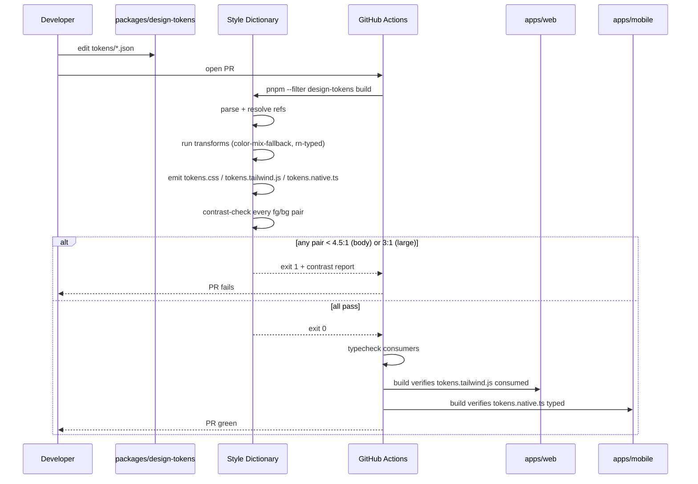
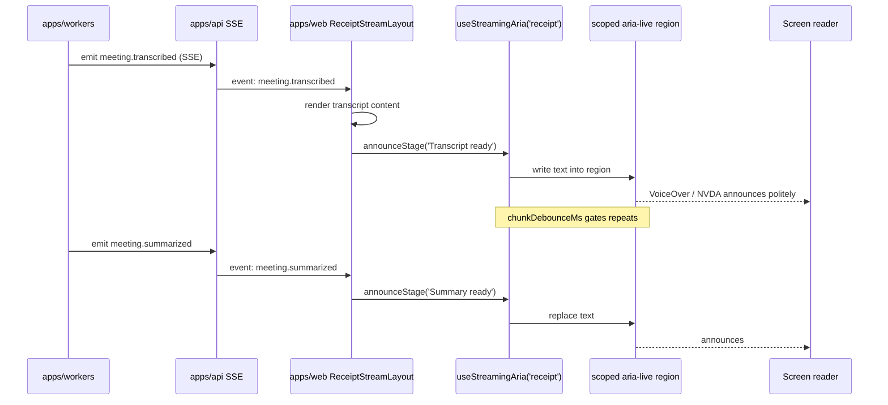
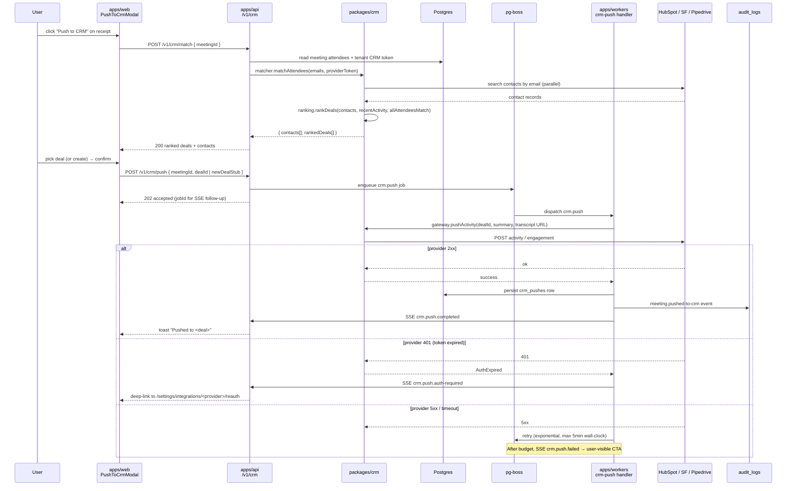
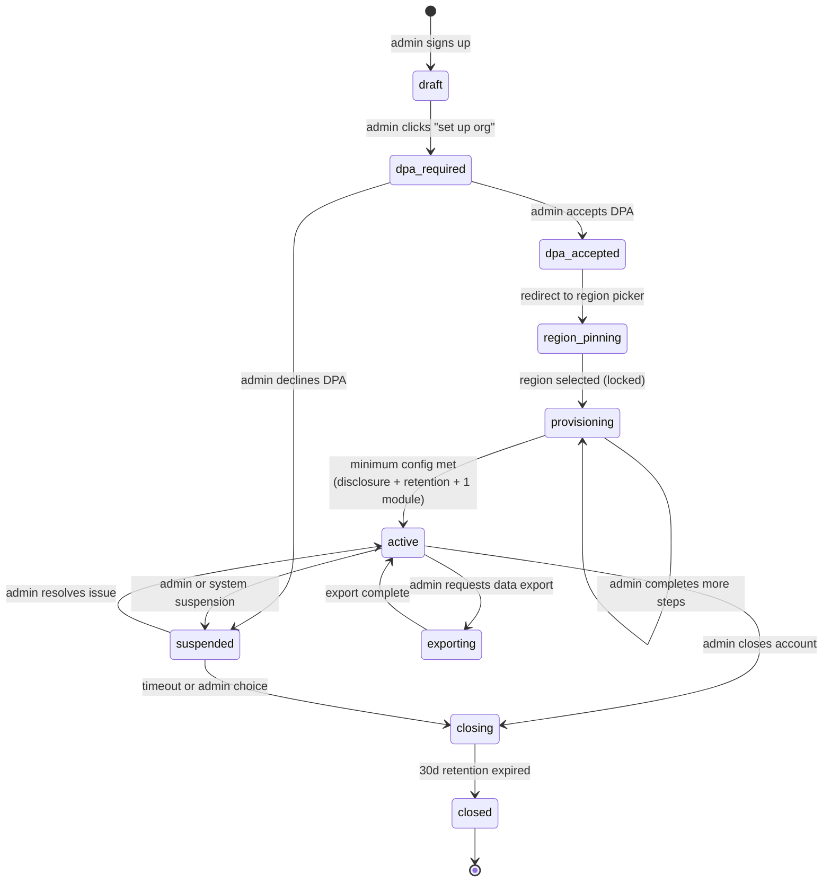
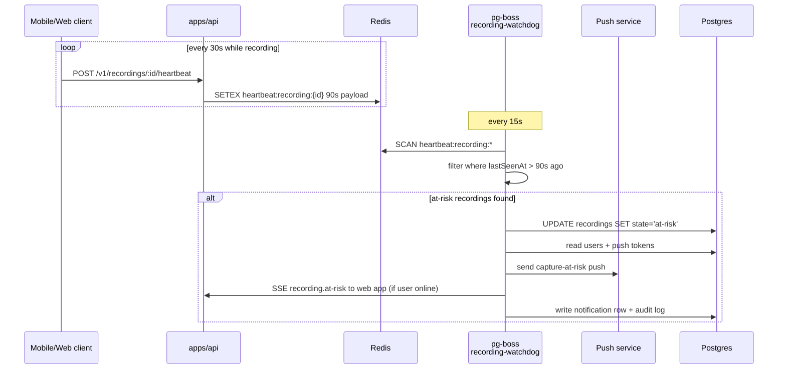
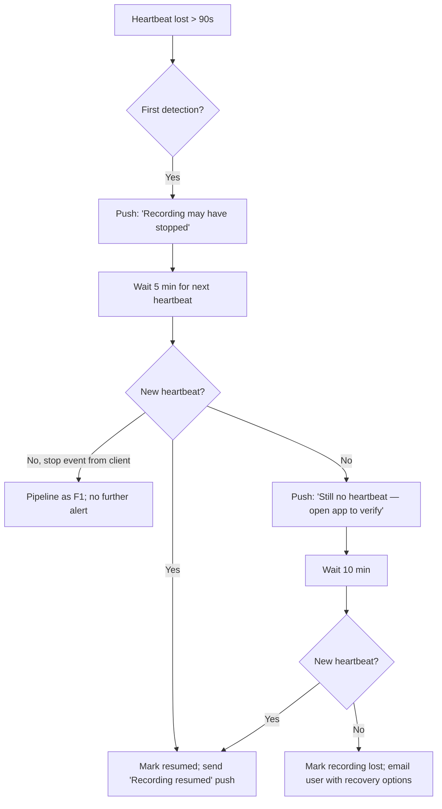

# Architecture Addendums — Patterns Surfaced by UX Design Spec

This document covers seven technical patterns introduced or sharpened by
the locked UX spec that are **not** sufficiently specified in
`docs/architecture.md`. For each pattern, decide one of:

- **Addendum required** — extend architecture with new contract; ADR
  mandatory for non-trivial deviations.
- **Documented pattern, no addendum** — clean fit with existing
  architecture; just record the convention.

Status by section:

| § | Pattern | Verdict |
|---|---|---|
| 1 | Style Dictionary token build pipeline | **Addendum** + ADR-0002 |
| 2 | ARIA streaming infrastructure | **Addendum** (component contract; no ADR) |
| 3 | F5-CRM deal-mapping mechanics | **Addendum** + ADR-0003 |
| 4 | F2-admin flow + DPA gate | **Addendum** + ADR-0004 (schema) |
| 5 | Real-time heartbeat detection (capture-at-risk + bot liveness) | **Addendum** (no ADR — pure protocol; reuses existing surfaces) |
| 6 | 10-minute resumable upload retry budget | **Documented pattern** — fits existing architecture; record convention |
| 7 | Region-aware EU explicit-consent branch (F3) | **Addendum** + ADR-0005 |
| 8 | Cross-tenant audit-log writes for cross-org sharing | **Addendum** + ADR-0006 |

---

## 1. Style Dictionary Token Build Pipeline

### Problem

UX spec § "Token Architecture" mandates a single `tokens.json`
source-of-truth that fans out to web (CSS variables + Tailwind theme)
and React Native (typed JS objects), with WCAG AA contrast as a CI gate.
The architecture document does not name `packages/design-tokens`,
the build pipeline, or its CI integration.

### Decision summary

Add `packages/design-tokens` to the workspace. Use **Style Dictionary
4.x** (Amazon-maintained, widely adopted, plugin model) as the token
transformer. Build runs in CI and emits three artifacts consumed by
their respective hosts.

### Package layout

```text
packages/design-tokens/
├── package.json
├── tokens/
│   ├── color.json
│   ├── spacing.json
│   ├── typography.json
│   ├── motion.json
│   ├── elevation.json
│   ├── focus.json
│   └── modes/                    # density × motion × theme overlays
│       ├── density.dense.json
│       ├── density.relaxed.json
│       ├── density.accessible.json
│       ├── motion.default.json
│       ├── motion.gentle.json
│       ├── motion.reduced.json
│       ├── theme.light.json
│       └── theme.dark.json
├── style-dictionary.config.js
├── src/
│   ├── transforms/               # custom SD transforms
│   │   ├── color-mix-fallback.ts # static fallback for color-mix()
│   │   └── rn-typed.ts           # typed RN export
│   ├── checks/
│   │   └── contrast.ts           # WCAG AA pair checker (used in CI gate)
│   └── index.ts
├── build/                        # generated; gitignored
│   ├── tokens.css                # web — :root, .theme-dark, .density-X, .motion-X
│   ├── tokens.tailwind.js        # web — Tailwind theme extension
│   ├── tokens.native.ts          # RN — typed object tree
│   └── tokens.contrast-report.json
└── README.md
```

### Token taxonomy

Three orthogonal axes compose at runtime:

- **Theme** (`light`, `dark`, … reserved): top-level CSS variable scope
  — `:root`, `.theme-dark`.
- **Density** (`dense`, `relaxed`, `accessible`): mode class
  overriding spacing/typography/touch tokens — `.density-relaxed`.
- **Motion** (`default`, `gentle`, `reduced`): mode class overriding
  motion duration/easing — `.motion-reduced`. `prefers-reduced-motion`
  auto-applies via media query in `tokens.css`.

3 × 3 × 3 = 27 effective combinations; **none are pre-baked**. Style
Dictionary emits each axis as a CSS variable scope; runtime composition
is the host's responsibility (web: class-name composition on `<html>`;
RN: object spread).

Naming follows the categories already locked in the UX spec:
`--color-bg`, `--color-fg`, `--color-accent`, `--color-{success,
warning, danger}`, `--space-0..8`, `--radius-{sm,md,lg}`,
`--font-sans`, `--text-xs..3xl`, `--leading-{tight,normal,loose}`,
`--motion-{fast,base,slow}`, `--easing-{default,gentle,reduced}`,
`--shadow-{sm,md,lg}`, `--z-{base,elevated,sticky,overlay,modal,
popover,toast,recording-status}`, `--focus-ring-{color,width,offset}`,
`--opacity-disabled`.

### Build pipeline (sequence)



### Static fallback for `color-mix()`

`color-mix()` has no support in iOS Safari < 16.4 and is brittle in
some embed surfaces (CRM iframe hosts may strip CSS color-functions
behind a sanitizer). The `color-mix-fallback` transform pre-computes
mixed values at build time and emits **two** CSS custom properties per
mix:

```css
:root {
  --color-accent-soft-fallback: #6366f140;            /* pre-computed */
  --color-accent-soft: color-mix(in oklch,
    var(--color-accent) 25%, transparent);
}
.no-color-mix {
  --color-accent-soft: var(--color-accent-soft-fallback);
}
```

`apps/web` adds `.no-color-mix` to `<html>` via a Modernizr-style
single-line feature test in the bootstrap script. Same approach
duplicated in `tokens.native.ts` (RN doesn't support `color-mix()` at
all — only the fallback is emitted).

### CI integration

New job in `.github/workflows/ci.yml`:

```yaml
tokens:
  runs-on: ubuntu-latest
  steps:
    - uses: actions/checkout@v4
    - uses: pnpm/action-setup@v4
    - run: pnpm install
    - run: pnpm --filter @aisecretary/design-tokens build
    - run: pnpm --filter @aisecretary/design-tokens contrast-check
      # exits non-zero on any AA regression
    - uses: actions/upload-artifact@v4
      with:
        name: contrast-report
        path: packages/design-tokens/build/tokens.contrast-report.json
```

Downstream jobs (`web-build`, `mobile-build`) `needs: tokens`. Web's
`tailwind.config.ts` imports `tokens.tailwind.js`; RN imports
`tokens.native.ts`. Both fail closed if the artifact is missing.

### Schema/architecture changes

- New workspace package: `packages/design-tokens` (add to
  `pnpm-workspace.yaml`).
- `apps/web/tailwind.config.ts` switches from inline theme to
  `theme.extend = require('@aisecretary/design-tokens/build/tokens.tailwind.js')`.
- `apps/mobile` consumes `@aisecretary/design-tokens/build/tokens.native`.
- CI workflow gains `tokens` job upstream of build jobs.

### Failure modes

| Mode | Detection | Mitigation |
|---|---|---|
| Token reference rot (deleted token still referenced) | SD build fails on unresolved ref | Build-time error |
| Contrast regression on dark theme | `contrast-check` script | CI gate fails PR |
| Generated artifacts drift from source | Artifacts gitignored; CI generates fresh every run | No drift possible |
| `color-mix()` host strips function | Static fallback always emitted; runtime feature test | Transparent degradation |
| Tailwind theme extension stale on web | `web-build` `needs: tokens` | Build order enforced |
| Quarterly token bloat | UX spec mandates "tokens without consumer pruned at quarterly review" | Manual review cadence |

### ADR-0002 — Style Dictionary as token build pipeline

```markdown
# ADR 0002: Style Dictionary as token build pipeline

## Status
PROPOSED

## Date
2026-04-29

## Context
The UX spec mandates a single tokens.json source-of-truth fanning out
to three platform-specific artifacts (web CSS vars, Tailwind theme,
typed RN objects), with WCAG AA contrast as a build-step gate. The
locked architecture (`docs/architecture.md`) does not name a token
build tool. Three options were live: (1) Style Dictionary, (2) Tokens
Studio (Figma-side, plugin-driven), (3) hand-rolled Node script.

## Decision
We will use Style Dictionary 4.x in a new `packages/design-tokens`
workspace package. Custom transforms supply `color-mix()` static
fallbacks and typed RN exports. A custom checker enforces WCAG AA
contrast on every defined fg/bg pair as a CI gate. Three artifacts
are emitted: `tokens.css`, `tokens.tailwind.js`, `tokens.native.ts`,
consumed by `apps/web` (Tailwind theme extension), `apps/web`
(global CSS), and `apps/mobile` respectively. Theme × density × motion
modes compose at runtime via class composition on web and object
spread on RN — 27 combinations are NOT pre-baked.

## Consequences

### Positive
- Single source-of-truth survives the platform expansion to RN.
- AA contrast regressions can't reach main.
- `color-mix()` browser/iOS-Safari/iframe-host gaps masked by static
  fallback emitted at build time.
- Plugin model (SD's transform/format API) accommodates future
  additions (e.g. iOS native, Figma round-trip) without rewrite.

### Negative
- One more workspace package to keep typechecked.
- ~15% upstream-tracking tax (matches the shadcn one already accepted).
- SD's TypeScript types are weak; we wrap its output in our own typed
  RN export.

### Neutral
- Build artifacts gitignored — every CI run regenerates.
- Web bootstrap gains a single-line feature test for `.no-color-mix`.

## Alternatives considered

| Option | Why rejected |
|---|---|
| Tokens Studio (Figma plugin) | Designer-side workflow; we want code-side source-of-truth, with Figma read-only consumer when designer onboarded. Reverse-direction sync introduces conflict resolution we don't need. |
| Hand-rolled Node transformer | 200 lines of boilerplate to replicate SD's reference-resolution and transform pipeline. No upside. |
| Tailwind-only (no fan-out) | Doesn't solve RN. Mobile would have a parallel hand-maintained palette. Drift inevitable. |

## Related
- Architecture section: `docs/architecture.md` § Frontend Architecture
- UX spec § Token Architecture
- Implementation PRs: TBD

## Notes
Style Dictionary v4 was chosen over v3 for its native
TypeScript-friendly config and improved transform composition.
```

---

## 2. ARIA Streaming Infrastructure

### Problem

UX spec mandates ARIA live-region announcements for: receipt streaming
(F1, four stages), RAG chat answer chunks + citations (F4),
capture-at-risk failures (F1, assertive), `RecordingStatusPill`
status (every 30s polite). Each is currently a per-component concern.
Without a shared contract, we'll get four bespoke implementations and
inconsistent screen-reader behavior.

### Verdict

**Addendum, no ARD.** This is a frontend convention layered on top of
the existing SSE channel; it doesn't deviate from architecture. Worth
documenting because component authors otherwise reimplement it.

### Taxonomy

| Surface | Politeness | Region kind | Trigger | Source of truth |
|---|---|---|---|---|
| Receipt stage arrival (transcript / summary / actions / analysis) | `polite` | one shared region per receipt page | SSE event `meeting.transcribed`, `meeting.summarized`, etc. | `useReceiptStream` hook |
| RAG chat answer chunk | `polite` (debounced) | one region per chat turn | LLM-gateway streaming chunks | `useChatStream` hook |
| RAG chat citation arrival | `polite` | piggybacks on chunk region; appended as new sentence | Citation extraction stream | `useChatStream` hook |
| `RecordingStatusPill` status update | `polite` | always-on `role="status"` region | Heartbeat timer (every 30s) | `useRecordingStatus` hook |
| Capture-at-risk failure | **`assertive`** | dedicated `role="alert"` region at app root | SSE event `recording.at-risk` | `useCaptureAlert` hook |
| Upload retry exhausted (10-min budget) | `assertive` | same alert region | SSE event `recording.upload-failed` | `useCaptureAlert` hook |
| Bot failed to join | `assertive` | same alert region | SSE event `bot.join-failed` | `useCaptureAlert` hook |
| Search results count | `polite` | per-search-results region | API response | `useSearch` hook |
| Action item check-off | `polite` | toast region | Mutation success | shadcn `useToast` already handles |

Two shared regions live at app root (single instance per browser tab):

```html
<!-- in apps/web/src/components/layout/AriaLiveRoot.tsx -->
<div role="status" aria-live="polite" aria-atomic="false"
     id="aria-polite-root" class="sr-only" />
<div role="alert" aria-live="assertive" aria-atomic="true"
     id="aria-alert-root" class="sr-only" />
```

Per-feature surfaces (receipt stream, chat) use **their own scoped
region** to avoid colliding announcements; the global polite root is
used for transient cross-feature events (search counts, etc.).

### Component contract

A small hook surface in `apps/web/src/hooks/use-aria-live.ts`
provides the contract — components don't reach into DOM directly.

```ts
// apps/web/src/hooks/use-aria-live.ts (new)

export type Politeness = 'polite' | 'assertive';

export interface AnnounceOptions {
  /** ms — debounce repeated announcements */
  debounceMs?: number;
  /** if true, clear region between announcements (forces re-announce of identical text) */
  clearBetween?: boolean;
}

export function useAriaLive(politeness: Politeness = 'polite') {
  // returns { announce: (text: string, opts?: AnnounceOptions) => void }
}

// Streaming-specific helper used by ReceiptStreamLayout + chat
export function useStreamingAria(opts: {
  scope: 'receipt' | 'chat' | 'global';
  /** stage labels emit politely on arrival */
  onStage?: (stage: string) => string; // returns announcement text
  /** chunk-level events debounced to avoid SR flooding */
  chunkDebounceMs?: number;
}): {
  announceStage: (stage: string) => void;
  announceChunk: (text: string) => void;
  announceCitation: (citation: { speaker?: string; ts: number }) => void;
};

// Capture-at-risk specific — always assertive
export function useCaptureAlert(): {
  emitAtRisk: (reason: 'heartbeat-lost' | 'upload-failed' | 'bot-join-failed') => void;
};
```

`ReceiptStreamLayout`, the chat component, and `RecordingStatusPill`
consume the hook; they never touch `aria-live` attributes directly.
Biome custom rule flags raw `aria-live=` attribute literals outside
`AriaLiveRoot.tsx` and `use-aria-live.ts`.

### Mobile equivalent

Expo / React Native maps to:

- `AccessibilityInfo.announceForAccessibility(text)` for transient
  announcements (used by `useAriaLive`'s native variant).
- `accessibilityLiveRegion="polite"|"assertive"` on container Views
  for streaming surfaces (Android only; iOS VoiceOver listens to
  `announceForAccessibility`).
- Heartbeat / capture-at-risk: native local notifications via
  `expo-notifications` carry the ARIA-equivalent for users not
  currently in the app.

A parallel hook `apps/mobile/src/hooks/use-rn-announce.ts` exposes
the same `announce(text, politeness)` surface so component code in
shared packages is identical.

### Sequence — receipt streaming



### Failure modes

| Mode | Detection | Mitigation |
|---|---|---|
| Two regions firing simultaneously | E2E axe-core test on F1 | Hook owns dedupe; per-scope regions prevent cross-scope collision |
| Streaming chunk floods screen reader | `chunkDebounceMs` default 750ms | Debounce in hook |
| Reduced-motion swap silently drops announcements | Per UX spec § Motion safety: "ARIA announcements unchanged" — dedicated test | Animation removal must not branch around `announce()` calls |
| RN Android `accessibilityLiveRegion` ignored on older OS | Fallback to `announceForAccessibility` | Both paths called; OS picks |
| Citation arrival without text content | Citation has structured `{speaker, ts}` only | Hook formats: *"Citation at 14:32, speaker Dana"* |

### Schema/architecture changes

None at backend. Existing SSE channel (`/api/v1/events`,
architecture § API & Communication Patterns) carries the events
already. Per-event `topic` filter on SSE subscription scopes to a
single meeting or chat session.

Frontend additions:
- `apps/web/src/components/layout/AriaLiveRoot.tsx` (mounted once)
- `apps/web/src/hooks/use-aria-live.ts`
- `apps/mobile/src/hooks/use-rn-announce.ts`
- Biome custom rule blocking raw `aria-live` outside the hook

No ADR required — pure frontend layering convention; no architectural
deviation.

---

## 3. F5-CRM Deal-Mapping Mechanics

### Problem

UX spec § F5-CRM specifies a multi-step flow: lookup attendees in
CRM, rank candidate deals, allow user to confirm or create, push
receipt as activity-note, audit-log the push. Architecture currently
has no provision for outbound CRM integrations. Two implementation
paths exist (Chrome extension overlay vs. server-side sync); UX spec
implies both surfaces (Chrome overlay + in-app "Push to CRM" button).

### Decision

**Server-side sync is the source of truth.** Chrome extension is a
thin presentation overlay that calls our backend APIs. Both surfaces
hit the same `apps/api/routes/crm.ts` endpoints. The actual CRM API
calls happen in `apps/workers/handlers/crm-push.ts` (queued, retryable).

### Architecture surface additions

```text
apps/api/src/routes/crm.ts                 — REST surface
apps/api/src/routes/crm/oauth.ts           — provider OAuth callbacks
apps/workers/src/handlers/crm-push.ts      — queue handler (push to CRM)
apps/workers/src/handlers/crm-sync.ts      — periodic deal/contact sync
packages/crm/                              — provider abstraction (NEW package)
  src/
    types.ts                               — provider-agnostic interface
    gateway.ts                             — routes by tenant config
    providers/
      hubspot.ts
      salesforce.ts
      pipedrive.ts
    ranking.ts                             — deal-ranking algorithm
    matcher.ts                             — attendee → contact match

apps/web/src/components/feature/share/PushToCrmModal.tsx
apps/web/src/extensions/chrome/             — Chrome extension (NEW app)
  manifest.json
  background.ts                            — service worker (auth)
  content/
    hubspot.ts                             — overlay script per host
    salesforce.ts
    pipedrive.ts
```

`packages/crm` follows the same provider-abstraction discipline as
`packages/llm-gateway` and `packages/storage` — only this package is
allowed to import HubSpot/Salesforce/Pipedrive SDKs. Biome rule update.

### Chrome extension vs. server-side responsibilities

| Concern | Chrome extension | Server-side |
|---|---|---|
| User auth to CRM | Re-uses host CRM cookies (no separate OAuth) | OAuth flow stored per-tenant in `tenant_integrations` |
| Attendee lookup | Calls our `/api/v1/crm/match` (server resolves via stored OAuth token) | `apps/api/routes/crm.ts` → `packages/crm/matcher.ts` |
| Deal ranking | Display only | `packages/crm/ranking.ts` |
| Push activity to deal | Calls our `/api/v1/crm/push` | Enqueues `crm.push` job; `apps/workers/handlers/crm-push.ts` consumes |
| Audit log | Server-only (single source) | `audit-logger` plugin |
| Retry on failure | Not retried in extension; server retries | pg-boss retry policy on `crm-push` |

The extension is a **presentation surface** — it never holds CRM
credentials. All CRM API calls go through server-side OAuth tokens
stored in `tenant_integrations`. This keeps audit complete and
prevents the extension from becoming a parallel security surface.

### Sequence — push to CRM (server-side)



### Deal-ranking algorithm

In `packages/crm/ranking.ts`:

```ts
type RankSignals = {
  allAttendeesMatch: boolean;        // +5
  someAttendeesMatch: boolean;       // +2
  dealStageActive: boolean;          // +3 (not closed-lost / closed-won)
  daysSinceLastActivity: number;     // -1 per 7d, capped -5
  amountUsd: number;                 // log-scaled small bonus
  ownerIsCurrentUser: boolean;       // +2
  meetingDurationMatchesExpected: boolean; // +1 (synergy with calendar)
};

// score = sum of weights, sorted desc, ties broken by recency
```

User **always** sees the ranked list when N>1; auto-pick only when
exactly one contact + exactly one open deal. The UX spec is explicit:
*"Multiple matching deals with no clear winner: never auto-pick."*

### Deal auto-create

When user picks "create new deal" in the modal:

1. Web posts `{ stub: { name, amountUsd?, ownerId, contactIds, stage } }`.
2. `crm.push` job opens the deal first via provider API, gets back
   the new deal's ID, then pushes the activity. Both ops in the same
   job; if deal-create succeeds and activity-push fails, the partial
   state is reflected in the audit log (`deal-created`,
   `activity-push-failed`) and surfaced to the user with a manual-
   retry CTA.

### Permission/auth flow

Per-provider:

- **HubSpot:** OAuth 2.0 PKCE; refresh tokens stored encrypted in
  `tenant_integrations.encrypted_token` (KMS-backed envelope
  encryption — see architecture § K1 gap resolution). Scopes
  requested: `crm.objects.contacts.read/write`,
  `crm.objects.deals.read/write`, `engagements.write`.
- **Salesforce:** OAuth 2.0 with refresh; per-org sandbox vs. prod
  endpoint stored alongside token. Scopes: `api`, `refresh_token`.
- **Pipedrive:** OAuth 2.0; tokens shorter-lived; refresh handled in
  `packages/crm/providers/pipedrive.ts`.

Tokens never leave server. Chrome extension authenticates to **our**
backend via existing JWT; backend brokers all CRM calls.

### Queued retry pattern

`crm.push` job uses pg-boss retry config:

```ts
{
  retryLimit: 4,
  retryDelay: 30,         // seconds, exponential
  retryBackoff: true,
  expireInSeconds: 300,   // 5min wall-clock budget per UX spec
}
```

After exhaustion, job state moves to `failed`; SSE event
`crm.push.failed` emitted; user-facing toast offers "Retry now" which
re-enqueues a fresh job with the same payload.

### Audit-log integration

New audit action added to the union type in
`apps/api/src/lib/audit-types.ts`:

```ts
| 'meeting.pushed-to-crm'        // success
| 'meeting.crm-push-failed'      // exhausted retries
| 'crm.deal-auto-created'        // when user selected "create deal"
| 'crm.contact-auto-created'     // when user selected "create contact"
| 'crm.oauth-connected'
| 'crm.oauth-revoked'
```

Each event records: `{ provider, dealId, contactIds[], scope, region }`.

### Schema additions

```sql
-- packages/db/migrations/202604300900_create_crm_integration_tables.sql

CREATE TABLE tenant_integrations (
  id UUID PRIMARY KEY DEFAULT gen_random_uuid(),
  tenant_id UUID NOT NULL REFERENCES tenants(id),
  provider TEXT NOT NULL,                        -- 'hubspot' | 'salesforce' | 'pipedrive' | 'nylas' | 'slack' | 'teams'
  encrypted_token BYTEA NOT NULL,                -- envelope-encrypted via KMS
  encrypted_refresh BYTEA,
  token_expires_at TIMESTAMPTZ,
  scopes TEXT[],
  provider_account_id TEXT,                      -- portal/instance/org id within the provider
  status TEXT NOT NULL DEFAULT 'active',         -- 'active' | 'expired' | 'revoked'
  connected_by_user_id UUID REFERENCES users(id),
  created_at TIMESTAMPTZ NOT NULL DEFAULT now(),
  updated_at TIMESTAMPTZ NOT NULL DEFAULT now(),
  UNIQUE (tenant_id, provider)
);

CREATE INDEX idx_tenant_integrations_tenant_provider
  ON tenant_integrations (tenant_id, provider);

ALTER TABLE tenant_integrations ENABLE ROW LEVEL SECURITY;
CREATE POLICY tenant_integrations_isolation ON tenant_integrations
  USING (tenant_id = current_setting('app.current_tenant_id')::uuid);

CREATE TABLE crm_pushes (
  id UUID PRIMARY KEY DEFAULT gen_random_uuid(),
  tenant_id UUID NOT NULL REFERENCES tenants(id),
  meeting_id UUID NOT NULL REFERENCES meetings(id),
  provider TEXT NOT NULL,
  external_deal_id TEXT,
  external_activity_id TEXT,
  status TEXT NOT NULL,                          -- 'queued' | 'pushed' | 'failed' | 'auth-required'
  failure_reason TEXT,
  pushed_by_user_id UUID REFERENCES users(id),
  created_at TIMESTAMPTZ NOT NULL DEFAULT now(),
  updated_at TIMESTAMPTZ NOT NULL DEFAULT now()
);

CREATE INDEX idx_crm_pushes_tenant_meeting
  ON crm_pushes (tenant_id, meeting_id);

ALTER TABLE crm_pushes ENABLE ROW LEVEL SECURITY;
CREATE POLICY crm_pushes_isolation ON crm_pushes
  USING (tenant_id = current_setting('app.current_tenant_id')::uuid);
```

### Failure modes

| Mode | Detection | Mitigation |
|---|---|---|
| Provider rate-limit (HubSpot 100/10s) | 429 from provider | pg-boss exponential backoff; respects `Retry-After` header |
| Token expired | 401 from provider | Status flips to `auth-required`; user re-authorizes; queued job re-runs post-refresh |
| Provider account revoked | Persistent 401 after refresh | Status `revoked`; user must reconnect from settings |
| Deal moved/deleted between match and push | 404 from provider | Audit `meeting.crm-push-failed` with reason; user re-picks |
| Multiple users pushing same meeting concurrently | DB unique constraint on `(meeting_id, provider, external_deal_id)` | Second push idempotent via external IDs |
| Chrome extension stale (manifest auth gone) | Extension health check on load | Extension prompts re-auth; falls back to web app modal |

### ADR-0003 — Server-side CRM gateway with thin Chrome extension

```markdown
# ADR 0003: Server-side CRM gateway; Chrome extension is presentation only

## Status
PROPOSED

## Date
2026-04-29

## Context
UX spec § F5-CRM specifies push-to-CRM from both the in-app receipt
screen AND a Chrome extension overlay on HubSpot/Salesforce/Pipedrive.
Two architectural shapes were possible: (1) extension holds the CRM
auth and calls CRM APIs directly; (2) extension is a thin overlay
that calls our backend, which holds auth and brokers all CRM calls.

The architecture document (§ Provider abstraction discipline) requires
that "LLM SDKs imported only inside packages/llm-gateway" etc. The
spirit of that rule is that integration credentials and API surfaces
are server-side, behind abstraction packages. CRM integrations should
follow the same discipline.

## Decision
We will introduce `packages/crm` (HubSpot, Salesforce, Pipedrive
SDK-importing package) and `apps/api/routes/crm.ts` as the only
surface for CRM operations. The Chrome extension is a presentation
overlay that authenticates to **our** backend (existing JWT) and calls
our REST endpoints. The extension never holds CRM tokens. All CRM
API calls happen server-side through `packages/crm`. CRM OAuth
tokens are stored in `tenant_integrations.encrypted_token` with
KMS-backed envelope encryption. Pushes are queued via pg-boss
(`crm.push` job, 5-minute wall-clock retry budget). Audit log captures
every push attempt and outcome.

## Consequences

### Positive
- Single place to revoke CRM access.
- Audit log is complete (extension can't bypass it).
- Per-tenant compliance posture (can disable CRM provider per-tenant
  via `tenant_entitlements`).
- Extension shipping cadence decouples from CRM API changes (server
  ships separately).

### Negative
- Extension cannot work offline against CRM.
- Roundtrip latency adds ~200-400ms vs. direct extension → CRM call.
- We hold CRM tokens — additional encryption-at-rest obligation.

### Neutral
- Salesforce sandbox vs. prod requires per-tenant provider config
  field; not a deviation, just additional schema.

## Alternatives considered

| Option | Why rejected |
|---|---|
| Extension holds CRM auth | Bypasses audit log; parallel security surface; user-installed extension is harder to revoke; violates provider-abstraction discipline. |
| Direct browser → CRM via CORS proxy | CRM APIs don't permit; would require intermediary anyway; same as decision. |
| Webhook-only (CRM pulls from us) | Reverses control; doesn't satisfy F5-CRM "click push to CRM on receipt" UX. |

## Related
- Architecture sections: `docs/architecture.md` § Provider abstraction
  discipline, § Authentication & Security, § Integration Points
- UX spec § F5-CRM
- ADR-0002 (token build pipeline; same package-discipline pattern)

## Notes
The extension's manifest v3 service worker bursts can hit our
rate-limit; per-tenant rate-limit middleware applies.
```

---

## 4. F2-Admin Flow + DPA Gate

### Problem

UX spec § F2-admin describes a blocking provisioning sequence:
DPA acceptance → region pin (locked-once-selected) → disclosure config
→ retention defaults → module enable → integrations → SSO → invite.
The architecture mentions tenants and entitlements but does not
specify the **state machine** that gates capability behind these steps,
nor the schema fields recording these decisions.

### Verdict

**Addendum required + ADR-0004** for the schema + state machine.

### Tenant lifecycle state machine



State stored as `tenants.state TENANT_STATE` enum:

```sql
CREATE TYPE tenant_state AS ENUM (
  'draft',
  'dpa_required',
  'dpa_accepted',
  'region_pinning',
  'provisioning',
  'active',
  'suspended',
  'exporting',
  'closing',
  'closed'
);
```

Capability gating: `apps/api/plugins/tenant-state-check.ts` rejects
mutating routes when `tenants.state NOT IN ('active', 'provisioning')`.
Read routes restricted to admin-only when state in `('suspended',
'exporting', 'closing')`.

### Schema additions

```sql
-- packages/db/migrations/202604300915_extend_tenants_lifecycle.sql

ALTER TABLE tenants
  ADD COLUMN state tenant_state NOT NULL DEFAULT 'draft',
  ADD COLUMN data_region TEXT CHECK (data_region IN ('us', 'eu')),
  ADD COLUMN region_locked_at TIMESTAMPTZ,
  ADD COLUMN dpa_version TEXT,                     -- e.g. '2026-04-01'
  ADD COLUMN dpa_accepted_at TIMESTAMPTZ,
  ADD COLUMN dpa_accepted_by_user_id UUID REFERENCES users(id),
  ADD COLUMN suspended_at TIMESTAMPTZ,
  ADD COLUMN suspension_reason TEXT;

-- Region cannot be changed once locked; trigger enforces.
CREATE OR REPLACE FUNCTION enforce_region_lock() RETURNS TRIGGER AS $$
BEGIN
  IF OLD.region_locked_at IS NOT NULL
     AND NEW.data_region IS DISTINCT FROM OLD.data_region THEN
    RAISE EXCEPTION 'tenant region is locked at %', OLD.region_locked_at;
  END IF;
  RETURN NEW;
END;
$$ LANGUAGE plpgsql;

CREATE TRIGGER tenants_region_lock_guard
  BEFORE UPDATE OF data_region ON tenants
  FOR EACH ROW EXECUTE FUNCTION enforce_region_lock();

-- Tenant configuration not already covered by tenant_entitlements.
CREATE TABLE tenant_settings (
  tenant_id UUID PRIMARY KEY REFERENCES tenants(id),
  disclosure_text_premic TEXT,
  disclosure_text_bot_announcement TEXT,
  disclosure_text_patient_artifact TEXT,
  retention_audio_days INTEGER NOT NULL DEFAULT 90,
  retention_transcript_days INTEGER NOT NULL DEFAULT 365,
  retention_per_vertical JSONB NOT NULL DEFAULT '{}'::jsonb,
  consent_legal_basis TEXT NOT NULL DEFAULT 'legitimate-interest',
    -- 'legitimate-interest' | 'explicit-consent' (per-region default)
  policy_in_person_consent_required BOOLEAN NOT NULL DEFAULT TRUE,
  policy_optout_action TEXT NOT NULL DEFAULT 'per-participant-exclusion',
    -- 'per-participant-exclusion' | 'auto-quarantine'
  cross_org_share_policy TEXT NOT NULL DEFAULT 'allow',
    -- 'allow' | 'whitelist' | 'block'
  cross_org_share_whitelist TEXT[],
  created_at TIMESTAMPTZ NOT NULL DEFAULT now(),
  updated_at TIMESTAMPTZ NOT NULL DEFAULT now()
);

ALTER TABLE tenant_settings ENABLE ROW LEVEL SECURITY;
CREATE POLICY tenant_settings_isolation ON tenant_settings
  USING (tenant_id = current_setting('app.current_tenant_id')::uuid);
```

#### ADR-0004 trial-fields extension (added 2026-04-29 per readiness review Gap-EC2 / FR81)

Trial state is **orthogonal** to the lifecycle FSM (`tenant_state`).
A tenant in `provisioning` or `active` can also be in a trial sub-state.
We use **separate `trial_*` fields on `tenants`** rather than enum-bloating
`tenant_state` — this avoids representing two orthogonal concerns
(lifecycle progress vs. billing trial period) in a single enum and
lets a single tenant be both `active` and `trialing` simultaneously.

```sql
-- packages/db/migrations/202604301015_extend_tenants_trial.sql

ALTER TABLE tenants
  ADD COLUMN trial_kind TEXT
    CHECK (trial_kind IN ('pro', 'business', 'enterprise_pilot') OR trial_kind IS NULL),
  ADD COLUMN trial_starts_at TIMESTAMPTZ,
  ADD COLUMN trial_ends_at TIMESTAMPTZ,
  ADD COLUMN trial_card_on_file BOOLEAN NOT NULL DEFAULT FALSE,
  ADD COLUMN trial_expired_at TIMESTAMPTZ;          -- set when trial-end hits without conversion

-- Index for trial-reminder watchdog queries (T-3d, T-1d cron sweeps)
CREATE INDEX idx_tenants_trial_ends_at
  ON tenants (trial_ends_at)
  WHERE trial_kind IS NOT NULL AND trial_expired_at IS NULL;
```

**Trial-end transition matrix** (per FR81):

| Trial kind | Card on file at trial-end | Action |
|---|---|---|
| `pro` | true | Stripe auto-converts via `customer.subscription.updated`; `trial_kind` set null; tenant continues `active` |
| `pro` | false | `trial_expired_at = now()`; `tenant-state-check` plugin denies state-changing recording-pipeline routes; tenant retains read-only access + DSAR + admin actions; admin sees upgrade CTA |
| `business` | n/a (sales-assisted) | Admin sees "talk to sales" CTA + can extend trial via support; sales handoff path |
| `enterprise_pilot` | n/a | Custom expiration; admin contact-sales handoff with manual `trial_extended_until` override |

**Why fields, not enum extension:** if `trial_state` were folded into
`tenant_state`, a tenant transitioning from `trialing` → `active` would
be impossible to distinguish from a tenant in `provisioning` →
`active`, AND trial-state would be lost during state changes (e.g. an
`active` tenant in trial would have no way to record trial-end).
Separate fields keep concerns clean.

**`tenant-state-check` plugin extension:** when reading `tenants.state`,
the plugin ALSO consults `trial_expired_at` — if non-null, mutating
recording-pipeline routes return 402 Payment Required with upgrade
CTA target.

**New audit actions** (added to the `audit-types.ts` union):

```ts
| 'tenant.trial-started'
| 'tenant.trial-reminder-sent'           // T-3d, T-1d
| 'tenant.trial-converted'               // Pro auto-convert
| 'tenant.trial-expired'                 // sets trial_expired_at
| 'tenant.trial-extended'                // Enterprise pilot manual extension
```

### Provisioning sequence

```mermaid
sequenceDiagram
    participant Admin
    participant Web as apps/web<br/>/onboarding
    participant API as apps/api
    participant DB as Postgres
    participant Audit as audit_logs

    Admin->>Web: sign up
    Web->>API: POST /v1/tenants
    API->>DB: INSERT tenants (state='draft')

    Admin->>Web: click "set up org"
    Web->>API: PATCH /v1/tenants/me { transition: 'request-dpa' }
    API->>DB: UPDATE tenants SET state='dpa_required'
    Web->>Web: render DPA gate (cannot dismiss)

    Admin->>Web: accept DPA
    Web->>API: POST /v1/tenants/me/dpa { version, signature }
    API->>DB: UPDATE tenants SET state='dpa_accepted',<br/>dpa_version, dpa_accepted_at, dpa_accepted_by_user_id
    API->>Audit: tenant.dpa-accepted

    Web->>Web: redirect /onboarding/region
    Admin->>Web: pick region (US / EU)
    Web->>API: POST /v1/tenants/me/region { region: 'us' }
    API->>DB: UPDATE tenants SET state='provisioning',<br/>data_region='us', region_locked_at=now()
    API->>Audit: tenant.region-pinned

    Note over Admin,Audit: Provisioning steps (any order; capability unlocks per-step)

    Admin->>Web: configure disclosure
    Web->>API: PATCH /v1/tenants/me/settings { disclosure_text_* }
    API->>DB: UPSERT tenant_settings
    API->>Audit: tenant.disclosure-configured

    Admin->>Web: set retention defaults
    Web->>API: PATCH /v1/tenants/me/settings { retention_* }
    API->>Audit: tenant.retention-configured

    Admin->>Web: enable modules
    Web->>API: PATCH /v1/tenants/me/entitlements { modules: [...] }
    API->>DB: UPSERT tenant_entitlements
    API->>Audit: tenant.entitlements-changed

    Admin->>Web: connect integrations (optional)
    Admin->>Web: configure SSO (optional)
    Admin->>Web: invite users

    Note over API: When disclosure set + retention set + ≥1 module enabled
    API->>DB: UPDATE tenants SET state='active'
    API->>Audit: tenant.activated
```

### Routes

```ts
// apps/api/src/routes/tenants.ts (extends existing)

// DPA
POST   /api/v1/tenants/me/dpa           // accept; transitions state
GET    /api/v1/tenants/me/dpa           // current version + acceptance status

// Region pin (one-shot; subsequent calls 409)
POST   /api/v1/tenants/me/region        { region: 'us' | 'eu' }

// Tenant settings
GET    /api/v1/tenants/me/settings
PATCH  /api/v1/tenants/me/settings

// State (for onboarding progress UI)
GET    /api/v1/tenants/me/state

// Entitlements (existing) but with state-check gate
PATCH  /api/v1/tenants/me/entitlements
```

### Integration credentials surface

`/api/v1/tenants/me/integrations` proxies to provider-specific OAuth
flows. Each provider has its own `apps/api/src/routes/integrations/<provider>.ts`
that handles authorize → callback → store-encrypted-token → emit
audit event. Tokens persisted in `tenant_integrations` (introduced
in § 3 above). Surface displays connection status, last-used
timestamp, scopes granted, "disconnect" button.

### SSO config

Reserve `tenant_sso_config` table for SAML setup (deferred per
architecture § Deferred Decisions until first enterprise customer).
Day-1: Google + Microsoft OAuth at user-level; org admin can
require SSO via a flag on `tenant_settings.required_sso_provider`.

### Failure modes

| Mode | Detection | Mitigation |
|---|---|---|
| Admin abandons after DPA | `tenants.state='dpa_accepted'` for >7d | Re-engagement email; admin returns and resumes |
| Admin abandons before DPA | `state='dpa_required'` for >24h | Reminder email |
| Region selected by mistake | UX confirms with cooldown + warning | Region change requires support ticket + tenant migration job (deferred until needed) |
| Concurrent admin actions | Optimistic concurrency on `tenants.updated_at` | Second action 409 |
| State transition skip | `tenant-state-check` plugin rejects forbidden transitions | Server enforces FSM |
| DPA version updated mid-onboarding | `tenants.dpa_version != current_dpa_version` | Banner; user must re-accept (audit-logged) |

### ADR-0004 — Tenant lifecycle state machine + DPA gate

```markdown
# ADR 0004: Tenant lifecycle state machine + blocking DPA / region pin

## Status
PROPOSED

## Date
2026-04-29

## Context
The UX spec § F2-admin describes a blocking onboarding sequence
(DPA → region → disclosure → retention → modules → integrations →
SSO → invite). The architecture document mentions tenants and
entitlements but does not specify a state machine, the field set
recording acceptance, or the gating mechanism that prevents
recording-pipeline use before DPA acceptance + region pin. Without
both fields and gates, admins could enqueue meetings before
compliance preconditions are met.

## Decision
We will model tenant lifecycle as a Postgres enum
(`tenant_state`) with values: draft, dpa_required, dpa_accepted,
region_pinning, provisioning, active, suspended, exporting, closing,
closed. The `tenants` table gains `state`, `data_region`,
`region_locked_at`, `dpa_version`, `dpa_accepted_at`,
`dpa_accepted_by_user_id`. A trigger enforces region immutability
once `region_locked_at` is set. A new `tenant_settings` table
captures disclosure text, retention defaults, consent legal basis
(per-region default), and policy flags. A new
`tenant-state-check` Fastify plugin rejects mutating recording-
pipeline routes when state is not in {active, provisioning}.
Capability unlocks progressively as provisioning steps complete.
State `active` is reached automatically when disclosure is set,
retention is set, and ≥1 module is enabled.

## Consequences

### Positive
- Compliance preconditions (DPA + region) cannot be skipped.
- Audit log captures the full provisioning trail.
- Region-immutability is enforced in the DB, not just at the API
  layer (defense in depth).
- Onboarding UX has a single source of truth for "what's next?"
  via `GET /v1/tenants/me/state`.

### Negative
- One more enum to migrate when adding states (e.g. trial-expired).
- Region-change requires support intervention + dedicated tenant-
  migration job (acceptable given GDPR pinning).
- Tenant-state plugin adds one more middleware hop on every mutating
  request.

### Neutral
- `tenant_entitlements` (existing) is not folded into
  `tenant_settings` — entitlements are billing-driven; settings are
  admin-driven. Different write paths.

## Alternatives considered

| Option | Why rejected |
|---|---|
| Boolean flags (dpa_accepted, region_set, etc.) | Doesn't capture order; doesn't gate capability; doesn't model suspension/export/close. State machine is the right shape. |
| Application-layer state only | DB-level enum + trigger ensures region immutability survives a buggy admin route. Defense in depth. |
| Defer state machine until enterprise customer | Per UX spec, admin onboarding is Day-1; DPA gate is non-negotiable. |

## Related
- Architecture sections: `docs/architecture.md` § Authentication &
  Security, § Authorization, § Cross-Cutting Concerns (Tenant +
  region context, Audit logging)
- UX spec § F2-admin
- ADR-0005 (consent legal basis; lives in tenant_settings)

## Notes
DPA versioning lets us track acceptance of new contract terms. When
legal updates the DPA, all tenants flip to a banner state requiring
re-acceptance for new mutations (read-only otherwise).
```

---

## 5. Real-Time Heartbeat Detection (Capture-at-Risk + Bot Liveness)

### Problem

UX spec specifies two real-time liveness mechanisms:

- **Capture-at-risk (mobile/web client):** heartbeat to server every
  30s; lost heartbeat for >90s triggers detection; push within 60s.
- **Bot service (F3):** liveness ping every 30s; lost ping → push +
  email + banner immediately.

Architecture has no provision for either; SSE is one-way (server →
client) and pg-boss isn't suited for sub-second timing logic.

### Verdict

**Addendum, no ADR.** Pure protocol layered on existing surfaces;
implementation is straightforward.

### Heartbeat protocol — client → server

**Endpoint:** `POST /api/v1/recordings/:id/heartbeat`

**Cadence:** every 30s while recording. Implemented client-side via
`setInterval` (web) and `expo-background-fetch` + foreground task
(mobile). Stops on "stop recording" tap.

**Payload (zod-validated):**

```ts
{
  recordingId: string;       // UUID
  clientWallTimeMs: number;  // for clock-skew detection
  bytesCaptured: number;     // monotonic counter
  batteryLevelPct?: number;  // mobile only; for proactive warnings
  isBackground: boolean;     // true if app backgrounded
}
```

**Server side:** writes to Redis with TTL = 90s. Key:
`heartbeat:recording:{recordingId}` → JSON payload + `lastSeenAt`.

**Detection job (`recording-watchdog`):** pg-boss scheduled job every
15s scans for heartbeats whose Redis TTL is < 0 OR whose
`lastSeenAt` is > 90s old (Redis sets TTL but a key not yet expired
may still be stale if cadence drifted — both checks).



### Detection model

```ts
type DetectionResult =
  | { state: 'healthy'; lastSeenMsAgo: number }
  | { state: 'lagging'; lastSeenMsAgo: number; lastSeenAt: Date }   // 60-90s
  | { state: 'at-risk'; lastSeenMsAgo: number };                    // >90s

// Thresholds:
const HEARTBEAT_HEALTHY_MAX_MS = 60_000;  // 60s
const HEARTBEAT_AT_RISK_MIN_MS = 90_000;  // 90s
```

### Push notification dispatch

`packages/notifications/` (new package; **scaffolded in Epic 1 Story
1.10 per readiness review fix EQ-1 + Gap-EC1**) abstracts unified
push + email + (future) SMS dispatch:

- **Push:** iOS / Android via Expo Push (architecture § N1 already
  names this). Provider: `providers/expo-push.ts`.
- **Email:** Postmark (default) + SES (fallback) + SMTP (on-prem).
  Providers: `providers/postmark.ts`, `providers/ses.ts`,
  `providers/smtp.ts`. Per-tenant routing via
  `tenant_settings.notification_email_provider`.
- **Provider-agnostic interface:** `types.ts` defines
  `NotificationChannel`, `NotificationKind`, `Notification`. Gateway
  (`gateway.ts`) routes per tenant config + kind.
- **CI discipline:** Biome rule blocks `expo-server-sdk`,
  `postmark`, `aws-sdk/client-ses`, `nodemailer` imports outside
  `packages/notifications` — same pattern as `packages/llm-gateway`,
  `packages/storage`, `packages/transcription`.
- **`notifications` table** tracks
  `(id, tenant_id, recipient, channel, kind, payload_hash, status,
  attempts, dedup_key, created_at)` with RLS. Audit-log rows on
  every send: `notification.sent`, `notification.failed`,
  `notification.suppressed-dedup`, `notification.opted-out`.
- **Dedup:** suppress repeat sends within 5 min for same
  `(recipient, kind, dedup_key)`.
- **User preferences:** per-channel + per-kind opt-out via
  `user_preferences` table; honored at gateway layer.
- **Email template registry** (re-engagement, trial-reminder,
  DSAR-ready, share-notification, etc.) lives inside the package
  with i18next-localized variants.

**Consumers of `packages/notifications` across the epic plan:**

| Epic.Story | Kind | Channel(s) |
|---|---|---|
| Epic 1 Story 1.7 | `re-engagement-24h`, `re-engagement-72h` | email |
| Epic 4 Story 4.4 | `capture-at-risk` | push |
| Epic 4 Story 4.5 | `upload-retry-exhausted` | push + email |
| Epic 9 Story 9.6 | `bot-join-failed` | push + email + in-app banner |
| Epic 13 Story 13.7 | `trial-ending-soon`, `trial-expired` | email |
| Epic 14 Story 14.1 | `dsar-ready` | email |
| Epic 15 Story 15.5 | `share-received-slack`, `share-received-teams` | hub-app post |
| Epic 15 Story 15.6 | `analysis-completed`, plus hub-app event types | push + hub-app |

`recording-watchdog` enqueues `notification.send` jobs targeted at
the recording owner with `kind: 'capture-at-risk'`. Dedup logic
suppresses repeat pushes within 5 min for same `recordingId`.

### Retry-vs-fail decision tree



Recovery options when marked-lost:
1. Open the app — local audio file may still exist on device; standard
   F1 upload path resumes it.
2. Manually upload from device storage.
3. Contact support if neither works.

### Bot-service liveness ping (F3 equivalent)

Same protocol, different actor:

- **Endpoint:** `POST /api/v1/bot/sessions/:id/heartbeat` (internal
  bot-service-to-API; HMAC-signed since not user-auth).
- **Cadence:** every 30s while bot is in a meeting.
- **Watchdog:** same `recording-watchdog` job, separate Redis key
  prefix `heartbeat:bot:{sessionId}`.
- **Detection thresholds:** same (60s lagging, 90s at-risk) — bot
  service is on stable infrastructure so >90s genuinely means dead.
- **Failure response:** push + email + banner immediately (bot-failures
  are higher-severity per UX spec — UX explicitly differentiates).
  Plus auto-attempt fallback "upload from Zoom Cloud" (Zoom only)
  via `apps/workers/handlers/zoom-cloud-recording-fetch.ts`.

### Schema additions

```sql
-- packages/db/migrations/202604300930_recording_heartbeat_state.sql

ALTER TABLE recordings
  ADD COLUMN heartbeat_state TEXT NOT NULL DEFAULT 'healthy',
    -- 'healthy' | 'lagging' | 'at-risk' | 'lost' | 'stopped'
  ADD COLUMN last_heartbeat_at TIMESTAMPTZ,
  ADD COLUMN at_risk_first_detected_at TIMESTAMPTZ,
  ADD COLUMN bytes_captured_last BIGINT;

CREATE INDEX idx_recordings_heartbeat_state_at_risk
  ON recordings (heartbeat_state)
  WHERE heartbeat_state IN ('lagging', 'at-risk', 'lost');

-- bot_sessions table parallel
CREATE TABLE bot_sessions (
  id UUID PRIMARY KEY DEFAULT gen_random_uuid(),
  tenant_id UUID NOT NULL REFERENCES tenants(id),
  meeting_id UUID REFERENCES meetings(id),
  provider TEXT NOT NULL,                       -- 'zoom' | 'teams'
  external_meeting_id TEXT NOT NULL,
  state TEXT NOT NULL DEFAULT 'joining',         -- 'joining' | 'recording' | 'left' | 'failed'
  heartbeat_state TEXT NOT NULL DEFAULT 'healthy',
  last_heartbeat_at TIMESTAMPTZ,
  joined_at TIMESTAMPTZ,
  left_at TIMESTAMPTZ,
  failure_reason TEXT,
  region TEXT NOT NULL,
  created_at TIMESTAMPTZ NOT NULL DEFAULT now()
);

ALTER TABLE bot_sessions ENABLE ROW LEVEL SECURITY;
CREATE POLICY bot_sessions_isolation ON bot_sessions
  USING (tenant_id = current_setting('app.current_tenant_id')::uuid);
```

### Failure modes

| Mode | Detection | Mitigation |
|---|---|---|
| Network blip mid-heartbeat | Single missed beat | Buffer 1 missed beat; only alert at 60s+ |
| Phone tunnel / airplane mode | TTL expiry | Standard at-risk path; recovery on resume |
| Server clock skew | `clientWallTimeMs` recorded | Watchdog uses server-side `lastSeenAt`, not client time |
| Watchdog crashes | pg-boss retries; multi-replica workers | Health check on watchdog job |
| Push token stale | Push provider returns invalid-token error | Mark token `invalid`; fall back to email |
| User dismisses push, recording was fine | `Resumed` push when next heartbeat lands | Banner clears |
| Bot Zoom Cloud fallback file unavailable | Manual customer support path | Surfaced as "Recording lost" in admin queue |

No ADR — this is a protocol implementation that fits the existing
architecture (pg-boss for scheduled work, Redis for short-lived state,
SSE for live updates, Expo Push for mobile, audit-log plugin for
trail). It's worth documenting because it spans four pieces.

---

## 6. 10-Minute Resumable Upload Retry Budget

### Verdict

**Documented pattern, no addendum.** This fits cleanly into the
existing presigned-S3 multipart upload story (architecture § J1 data
flow + § Mobile / Web architecture). It's a client-side concern with
a server-visible result; no new architecture surface needed. Worth
recording the algorithm so client implementations are consistent.

### Pattern (record only)

**Algorithm (mobile + web identical):**

```ts
const RETRY_BUDGET_MS = 10 * 60 * 1000;  // 10 minutes wall-clock
const RETRY_DELAYS_MS = [
  1_000,     // 1s
  3_000,     // 3s
  10_000,    // 10s
  30_000,    // 30s
  60_000,    // 1min
  120_000,   // 2min
  300_000,   // 5min — caps; subsequent retries also 5min until budget
];

// Backoff with jitter ±20%; reset budget on user-initiated "retry now".
```

**Persistence (key part):**

In-flight uploads must survive app restart. Each chunked-upload
session's state (presigned URL, last-acknowledged byte offset, S3
multipart upload ID, retry attempt count, budget-started-at) is
persisted:

- **Mobile:** `expo-sqlite` table `upload_sessions`; survives device
  reboot. `expo-task-manager` resumes task on app foreground.
- **Web:** IndexedDB (via `idb` wrapper) under
  `aisecretary.upload-sessions`; service worker fetch handler
  resumes on tab return.

**Failure escalation (after 10-minute budget):**

1. Mark session `failed` in client-local store.
2. Emit `recording.upload-failed` SSE if user online; else
   queue Expo Push notification.
3. Show banner with three options (per UX spec § F1):
   - **Retry now** — resets budget; re-attempts from last chunk.
   - **Upload manually** — opens device file picker / web upload modal
     pointing at the same recording entity (`recordingId` + new
     presigned URL).
   - **Contact support** — opens support flow with `recordingId` and
     last error pre-filled.

**Server side:** S3 multipart upload abandonment after 24h via S3
lifecycle rule (already a standard S3 best-practice — gets recorded
in `infra/docker/` and Railway-S3 config, not architecture).

### Why no addendum

- **Storage abstraction unchanged** — `packages/storage` already
  provides multipart presigning.
- **No new schema** — `recordings.state` already has values like
  `pending`, `uploading`, `transcribing`, etc.; add `upload-failed`
  state if not present (one-line migration).
- **No new endpoints** — `POST /v1/recordings/:id/initiate-upload`
  and `POST /v1/recordings/:id/complete` already exist (architecture
  § J1).
- **No new service** — pure client-side retry logic.

The only architecture-doc nudge worth making is to add a one-liner to
the J1 data flow explicitly stating the 10-min retry budget; not an
addendum-scale change.

---

## 7. Region-Aware EU Explicit-Consent Branch (F3)

### Problem

UX spec § F3 splits bot-meeting consent two ways:

- **Non-EU OR `legitimate-interest`:** implicit acknowledgment; chat
  command `opt-out` available; staying = consenting.
- **EU AND `explicit-consent`:** explicit opt-in via chat command;
  60-second window; absent opt-in = audio diarized + this participant
  excluded.

This requires (a) per-meeting participant region detection, (b) a
consent-shape decision per meeting, (c) per-participant consent
state tracked through the recording, (d) downstream diarization-aware
exclusion at transcription time.

### Verdict

**Addendum required + ADR-0005** for the consent legal basis model
and the participant-exclusion mechanism.

### Participant region detection

Sources, in priority order:

1. **Meeting-metadata** (Zoom: participant locale + IP region from
   webhook payload; Teams: Graph user `usageLocation` + tenant region).
2. **Tenant default** — `tenant_settings.consent_legal_basis`
   (configured in F2-admin).
3. **Conservative default** — `explicit-consent` if any participant's
   region is unresolved AND tenant policy is `auto-detect`.

`packages/consent/region-detect.ts`:

```ts
export type Region = 'eu' | 'non-eu' | 'unknown';

export function detectParticipantRegion(p: {
  locale?: string;       // 'en-IE', 'fr-FR', 'en-US'
  ipCountry?: string;    // ISO 3166-1 alpha-2
  tenantUsageLocation?: string;
}): Region {
  // EU = EU member states + EEA (Iceland, Norway, Liechtenstein) + UK (GDPR-derived)
  // Returns 'unknown' on conflicting signals
}
```

### Consent legal basis state machine (per bot session)

```mermaid
stateDiagram-v2
    [*] --> pending: bot joined<br/>announce TTS

    pending --> implicit_ack: tenant policy = legitimate-interest<br/>OR all participants non-EU
    pending --> explicit_pending: tenant policy = explicit-consent<br/>OR any participant EU

    implicit_ack --> recording: announcement made<br/>chat-command opt-out available
    explicit_pending --> awaiting_optin: 60s window opens

    awaiting_optin --> recording: ≥1 participant typed 'opt-in'
    awaiting_optin --> partial_recording: 60s elapsed<br/>some opt-ins, others diarize-excluded

    recording --> opt_out_event: participant types 'opt-out'
    partial_recording --> opt_out_event: participant types 'opt-out'

    opt_out_event --> per_part_exclude: tenant policy = per-participant-exclusion
    opt_out_event --> quarantined: tenant policy = auto-quarantine

    per_part_exclude --> recording: continue; this participant marked
    per_part_exclude --> partial_recording: continue; this participant marked

    quarantined --> [*]: meeting ends; admin review queue
    recording --> [*]: meeting ends; pipeline F1
    partial_recording --> [*]: meeting ends; diarization-aware pipeline
```

### Schema — per-participant consent

```sql
-- packages/db/migrations/202604300945_consent_records.sql

CREATE TABLE meeting_participants (
  id UUID PRIMARY KEY DEFAULT gen_random_uuid(),
  tenant_id UUID NOT NULL REFERENCES tenants(id),
  meeting_id UUID NOT NULL REFERENCES meetings(id),
  bot_session_id UUID REFERENCES bot_sessions(id),
  display_name TEXT,
  email TEXT,
  external_user_id TEXT,                         -- Zoom uuid / Teams aadObjectId
  detected_region TEXT,                          -- 'eu' | 'non-eu' | 'unknown'
  diarization_speaker_id TEXT,                   -- e.g. 'spk_2' from Pyannote
  joined_at TIMESTAMPTZ NOT NULL,
  left_at TIMESTAMPTZ,
  created_at TIMESTAMPTZ NOT NULL DEFAULT now()
);

CREATE TABLE consents (
  id UUID PRIMARY KEY DEFAULT gen_random_uuid(),
  tenant_id UUID NOT NULL REFERENCES tenants(id),
  meeting_id UUID NOT NULL REFERENCES meetings(id),
  participant_id UUID REFERENCES meeting_participants(id),
  legal_basis TEXT NOT NULL,
    -- 'legitimate-interest' | 'explicit-consent'
  consent_shape TEXT NOT NULL,
    -- 'pre-mic-modal' | 'bot-tts-implicit'
    -- | 'bot-chat-explicit-optin' | 'in-person-qr-ack'
    -- | 'patient-disclosure-ack'
  decision TEXT NOT NULL,
    -- 'granted' | 'declined' | 'pending' | 'expired-no-response'
  decision_at TIMESTAMPTZ NOT NULL DEFAULT now(),
  evidence JSONB NOT NULL,
    -- {chat_message_id, ip, locale, tts_played_at, qr_scanned_at, ...}
  created_at TIMESTAMPTZ NOT NULL DEFAULT now()
);

CREATE INDEX idx_consents_meeting_participant
  ON consents (meeting_id, participant_id);

ALTER TABLE meeting_participants ENABLE ROW LEVEL SECURITY;
CREATE POLICY meeting_participants_isolation ON meeting_participants
  USING (tenant_id = current_setting('app.current_tenant_id')::uuid);
ALTER TABLE consents ENABLE ROW LEVEL SECURITY;
CREATE POLICY consents_isolation ON consents
  USING (tenant_id = current_setting('app.current_tenant_id')::uuid);
```

### Diarization-aware exclusion

`apps/workers/handlers/transcribe.ts` (existing) gains a post-step:

```ts
// After diarization yields speaker turns:
const excludedSpeakerIds = await getExcludedSpeakers(meetingId);
const filteredTurns = turns.filter(
  t => !excludedSpeakerIds.includes(t.speakerId)
);
// Filtered turns proceed to summarization. Excluded segments retained
// in raw audio for audit/legal hold but never reach the LLM gateway.
```

`packages/transcription/diarize-exclude.ts` — new helper that joins
`meeting_participants.diarization_speaker_id` against `consents`
where `decision IN ('declined', 'expired-no-response')`.

**Audio retention nuance:** excluded segments stay in the source
audio file (compliance: legal hold, future re-consent). Only the
**transcript content** for those speakers is suppressed. This is
auditable: the audio file is one artifact, the suppression policy is
a separate query.

### Org-policy override matrix

`tenant_settings.policy_optout_action`:

| Tenant policy | Participant declines | Result |
|---|---|---|
| `per-participant-exclusion` (default) | Audio diarized; that speaker's transcript suppressed; meeting proceeds | `partial_recording` state |
| `auto-quarantine` | Entire recording quarantined to admin review queue | `quarantined` state |

`tenant_settings.consent_legal_basis`:

| Legal basis | Default per region | Behavior |
|---|---|---|
| `legitimate-interest` | Default for US tenants | Implicit consent shape; opt-out by chat command |
| `explicit-consent` | Default for EU tenants | 60s opt-in window; missing opt-in = exclusion |

When tenant has US default but EU participant joins, **EU participant
is treated as explicit-consent** (per-participant override). The
tenant policy is the default; the most-protective applicable rule wins.

### Bot service responsibilities

`apps/bot/src/zoom/consent-orchestrator.ts` (new):

```ts
// 1. On join: TTS announce + chat post (existing)
// 2. Detect region per participant (region-detect package)
// 3. Branch consent shape per region+policy
// 4. If explicit: open 60s window, listen for chat 'opt-in' / 'opt-out'
// 5. Map participant → diarization_speaker_id (post-meeting via Pyannote)
// 6. Write consents rows for each participant before pipeline kicks off
```

Same for Teams.

### Sequence — EU explicit consent

```mermaid
sequenceDiagram
    participant Bot as apps/bot
    participant API as apps/api
    participant DB as Postgres
    participant Pyannote as packages/transcription<br/>diarize-exclude
    participant Worker as apps/workers<br/>transcribe handler
    participant LLM as packages/llm-gateway

    Bot->>Bot: join meeting; TTS announce
    Bot->>API: POST /v1/bot/sessions { participants[] }
    API->>DB: INSERT meeting_participants

    loop region detection
        Bot->>Bot: regionDetect(participant)
        alt any EU + policy=explicit-consent
            Bot->>Bot: open 60s window; chat-prompt
            alt participant types 'opt-in'
                Bot->>API: POST /v1/consents { decision: 'granted' }
            else 60s elapsed, no message
                Bot->>API: POST /v1/consents { decision: 'expired-no-response' }
            else participant types 'opt-out'
                Bot->>API: POST /v1/consents { decision: 'declined' }
            end
        else non-EU, policy=legitimate-interest
            Bot->>API: POST /v1/consents { decision: 'granted', shape: 'bot-tts-implicit' }
        end
    end

    Bot->>API: meeting ended; upload artifact
    API->>Worker: enqueue transcribe job (F1)
    Worker->>Pyannote: diarize audio
    Pyannote->>DB: UPDATE meeting_participants SET diarization_speaker_id
    Worker->>DB: read consents for meeting
    Worker->>Worker: filter speaker turns by consent decision
    Worker->>LLM: summarize filtered turns
    Note over Worker,LLM: Excluded speakers' content<br/>never reaches LLM gateway
```

### Failure modes

| Mode | Detection | Mitigation |
|---|---|---|
| Diarization speaker doesn't map to a known participant | `external_user_id` mismatch | Conservative: treat unknown speaker as `expired-no-response` under explicit-consent; suppress transcript for that speaker |
| Participant joins after 60s window | `joined_at > consent_window_end` | Open fresh 60s window for that participant; same path |
| Participant changes mind mid-meeting | Chat command `opt-in` or `opt-out` after window | New `consents` row; suppression-state recomputed pre-pipeline |
| Region detection conflicting (locale=en-IE, IP=US) | `detectParticipantRegion` returns `unknown` | Conservative: treat as EU under tenant default unless tenant explicitly chose `non-eu` policy |
| Bot loses connection during opt-in window | Heartbeat watchdog (§ 5) | Bot reconnects; re-issues prompt with adjusted window (max 90s total) |
| Transcript pipeline runs before consents are written | API ensures all consents persisted before enqueue | Server-side ordering enforced |
| Audit-log diff vs. transcript ("you suppressed someone but their voice is in the audio") | Different artifacts; audit trail shows distinction | UX in admin DSAR queue clarifies |

### ADR-0005 — Consent legal basis model + diarization-aware exclusion

```markdown
# ADR 0005: Per-participant consent model with diarization-aware exclusion

## Status
PROPOSED

## Date
2026-04-29

## Context
The UX spec § F3 splits bot-meeting consent two ways: implicit
(non-EU / legitimate-interest) vs. explicit (EU / explicit-consent),
with a 60-second opt-in window and per-participant exclusion via
diarization. The architecture document mentions consent at a high
level (cross-cutting concerns, consent-check plugin) but does not
specify the legal-basis model, per-participant tracking, or how
diarization-aware exclusion threads through the transcription
pipeline. Without explicit specification, F3's compliance behavior
is undefined.

## Decision
We will introduce two tables: `meeting_participants` (one row per
person in a meeting, with detected region + diarization speaker ID)
and `consents` (one row per consent decision, with legal_basis,
consent_shape, decision, and evidence JSONB). Tenant default
consent legal basis is captured in `tenant_settings.consent_legal_basis`
(introduced in ADR-0004). Per-participant override applies: any EU
participant under any tenant default triggers explicit-consent path
for that participant. `packages/consent/region-detect.ts` resolves
participant region from meeting metadata. `apps/bot` orchestrates the
60s opt-in window for the explicit-consent path. The transcribe
handler reads consents post-diarization and suppresses transcript
content for speakers without a `granted` decision. Excluded audio
segments remain in the source artifact (legal hold) but never reach
the LLM gateway.

## Consequences

### Positive
- GDPR-compliant default for EU participants regardless of tenant
  default.
- Per-participant audit trail (what each person was asked, what they
  decided, when).
- Clean separation of artifacts: audio retention vs. transcript
  suppression — different lifecycle, different queries.
- Diarization-driven exclusion reuses the Pyannote pass already
  needed for whisper-api transcription (architecture § D1).

### Negative
- Two new tables under RLS; one more migration to maintain.
- Bot-service complexity grows — consent-orchestrator manages 60s
  windows, chat-command parsing, and per-participant state.
- Diarization speaker-to-participant mapping is heuristic; conflicts
  fall to conservative defaults, which can result in over-suppression
  for ambiguous cases (acceptable trade-off vs. under-suppression).

### Neutral
- Consent shape is captured as a string enum-ish value rather than a
  separate FK to a shapes table. Keeps schema simple.

## Alternatives considered

| Option | Why rejected |
|---|---|
| Single `consents` row per meeting (consent-as-binary) | Doesn't model per-participant decisions; can't support EU explicit-consent. |
| Block recording entirely if any EU participant detected without explicit opt-in | Over-conservative; UX spec specifies per-participant exclusion as the default. |
| Suppress in audio (zero out segments) rather than transcript-only | Destroys evidence; conflicts with legal-hold. |
| Tenant-only consent policy (no per-participant override) | Fails GDPR — EU participant in US-default tenant must still get explicit-consent path. |

## Related
- Architecture sections: `docs/architecture.md` § Cross-Cutting
  Concerns (Consent + recording disclosure), § Compliance posture
  routing, § Gap E1 (EU embeddings — same EU-tenant context)
- UX spec § F3
- ADR-0004 (tenant_settings introduces consent_legal_basis field)

## Notes
"EU" includes EU member states + EEA (Iceland, Norway,
Liechtenstein) + UK. Per-region interpretation is settled in the
`region-detect.ts` constants table (versioned with the package).
```

---

## 8. Cross-Tenant Audit-Log Writes for Cross-Org Sharing

### Problem

UX spec § U32 + FR74 specify that when a sender shares a meeting (clip,
insight, or token URL) with a recipient whose email belongs to **another
AI Secretary tenant**, the share must appear *as inbound* in the
receiving tenant's audit / activity surface — labeled *"shared from
acme.com"* — and the receiving-org admin's accept-policy
(`accept-all` / `whitelist` / `block-all`, configured in F2-admin per
ADR-0004) is enforced **at view-time**, not send-time. Story 8.4
(sender side) requires *"Receiving-tenant audit-log entry written"*;
Story 12.7 (receiving side) requires the policy gate.

The architecture's existing audit discipline does not cover this:

- `audit_logs` is tenant-scoped and protected by RLS:
  `tenant_id = current_setting('app.current_tenant_id')::uuid`.
- The `audit-logger` plugin runs in the **sender's** request context;
  `app.current_tenant_id` is the sender's tenant. A direct insert of an
  `audit_logs` row with `tenant_id = receiver_tenant_id` violates RLS.
- Bypassing RLS via a service role for cross-tenant writes punctures
  the most-protected invariant in the architecture (defense-in-depth
  RLS) for what is a routine product flow, and would silently allow
  any future caller to write rows into any tenant's audit log.

We need a write path that records the inbound share in the receiver's
data without RLS bypass and without conflating it with the receiver's
own first-party audit history.

### Verdict

**Addendum required + ADR-0006.**

### Decision summary

Introduce `inbound_shares` — a **first-class, tenant-scoped table on
the receiving tenant** that records every cross-org share targeted at
that tenant. The sender's `audit_logs` records the outbound event
(`share.cross-org-sent`) as a normal in-tenant write. The receiver's
`inbound_shares` row is written by a dedicated service (`share-service`,
running in a per-write *receiver tenant context*) and is treated as
an in-tenant row — RLS enforces `tenant_id = current_setting(...)`
exactly as for any other table. The receiving-org admin's audit /
activity views surface `inbound_shares` alongside `audit_logs` (UNION
view, same filters). View-time enforcement (Story 12.7) reads
`tenant_settings.cross_org_share_policy` + `cross_org_share_whitelist`
and either renders the share or returns the "blocked by your org" page
— and writes a corresponding `share.cross-org-blocked-by-policy`
row into the receiving tenant's `audit_logs` when a block fires.

No RLS bypass. No platform-scoped audit table. The cross-tenant nature
of the event is an attribute of the row (`source_tenant_id`,
`source_tenant_domain`), not an escape hatch.

### Schema additions

```sql
-- packages/db/migrations/202604301000_create_inbound_shares.sql

CREATE TYPE inbound_share_kind AS ENUM (
  'meeting',          -- whole meeting
  'clip',             -- bounded span
  'insight',          -- single analysis card / action item
  'token-url'         -- public token URL targeted at a known recipient
);

CREATE TYPE inbound_share_status AS ENUM (
  'pending',          -- received; awaiting first view-time policy eval
  'accepted',         -- view-time policy permitted; recipients can open
  'blocked-by-policy',-- view-time policy denied; "blocked by your org"
  'expired',          -- token URL expiry passed
  'revoked'           -- sender revoked the share
);

CREATE TABLE inbound_shares (
  id UUID PRIMARY KEY DEFAULT gen_random_uuid(),
  tenant_id UUID NOT NULL REFERENCES tenants(id),         -- receiving tenant
  source_tenant_id UUID NOT NULL,                          -- sending tenant (cross-region-safe; no FK)
  source_tenant_domain TEXT NOT NULL,                      -- e.g. 'acme.com' (display label)
  source_user_email TEXT NOT NULL,                         -- sender for display; do NOT log full token
  source_share_id UUID NOT NULL,                           -- sender-side share record id
  kind inbound_share_kind NOT NULL,
  recipient_email TEXT NOT NULL,                           -- known intended recipient on this tenant
  recipient_user_id UUID REFERENCES users(id),             -- nullable: recipient may not yet have an account
  resource_label TEXT NOT NULL,                            -- "Pricing call — Apr 28" (display only)
  token_url_hash TEXT,                                      -- SHA-256 of the token URL when applicable
  status inbound_share_status NOT NULL DEFAULT 'pending',
  policy_evaluated_at TIMESTAMPTZ,
  policy_decision_reason TEXT,                              -- 'whitelist-match' | 'whitelist-miss' | 'block-all' | 'accept-all' | 'expired' | 'revoked'
  expires_at TIMESTAMPTZ,
  created_at TIMESTAMPTZ NOT NULL DEFAULT now(),
  updated_at TIMESTAMPTZ NOT NULL DEFAULT now(),
  UNIQUE (tenant_id, source_share_id)
);

CREATE INDEX idx_inbound_shares_tenant_status_created
  ON inbound_shares (tenant_id, status, created_at DESC);
CREATE INDEX idx_inbound_shares_tenant_recipient
  ON inbound_shares (tenant_id, recipient_email);
CREATE INDEX idx_inbound_shares_tenant_source_domain
  ON inbound_shares (tenant_id, source_tenant_domain);

ALTER TABLE inbound_shares ENABLE ROW LEVEL SECURITY;
CREATE POLICY inbound_shares_isolation ON inbound_shares
  USING (tenant_id = current_setting('app.current_tenant_id')::uuid);

-- Append-only from app role (mirrors audit_logs discipline).
REVOKE UPDATE, DELETE ON inbound_shares FROM app_role;
GRANT SELECT, INSERT ON inbound_shares TO app_role;
-- Status mutations go through a SECURITY INVOKER stored proc that
-- runs under tenant context and only flips status fields.
```

A unified read view stitches `inbound_shares` into the admin audit
timeline (`AuditLogTable`, Story 12.x):

```sql
CREATE VIEW v_tenant_audit_timeline AS
  SELECT 'audit'::text       AS source, id, tenant_id, action,
         actor_user_id, target_id, payload, created_at
    FROM audit_logs
  UNION ALL
  SELECT 'inbound-share'::text AS source, id, tenant_id,
         'share.cross-org-received'::text AS action,
         NULL::uuid           AS actor_user_id,
         source_share_id      AS target_id,
         jsonb_build_object(
           'sourceTenantDomain', source_tenant_domain,
           'sourceUserEmail',    source_user_email,
           'kind',               kind,
           'status',             status,
           'recipientEmail',     recipient_email
         )                    AS payload,
         created_at
    FROM inbound_shares;
-- View inherits RLS from base tables.
```

### Cross-region constraint

Sender tenant and receiver tenant may be in **different regions**
(US sender → EU receiver, or vice versa). Handling:

- `inbound_shares.source_tenant_id` carries no FK (cross-region FKs
  aren't enforceable; the column is informational).
- The write path is asynchronous: sender's request enqueues a
  `share.cross-org-deliver` pg-boss job pinned to the **receiver's
  region**. The job runs on a worker in the receiver's data plane,
  sets `app.current_tenant_id = receiver_tenant_id` +
  `app.current_region = receiver_region`, and INSERTs the
  `inbound_shares` row.
- Resource bytes (transcript, audio, analysis) **never** cross
  regions during share — only the `inbound_shares` metadata row +
  the token URL do. View-time fetch happens against the **sender's**
  region storage via the shared token URL (architecture § J8 sharing
  pattern unchanged).

### Sequence — cross-org share lifecycle

```mermaid
sequenceDiagram
    participant Sender as Sender (apps/web)
    participant SAPI as apps/api<br/>(sender region)
    participant SDB as Sender DB
    participant SAudit as audit_logs<br/>(sender tenant)
    participant PB as pg-boss<br/>share.cross-org-deliver
    participant RAPI as apps/api<br/>(receiver region)
    participant RDB as Receiver DB
    participant Recv as Recipient (apps/web)
    participant RAudit as audit_logs<br/>(receiver tenant)

    Sender->>SAPI: POST /v1/shares { meetingId, recipients[] }
    SAPI->>SAPI: detect cross-org recipients<br/>(email domain → tenant lookup)
    SAPI->>SDB: INSERT shares (cross_org=true)
    SAPI->>SAudit: share.cross-org-sent<br/>(sender tenant; RLS-clean)
    SAPI->>PB: enqueue share.cross-org-deliver<br/>(receiver region, receiverTenantId)
    SAPI-->>Sender: 201 { shareId } (sender always succeeds)

    PB->>RAPI: dispatch in receiver region
    RAPI->>RAPI: SET app.current_tenant_id = receiverTenantId<br/>SET app.current_region = receiverRegion
    RAPI->>RDB: INSERT inbound_shares (status='pending')
    Note over RAPI,RDB: RLS enforces tenant_id match — no bypass

    Recv->>RAPI: GET /v1/shared/{token}
    RAPI->>RDB: read inbound_shares + tenant_settings<br/>(cross_org_share_policy, whitelist)
    alt policy=accept-all OR (policy=whitelist AND domain matches)
        RAPI->>RDB: UPDATE inbound_shares<br/>SET status='accepted', reason='whitelist-match'|'accept-all'
        RAPI->>RAPI: proxy/redirect to sender-region token URL
        RAPI-->>Recv: shared content (per architecture § J8)
    else policy=block-all OR (policy=whitelist AND domain miss)
        RAPI->>RDB: UPDATE inbound_shares<br/>SET status='blocked-by-policy', reason='whitelist-miss'|'block-all'
        RAPI->>RAudit: share.cross-org-blocked-by-policy<br/>(receiver tenant; RLS-clean)
        RAPI-->>Recv: "Blocked by your org" page
    end
```

### View-time enforcement integration (Story 12.7)

`apps/api/src/plugins/cross-org-share-policy.ts` (new) runs on the
shared-token resolution route in the **receiver's** API. Reads
`tenant_settings.cross_org_share_policy` + `cross_org_share_whitelist`
(both introduced in §4 / ADR-0004); evaluates against
`inbound_shares.source_tenant_domain`; updates `status` and
`policy_decision_reason`; on block, writes
`share.cross-org-blocked-by-policy` to receiver's `audit_logs` via
the standard `audit-logger` plugin.

Policy resolution table:

| Receiver policy | Source domain whitelist | Decision | Reason |
|---|---|---|---|
| `accept-all` | n/a | accept | `accept-all` |
| `whitelist` | source domain in list | accept | `whitelist-match` |
| `whitelist` | source domain not in list | block | `whitelist-miss` |
| `block-all` | n/a | block | `block-all` |

Policy changes are themselves audit-logged on the receiver as
`share.cross-org-policy-changed` (with old/new values) — required by
Story 12.7 AC.

Admin UI in F2-admin (Story 12.7):
- Three-radio selector + chip-style domain whitelist editor
- Live preview: list of last 30d inbound shares colored by what the
  current draft policy *would* have decided
- "Save" requires `tenant_members.role = 'admin'` + writes
  `share.cross-org-policy-changed` audit row

### Audit-action enum additions

Append to the union type in `apps/api/src/lib/audit-types.ts` (the
existing single source of truth — do not duplicate the type):

```ts
| 'share.cross-org-sent'                  // sender-side; one row per recipient
| 'share.cross-org-received'              // receiver-side; surfaced via v_tenant_audit_timeline (no audit_logs row)
| 'share.cross-org-blocked-by-policy'     // receiver-side, view-time
| 'share.cross-org-accepted'              // receiver-side, view-time (only when policy ≠ accept-all)
| 'share.cross-org-policy-changed'        // receiver-side, admin action
| 'share.cross-org-revoked'               // sender-side; cascades to inbound_shares.status='revoked'
```

`share.cross-org-received` is *not* a row in `audit_logs` — the
`inbound_shares` row IS the receipt evidence. The action name exists
in the enum so the unified `v_tenant_audit_timeline` view can label
it consistently and so admin filters round-trip cleanly. The
`cross-org-share-policy` plugin and `share-service` together emit the
others into `audit_logs` via the standard `audit-logger` plugin, no
direct table writes.

### Failure modes

| Mode | Detection | Mitigation |
|---|---|---|
| Receiver tenant lookup by email-domain ambiguous (multiple tenants share a domain) | Tenant directory query returns >1 | Sender treats as external (non-AISecretary) recipient; no `inbound_shares` write |
| `share.cross-org-deliver` job dispatched cross-region but receiver region is down | pg-boss retry + dead-letter | Standard retry; sender's `share.cross-org-sent` already recorded; receiver delivery is eventually-consistent |
| Receiver tenant deleted between send and delivery | INSERT receives `tenant_id` FK violation OR row written then orphaned | Job catches FK error; sender notified via SSE; outbound share marked `recipient-tenant-gone` |
| Receiver policy changes between deliver and view | View-time re-evaluates from current `tenant_settings` (no caching) | View-time always authoritative; matches Story 12.7 contract |
| Sender revokes share after delivery | Sender enqueues `share.cross-org-revoke` job | Job updates `inbound_shares.status='revoked'`; subsequent views return "share revoked by sender" |
| Token URL bytes hosted in sender region but recipient blocked by receiver policy | Receiver-side block returns "blocked by your org" page; sender's URL never reaches recipient browser | View-time gate is on receiver-region API; sender region never sees the recipient's request |
| Cross-region clock skew on `expires_at` vs. `policy_evaluated_at` | All comparisons use receiver-region `now()` | Single-clock comparison per region |
| RLS misconfiguration on `inbound_shares` | CI-grep test asserts every tenant-scoped table has `_isolation` policy | Standard CI gate (architecture § Schema invariants) |
| Append-only invariant breach (someone tries to UPDATE `inbound_shares` directly from app role) | Postgres role grants reject UPDATE/DELETE | Status changes go through dedicated SECURITY INVOKER proc |
| Audit-log forgery via fake `source_tenant_domain` | Sender's API computes domain from authenticated tenant context, not request body | Server-derived; never trust client value |

### ADR-0006 — Cross-tenant audit writes via tenant-scoped `inbound_shares` table

```markdown
# ADR 0006: Cross-tenant audit writes via tenant-scoped inbound_shares table

## Status
PROPOSED

## Date
2026-04-29

## Context
FR74 + UX U32 require that a share originating in one AI Secretary
tenant and targeted at a recipient in another AI Secretary tenant
appears in the receiving tenant's audit / activity surface ("shared
from acme.com") and is gated by the receiving-org admin's
accept-policy at view-time. Story 8.4 calls for "Receiving-tenant
audit-log entry written"; Story 12.7 calls for view-time enforcement
of the policy.

The architecture's audit discipline (`docs/architecture.md` §
Authentication & Security; § Schema invariants) makes every
tenant-scoped table — including `audit_logs` — RLS-protected by
`tenant_id = current_setting('app.current_tenant_id')::uuid`. The
`audit-logger` plugin runs under the sender's tenant context. A direct
INSERT into the receiving tenant's `audit_logs` from the sender's
context violates RLS. Three options exist: (a) a privileged service
path that bypasses RLS for cross-tenant writes; (b) a tenant-scoped
`inbound_shares` table on the receiving tenant, written by a
receiver-region worker under the receiver's tenant context; (c) a
platform-scoped `cross_org_share_events` table outside any tenant's
RLS scope.

## Decision
We will introduce `inbound_shares` — a first-class, tenant-scoped
table on the receiving tenant — and an asynchronous receiver-region
delivery job (`share.cross-org-deliver`) that writes the row under
the receiver's tenant + region context. The sender records its own
outbound event (`share.cross-org-sent`) in its own `audit_logs` as a
normal in-tenant write. The receiving-org admin's audit timeline
surfaces both via a UNION view (`v_tenant_audit_timeline`).
View-time enforcement reads `tenant_settings.cross_org_share_policy`
+ `cross_org_share_whitelist` (introduced in ADR-0004), updates the
`inbound_shares` status, and writes a `share.cross-org-blocked-by-policy`
or `share.cross-org-accepted` audit row through the standard
`audit-logger` plugin under receiver context. No RLS bypass exists
anywhere in the path. `inbound_shares` is append-only from the app
role; status transitions go through a SECURITY INVOKER stored proc.

## Consequences

### Positive
- The strongest invariant in the architecture (RLS on every
  tenant-scoped table) is preserved without exception.
- Cross-tenant writes are explicit, queryable, and auditable as
  first-class data, not as a side effect of a privileged path.
- The cross-region case (US ↔ EU) is handled by the receiver-region
  worker, keeping audit writes inside the data plane that owns them.
  No data bytes cross regions; only metadata + the existing token URL.
- View-time enforcement reuses `tenant_settings` (already in §4) and
  the standard `audit-logger` plugin; no new audit code path.

### Negative
- One more table under RLS + migration to maintain.
- Eventual-consistency window between sender success and
  receiver-side row appearing (bounded by pg-boss retry SLA, target
  <30s). UX must not promise instant visibility on the receiver.
- A new pg-boss job class (`share.cross-org-deliver`) needs a
  cross-region dispatch convention; we already have region-pinned
  jobs (architecture § Workers), so the convention extends rather
  than invents.

### Neutral
- `share.cross-org-received` is an audit-action *name* that exists
  for filtering / labeling purposes but does not produce an
  `audit_logs` row — the `inbound_shares` row is the receipt
  evidence. Captured in the UNION view.
- Sender and receiver may share a domain but be different tenants
  (multi-tenant company). Detection uses tenant-id, not domain
  alone; the domain is display only.

## Alternatives considered

| Option | Why rejected |
|---|---|
| Service-role write that bypasses RLS to insert directly into receiver's `audit_logs` | Punctures the most-protected invariant for a routine product flow. Once the bypass exists, every future cross-tenant feature will be tempted to reuse it. Defense-in-depth value of RLS comes from "no exceptions." |
| Platform-scoped `cross_org_share_events` table outside any tenant's RLS scope | Creates a third audit surface that admin UIs must learn to query. Splits the receiver-org's audit story across two locations (`audit_logs` for in-tenant events, `cross_org_share_events` for inbound shares). Worse UX, worse discoverability, no upside vs. `inbound_shares`. |
| Synchronous cross-region write from sender's request | Requires opening a write path from one region's API to another region's DB. Violates region pinning (architecture § Region pinning enforced at data layer). Cross-region transactions also can't be made atomic. |
| Treat cross-org shares as plain external email shares (no `inbound_shares` row) | Loses the receiver-org's ability to enforce accept-policy or surface inbound shares. Fails FR74 + Story 12.7. |
| Push notification only (no persisted row on receiver) | No durable evidence; admin can't audit "what shares my org received last quarter." Fails GDPR + SOC2 evidence expectations and admin spec. |

## Related
- Architecture sections: `docs/architecture.md` § Authentication &
  Security (audit log discipline), § Schema invariants (RLS), § J8
  Sharing data flow, § Region pinning
- ADR-0004 (introduced `tenant_settings.cross_org_share_policy` + 
  `cross_org_share_whitelist` — the policy-config side; this ADR is
  the audit-write + enforcement side)
- Epics: FR74; Story 8.4 (sender side); Story 12.7 (receiving-org
  accept-policy)
- UX spec § U32

## Notes
The `v_tenant_audit_timeline` UNION view is the only place admin UIs
query for the audit timeline; both `audit_logs` and `inbound_shares`
remain append-only at the table level. Status transitions on
`inbound_shares` (pending → accepted / blocked-by-policy / expired /
revoked) are the *one* mutation the schema permits and run through a
narrow SECURITY INVOKER proc — not a general UPDATE grant.
```

---

## Summary table — what changes, where

| Surface | Add | Modify | Reason |
|---|---|---|---|
| `pnpm-workspace.yaml` | `packages/design-tokens`, `packages/crm`, `packages/notifications`, `packages/consent` | — | New domain abstractions |
| `packages/db/schema/` | `tenant_settings`, `tenant_integrations`, `crm_pushes`, `bot_sessions`, `meeting_participants`, `consents`, `inbound_shares` (+ `v_tenant_audit_timeline` view) | `tenants` (state, region, DPA), `recordings` (heartbeat), `tenant_entitlements` (no change) | Lifecycle, consent, CRM, heartbeat, cross-org sharing |
| `packages/db/migrations/` | 6 new migrations (tokens unrelated) | — | Forward-only |
| `apps/api/plugins/` | `tenant-state-check.ts`, `cross-org-share-policy.ts` | `audit-logger` (new actions) | DPA gate; view-time cross-org policy; new audit events |
| `apps/api/routes/` | `crm.ts`, `crm/oauth.ts`, `consents.ts`, `tenants/dpa.ts`, `tenants/region.ts`, `recordings/heartbeat.ts`, `bot/sessions.ts`, `shared/$token.ts` (cross-org policy gate) | `tenants.ts` (settings), `shares.ts` (cross-org detection + outbound enqueue) | New endpoints |
| `apps/workers/handlers/` | `crm-push.ts`, `crm-sync.ts`, `recording-watchdog.ts`, `zoom-cloud-recording-fetch.ts`, `share-cross-org-deliver.ts`, `share-cross-org-revoke.ts` | `transcribe.ts` (consent-aware filtering) | Async work + diarization gating + cross-region share delivery |
| `apps/bot/` | `consent-orchestrator.ts` (zoom + teams) | — | Region-aware consent flow |
| `apps/web/src/hooks/` | `use-aria-live.ts`, `use-streaming-aria.ts`, `use-capture-alert.ts` | — | ARIA contract |
| `apps/web/src/components/layout/` | `AriaLiveRoot.tsx` | App root mount | Single live-region pair |
| `apps/web/src/extensions/chrome/` | new app | — | CRM overlay |
| `apps/mobile/src/hooks/` | `use-rn-announce.ts` | — | RN parity for ARIA |
| `.github/workflows/ci.yml` | `tokens` job | `web-build`/`mobile-build` `needs: tokens` | Contrast gate |
| `apps/api/src/lib/audit-types.ts` | 14+ new actions (CRM, DPA, region, consent, cross-org sharing) | — | Type-checked audit coverage |
| `docs/decisions/` | ADR-0002, 0003, 0004, 0005, 0006 | — | Per this addendum |

## Cross-references back to architecture.md

- **§ Provider abstraction discipline** is reaffirmed and extended:
  CRM, notifications, consent-region-detect all become package-shaped
  abstractions with the same import-restriction CI rule.
- **§ Cross-cutting concerns** gains explicit named locations for
  heartbeat (apps/workers/handlers/recording-watchdog.ts) and
  per-participant consent (consents table + apps/bot orchestrator).
- **§ Gap E1** (EU embeddings) and **§ Compliance posture routing**
  combine with ADR-0005 to cover the full EU-data-protection story
  end-to-end (storage residency + LLM routing + per-participant
  consent).
- **§ Authorization** roles unchanged; new admin-only routes
  (`/v1/tenants/me/dpa`, `/region`, `/integrations/oauth/*`) all
  require `tenant_members.role = 'admin'`.
- **§ J1 data flow** gains the ARIA streaming announce + heartbeat
  emit in the client trace; J3 gains the consent-orchestrator step.

## Items intentionally NOT addressed here

- **DPA document content** — legal/compliance scope, not engineering.
- **Region migration** (US → EU after pin) — deferred per ADR-0004
  consequences. Will need an ADR when first request lands.
- **Push-notification copy localization** — ships with i18next infra
  already locked in architecture.
- **Bot consent for users who join via dial-in (no chat)** — open
  question; current behavior under explicit-consent = excluded by
  default. Worth a separate design pass.
- **What "EU" means as it evolves** (e.g. UK post-Brexit refinements)
  — versioned table inside `packages/consent`; not architecture-level.
- **Cross-tenant DSAR cascade for inbound shares** — when a receiving
  tenant runs a DSAR for `recipient_email`, do `inbound_shares` rows
  count toward that DSAR's scope, and does the response cascade to the
  *sender* tenant's source data? Current intent: `inbound_shares`
  rows ARE in scope for the receiving tenant's DSAR (they are
  receiver-tenant data); the underlying meeting bytes remain
  controller-of-record on the sender tenant and are NOT cascaded — the
  receiver's DSAR response includes the metadata row only. Confirming
  this with legal before Story 12.7 lands is on the open-work list.
- **Token URL bytes residency on view-time** — when an EU receiver
  views a share originating from a US sender, the bytes are fetched
  from US storage by the recipient's browser via the existing token
  URL. This re-uses architecture § J8 sharing semantics; no new
  cross-region data path is introduced. Whether EU receiving tenants
  want a residency override for inbound content is a separate
  product/legal decision, deferred.
- **Bulk inbound-share rate limits / abuse vectors** — a hostile
  sender tenant spamming `inbound_shares` rows into a receiver tenant.
  Per-source-tenant rate limit + receiver-side block-source-tenant
  control belongs in a follow-up; current `block-all` policy already
  provides the nuclear option.

End of addendums.
