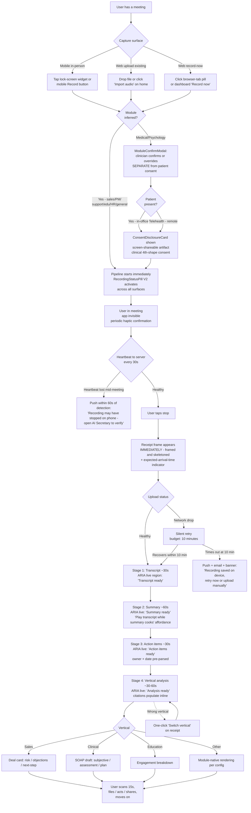
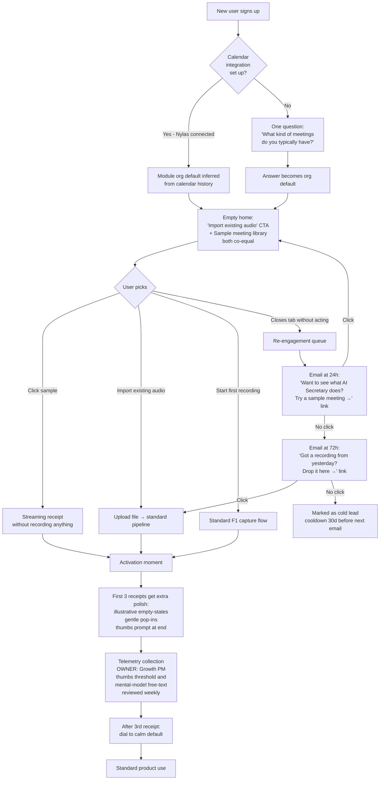
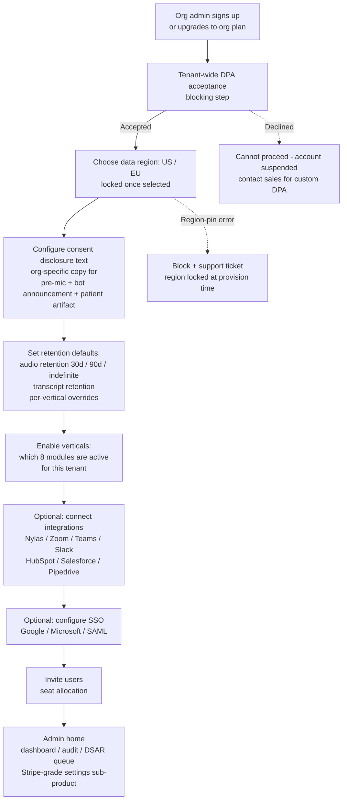
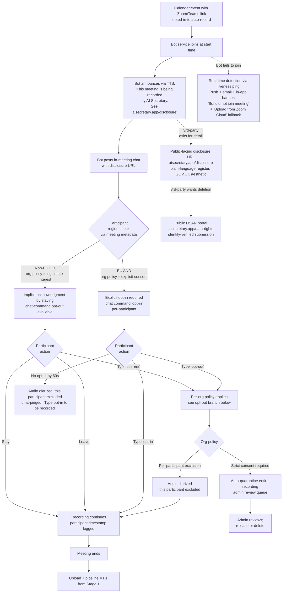
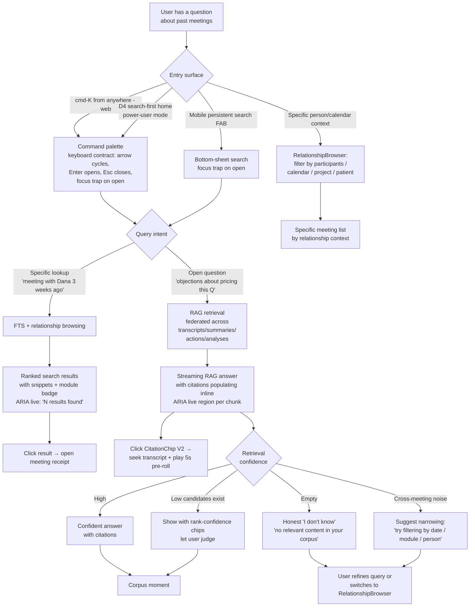
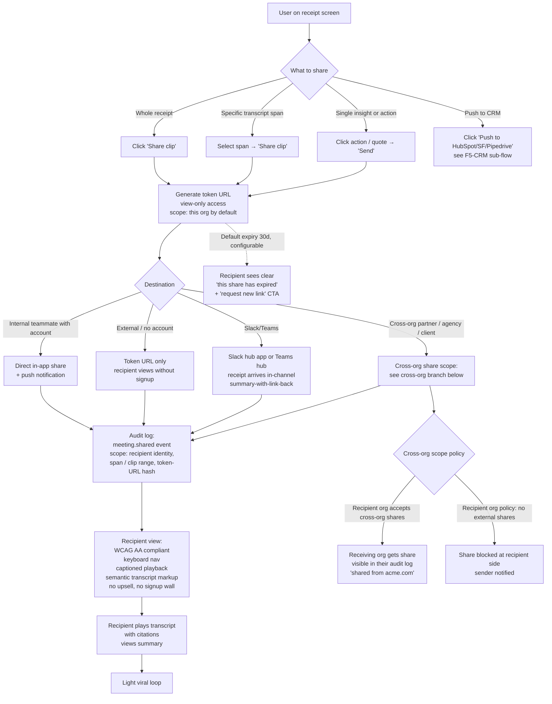
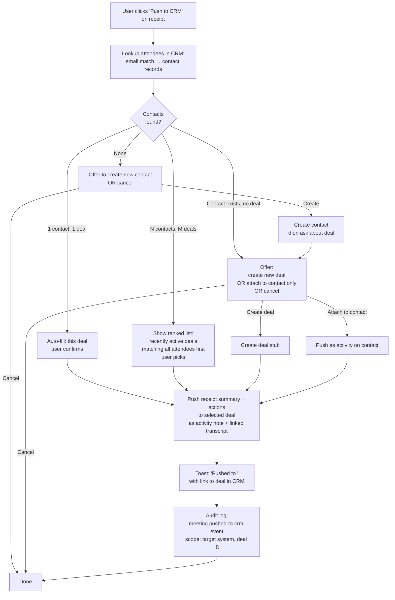

# UX Design Specification — AI Secretary System

**Author:** Anthony
**Date:** 2026-04-29

---

## Executive Summary

### Project Vision

AI Secretary turns any meeting — recorded in person on a phone, on the
desktop, or auto-captured from Zoom/Teams — into a searchable knowledge
asset with vertical-specific AI analysis (sales, HR, education, medical,
support, PM, psychology, general). The wedge against Otter, Fathom,
Fireflies, Upheal, and Granola is the combination of (a) recording works
anywhere, (b) module-config'd vertical analysis, (c) privacy/compliance
posture as Day-1 plumbing, and (d) RAG search + chat across the corpus.

The UX exists to make four moments feel inevitable:

1. **Capture** — start recording with one tap, anywhere
2. **Receipt** — transcript + summary + actions arrive, glanceable
3. **Recall** — search or chat the corpus, get cited evidence
4. **Govern** — admins configure consent, retention, modules, region,
   and process data-subject requests without leaving the product

### Target Users

**Day-1 primary personas (drive defaults, sample data, homepage):**

- **Sales rep / AE** — captures discovery + demo calls, wants
  deal-risk/objections/next-steps, lives in CRM-adjacent workflows
- **Therapist / clinician (psychology + medical/BH)** — captures
  in-office sessions and telehealth, wants SOAP draft, alliance signals,
  risk flags, lives under HIPAA constraints

**Secondary at launch (supported, not the canonical demo):**

- Recruiter / hiring manager (HR module)
- Instructor / TA (Education module + LTI launch)
- Support agent / CS lead (Support module)
- PM / scrum master (PM module)
- **Individual professional / solo user (General module)** — real persona,
  not a fallback. Solo consultants, freelancers, one-person practices.
  See "Single-user mode" under Product Personality.

**Cross-cutting personas — first-class peer spaces:**

- **Org admin** — entitlements, retention, consent disclosure,
  integrations, billing, SSO, audit, DSAR processing. Separate
  `/settings/*` product space.
- **Team lead / supervisor** — AE Director, Clinical Supervisor, CS Lead,
  Department Chair. Aggregated view of team's meetings, analysis trends,
  coaching surface.
- **Third-party meeting participant (non-customer)** — a person whose
  voice is recorded by an AI Secretary user (in-person prospect, Zoom
  participant, patient). Has no account but has rights. Public-facing
  disclosure surface, opt-out flow, DSAR submission portal — reachable
  without authentication, from a known URL referenced in the bot's
  announcement and on a printable disclosure artifact.

### Product Personality

- **Tone (default):** Pro-tool / dense — Linear, Notion, Height school.
  Keyboard-first, information-dense, prosumer. No mascots, no consumer
  marketing copy in-app, no "are you sure?" hand-holding.
- **Tone (vertical adjustment):** Medical and Psychology surfaces relax
  density — longer line-length, more generous whitespace, softer chrome,
  larger touch targets. Same design system, per-vertical density variants.
- **Tone (single-user mode):** Solo / individual users default to a
  reduced-surface app: no team-lead views, no embed/CRM features visible,
  no admin sub-product, no module-pricing CTAs unless the user opts in.
  A toggle in settings ("organization features") reveals enterprise
  surfaces if the user upgrades or joins an org.
- **Privacy posture:**
  - **Routine user flows:** invisible plumbing — no badges, no compliance
    copy, no region indicators in chrome.
  - **Admin surfaces:** region pinning, BAA-eligibility per provider,
    no-training contract status, audit log — visible as admin-facing facts
    auditors can read and export.
  - **Clinical/patient-facing consent:** patient-facing disclosure
    artifact (one-pager, screen-shareable) for therapists to show patients
    before session capture.
  - **In-person third-party consent:** "present-disclosure-to-the-room"
    flow — when a user starts an in-person recording, the recording UI
    can display a QR code or short URL the other party can scan/tap to
    acknowledge. Acknowledgment timestamps recorded alongside the meeting.
    Required when org config flags in-person meetings as needing explicit
    third-party consent.
  - **Non-customer DSAR portal:** public-facing surface at a known URL
    (e.g. `aisecretary.app/data-rights`) reachable without an account.
    Identity verification flow for non-account third parties. Submitted
    requests propagate to the relevant tenant's admin queue with
    cascade-scope preview.
  - **Never** as marketing badges or trust-seal chrome in routine UI.
- **Accessibility (Day-1 non-negotiable):** WCAG 2.2 AA across all user
  surfaces. Section 508 conformance documented for medical/clinical
  surfaces. Three density modes baked in from the start:
  `dense | relaxed | accessible` — `accessible` adds larger type, max
  contrast, looser spacing; auto-applied via OS prefers-contrast and
  prefers-reduced-motion media queries with manual override in settings.
  Voice/dictation is a first-class input on mobile (not a fallback) for
  motor-impairment accessibility AND practical clinician use.
- **Surface scoping:**
  - **Mobile (Expo + PWA):** capture + glanceable summary + lightweight
    authoring (SOAP note edit, action-item check-off, summary edits via
    text OR voice/dictation) + share. Heavy analysis dashboards and RAG
    chat remain web-only with explicit "Open on web →" handoffs.
  - **Web:** full analysis surfaces, RAG chat, advanced search, admin /
    settings / billing / DSAR processing, supervisor / team-lead views.
  - **Embed surfaces:** Chrome extension overlay for CRM (HubSpot,
    Salesforce, Pipedrive); Slack and Teams hub apps that push the
    receipt into team chat. First-class distribution surfaces.
  - **Public-facing surfaces:** disclosure pages and DSAR portal — no
    auth, must be findable from the bot's announcement and from a
    printable disclosure artifact.
  - Recording control parity: a single visual primitive across phone
    lock screen, browser tab pill, bot status row, and embed surfaces.

### Key Design Challenges

1. **Eight verticals, one product, non-overlapping vocabularies.** Solved
   by shared chrome + a strict component contract for analysis output,
   with module-aware content slots.

2. **Three recording mental models in one app** (mobile in-person, web
   upload, bot auto-join). Single recording status primitive across
   surfaces non-negotiable.

3. **Consent has four distinct shapes, each with its own UX:**
   (a) account-holder pre-mic modal,
   (b) bot-announced third-party consent for online meetings,
   (c) in-person third-party "present-to-the-room" disclosure (QR/URL
   the prospect/patient acknowledges),
   (d) clinical patient-facing screen-shareable disclosure artifact.
   Each is distinct; misusing one for another is a privacy bug.

4. **Pro-tool density without eight-module visual chaos.** Hard reusable
   component contract for analysis rendering, defined before module #2.

5. **Per-vertical density adjustment without forking the design system.**
   Density-mode tokens consumed by shared components, not parallel
   component sets.

6. **Three density modes (`dense | relaxed | accessible`) with media-query
   detection and user override.** All three must be designed from the
   start, not retrofitted.

7. **Search and RAG chat compete for screen real estate.** Pick one
   primary pattern (chat-embedded-in-search, peer surface, or sidekick)
   early; mixing creates two half-products.

8. **Org admin + team lead as substantial parallel products.** Each is a
   product space, not a tab.

9. **Action items as a first-class space**, not buried in per-meeting
   views.

10. **Mobile lightweight authoring** with focused single-field editing
    patterns AND first-class voice/dictation input.

11. **CRM / Slack / Teams embed surfaces** native to each host while
    sharing component vocabulary with the standalone app.

12. **Single-user mode vs. enterprise mode without two products.** A
    feature-visibility layer (not a separate codepath) that hides
    team-lead/admin/embed/coaching surfaces by default for solo users.

13. **DSAR cascade preview UX in admin.** When an admin actions a
    deletion request, surface the affected scope ("47 transcripts,
    12 summaries, 3 analyses, 1,200 embeddings — confirm") before commit.

14. **Empty-state IS the conversion battlefield.** The receipt moment
    only sells after a user has a meeting. First-launch design must
    bridge that gap.

### Design Opportunities

1. **The "post-meeting receipt" moment** — instant-glanceable, vertical-
   native (deal card, SOAP draft, engagement breakdown). The screen that
   sells the product.

2. **Recording control parity as a primitive** across mobile lock screen,
   browser tab pill, bot status row, embed surfaces, calendar markers.

3. **Search-first navigation** — cmd-k on web; intentional designed
   mobile peer (persistent search FAB or bottom-tab) so mobile doesn't
   feel stripped down.

4. **Module-native rendering as a positive constraint** — same component
   contract; vertical-fluent labeling, density, content slots.

5. **Action items as a first-class space** — "My Actions" cross-meeting
   roll-up with status, due date, source-meeting backlink.

6. **Sharing as a light viral loop** — read-only token URLs, no signup
   required for view-only.

7. **Admin as a parallel product.** Queryable filterable exportable audit
   timeline. Entitlement grid. DSAR processing queue with cascade-scope
   preview.

8. **Team-lead / supervisor view as a parallel product** — meeting
   roll-ups, analysis trend charts, coaching surface (annotate teammate's
   meeting, share back as feedback).

9. **Embed/distribution surfaces as growth leverage** — Chrome extension
   for CRM, Slack/Teams hub apps. Receipt arrives where users already
   work.

10. **Patient-facing consent artifact** as a clinical-trust asset —
    designed, screen-presentable disclosure differentiator vs. Upheal.

11. **In-person third-party consent flow** — present-to-the-room QR/URL
    the other party scans/taps to acknowledge. Records timestamps
    alongside the meeting. Solves a gap every competitor in this category
    quietly ignores.

12. **Non-customer DSAR portal** — public-facing
    `aisecretary.app/data-rights` for non-account third parties to submit
    deletion/access requests. Identity-verified, propagates to the correct
    tenant. Reputational moat — every other vendor in this space pretends
    third parties don't exist.

13. **Live captioning during recording** — same transcript pipeline feeds
    real-time captions to participants who are deaf or HoH. Accessibility
    win + competitive feature.

14. **Voice/dictation as first-class mobile input** — clinicians edit
    SOAP notes by voice on the way to the next session. Motor-impairment
    accessibility AND practical convenience.

15. **Empty-state activation design** — three explicit elements:
    (a) sample meeting library on first launch (synthetic content only,
    no real recordings of real people),
    (b) "import existing audio" CTA front-and-center on the empty
    homepage,
    (c) locked-module upsell pattern — when a user views a meeting that
    could benefit from a module they don't have, surface an inline "try
    Sales analysis on this meeting" CTA, not a separate billing page.
    Designed for the PRD's 70%-upload-in-7-days activation metric.

16. **Single-user mode** — a deliberately reduced-surface experience for
    solo users (no team-lead views, no admin sub-product, no embed/CRM
    features by default), with a "show organization features" toggle
    for users who join an org or upgrade.

17. **Single recording status primitive** appears on all surfaces — same
    visual language so users always know which meeting is recording where
    and what the bot is doing on their behalf.

## Core User Experience

### Defining Experience

The product has **three co-equal core loops**. Each closes independently —
a user who only captures, only consumes receipts, or only searches the
corpus all get standalone value. Designing all three as equal-rank
priorities is the structural difference from single-loop competitors.

**1. Capture loop** (daily, per meeting)

- Atomic action: start a recording — one tap, anywhere
- Mobile: lock-screen widget, background record, offline capture,
  resumable upload, Bluetooth/USB mic input
- Web: browser-tab record (offline-capable via Service Worker +
  IndexedDB), audio/video file upload, mic input parity
- Bot: auto-joins calendar-scheduled Zoom/Teams meetings (no user UI)
- Module classification: **inferred** from calendar context (event title,
  attendees, prior meetings with same person, org default) for sales /
  PM / support / education / HR / general. **Explicit confirmation
  required at capture time for medical and psychology** — auto-running a
  SOAP draft on the wrong session is a privacy and clinical-quality risk.

**2. Receipt loop** (per meeting, post-capture)

- Receipt streams progressively, not as a single arrival event:
  - Transcript ready (~30s)
  - Summary populates (~60s later)
  - Action items resolved (~30s later)
  - Vertical analysis renders (~30–60s later)
- User can start reading transcript while later stages cook
- Failures surface stage-by-stage rather than waiting for total pipeline
- Vertical-native rendering: same component contract; sales surface
  reads as a deal card, clinical surface as a SOAP note, education as an
  engagement breakdown

**3. Synthesis loop** (cross-meeting, power users + leads)

- Search the corpus — one keystroke away on every surface
  (cmd-k web; persistent search peer on mobile)
- RAG chat with cited evidence
- Supervisor / team-lead rollups (cross-team meeting trends)
- "My Actions" cross-meeting action-item dashboard

### Platform Strategy

**Surface inventory:**

- **Mobile (Expo native + PWA)** — capture-first, glanceable receipt,
  lightweight authoring (text + voice/dictation), share
- **Web** — full surface: capture, all receipt views, RAG chat, advanced
  search, admin/settings/billing/DSAR, supervisor and team-lead views
- **Embed surfaces** — Chrome extension overlay for HubSpot/Salesforce/
  Pipedrive; Slack and Teams hub apps for receipt distribution
- **Public-facing surfaces (unauthenticated)** — disclosure pages and
  third-party DSAR portal at a known URL
- **Bot service (no user UI)** — auto-join Zoom/Teams; consent
  announcement; recording capture

**Platform capability requirements:**

| Capability | Mobile | Web | Notes |
|---|---|---|---|
| Offline capture | required | required | Service Worker + IndexedDB on web; native filesystem on mobile |
| Background recording | required | required | iOS background audio modes + Android foreground service (native); Web Audio API + visibility-aware on web |
| Bluetooth / USB mic input | required | required | Per-platform permission UX |
| Resumable upload | required | required | Survives network drops, app suspension, device reboots |
| Cross-device handoff | implicit | implicit | Account sync; receipt available wherever signed in |
| Voice / dictation input | first-class | supported | First-class on mobile editing surfaces (SOAP notes, action items) |
| Keyboard navigation | n/a | first-class | cmd-k everywhere, ARIA, focus management |
| Touch targets | ≥ 44pt always | ≥ 44pt in `accessible` density | WCAG 2.2 AA |
| Push notifications | required | supported | For capture and bot failures, share invites |

**Interaction model:**

- Mobile: touch-first, voice-supported
- Web: keyboard-first, mouse-supported, voice-supported in editing surfaces
- Embed: inherits host (HubSpot, Salesforce, Slack, Teams)

### Effortless Interactions

Zero-friction by design:

1. **Starting a recording.** One tap from home screen, lock-screen widget,
   browser tab pill, or calendar event. No "what kind of meeting?" modal
   (except medical/psychology). No "name this meeting" prompt. Pipeline
   starts immediately.
2. **Module classification.** Inferred from calendar context. User can
   override before or after. Medical/psychology confirmed at capture.
3. **Naming a meeting.** Auto-named from calendar event, attendee, or
   timestamp. Editable later. Never asked up front.
4. **Resumable upload.** Network drops, app backgrounded, device reboots —
   upload silently resumes when conditions allow. User never sees
   "upload failed" for a recoverable condition.
5. **Calendar context inference.** A meeting on the calendar already
   carries title, attendees, suggested module, expected duration before
   the user clicks record.
6. **Action item assignment.** "Send proposal by Friday" — system parses
   owner ("you") and date ("Friday"). One-tap accept or edit. No date
   picker by default.
7. **Sharing.** Select a transcript span, one-click "share clip." No
   multi-step modal. Recipient views without signup for view-only access.
8. **Search.** Always one keystroke away — type immediately, no field-
   focus latency, no spinner before suggestions appear.

### Critical Success Moments

**Activation moments (must succeed for retention):**

1. **First-launch empty state.** Sample meeting library + import-existing-
   audio CTA. Within 60 seconds the user experiences a receipt without
   having recorded anything. If this fails the user closes the tab.
2. **First recording → first receipt.** User records a real meeting and
   watches the receipt stream in stage by stage. This is "it actually
   works."
3. **First meaningful search.** User types something they remember from a
   past meeting; corpus retrieves it with citation. This is the corpus
   moment — what beats Granola.
4. **First share.** Teammate views the shared clip without signup.
   Outbound velocity moment.
5. **First locked-module CTA.** Inline "try Sales analysis on this
   meeting" surfaces on a meeting that fits. Monetization moment.

**Critical failure modes (designed against):**

| Failure | Severity | UX response |
|---|---|---|
| Background recording silently fails on phone | Catastrophic | Persistent recording-status indicator; haptic + visual confirmation every N minutes that recording is live |
| Receipt arrives wrong-vertical | High | Module confirmation at capture for medical/psychology; one-click vertical override after receipt for others |
| Bot fails to join Zoom mid-meeting | Catastrophic | Push notification + email immediately; in-app banner |
| Upload corrupted / unable to transcribe | High | Push notification; auto-retry; if unrecoverable, surface clearly |
| Consent declined by participant | Variable | Auto-quarantine recording per org policy; admin queue review; **push for clinical**, silent + audit log for sales |
| Analysis slower than expected | Low | Silent in-app indicator; eventual delivery |
| Module analysis low-confidence | Low | Subtle `low confidence` chip on receipt |
| Search returns nothing user expected | Medium | Empty state explains the query that ran; offer "ask the corpus" RAG fallback |

### Experience Principles

1. **Capture is sacred.** Recording must work, must record everything,
   must survive network/battery/app-state. No feature in the product is
   worth a 1% capture failure rate.
2. **Receipt is the product.** The post-meeting screen sells, retains,
   activates. Stream it progressively — motion within seconds.
3. **The corpus is the moat.** Search and chat are first-class peers to
   capture and receipt, not "advanced features." One keystroke from
   anywhere, every surface.
4. **Defaults over decisions.** Don't ask users to classify, name, or
   configure during capture. Infer; let them correct after. *Exception:
   medical/psychology require explicit module confirmation at capture.*
5. **One vocabulary for "a recording is happening."** Single visual
   primitive across mobile lock screen, browser tab pill, bot status row,
   embed surfaces, calendar event marker.
6. **Density adapts to vertical and ability.** Same design system;
   medical/psychology and `accessible` mode get more breathing room.
7. **Search is one keystroke away. Always.** cmd-k on web, persistent
   search peer on mobile, address-bar parity in embed surfaces.
8. **Privacy is plumbing in routine flows; visible where required.**
   Admin surfaces, patient-facing artifacts, public DSAR portal — these
   show privacy facts. Routine UI does not.
9. **Offline is the default assumption, not a degraded mode.** Mobile
   and web both. Network is treated as flaky.
10. **Failures are loud where capture is at risk; silent where quality
    is graceful.** Push for "your recording is in danger." Quiet for
    "your analysis took 5 minutes instead of 90 seconds."

## Desired Emotional Response

### Primary Emotional Goals

**Anchor emotion:** Calm competence — the Linear / Things 3 / Stripe
Dashboard register. Software for serious work that quietly does serious
work, without asking the user to admire it.

**Two co-equal feelings the product produces:**

1. **"This product respects my time"** — efficiency-anchored. One-tap
   capture, instant search, no decisions during capture, no ceremony.
2. **"This product carries the weight for me"** — relief-anchored. The
   meeting is recorded. The notes are taken. The action items are
   extracted. The user can be present in the room and trust the system
   has it handled.

These are not in tension; they reinforce each other. Efficiency is what
makes the relief credible. Relief is what makes the efficiency feel
worth it.

**The emotion at the receipt moment is the product's emotional center.**
When transcript + summary + actions stream in, the user should feel a
small, earned satisfaction — not "wow," not "delight," not
"excitement." Something closer to "good. that's handled." Designed for
repeated use over months, not a single demo moment.

### Emotional Journey Mapping

| Moment | Target emotion | What that requires |
|---|---|---|
| Discovery (marketing site, first impression) | Trustworthy + serious | Restrained design, no growth-hacker tropes |
| First launch (empty state) | Curious + oriented | Sample meeting library; "import existing audio" CTA |
| Starting a recording | **Invisible** (no emotion) | One tap, zero modals, app disappears; user attends to the meeting |
| Mid-recording status check | Quietly reassured | Glance-able status pill; no anxiety needed |
| Receipt streaming in | Relief + small validation | Progressive arrival; vertical-native rendering |
| Editing summary / actions | Focused | Single-field-at-a-time on mobile; keyboard-fluent on web |
| First search hit | Quiet satisfaction | Sub-2s response; cited evidence |
| RAG chat reply | Trusted (cites > confidence) | Citations always; "I don't know" beats hallucination |
| First share | Generous + competent | Recipient view loads instantly; no signup friction |
| Returning to use it again | Reassured of continuity | "My Actions" surfaces what's open; receipt of last meeting still glance-able |
| Admin / governance surfaces | In command | Auditor-grade transparency; queryable everything |
| Capture-at-risk failure | **Empowered** | Clear what happened + clear what to do; no catastrophizing |
| Graceful failure (slow analysis) | Informed without alarm | Subtle indicators; no banners, no toasts |
| Locked-module CTA | Tempted, not pressured | Inline contextual nudge; never an interruption |
| Patient-facing consent (clinical) | Respected + informed | Plain language; explicit rights; readable in <60 seconds |
| Third-party DSAR portal | Heard + helped | Public, no auth, plain language, fast resolution path |

**Vertical emotional adjustment.** Clinical surfaces (medical and
psychology) carry a calmer, slower, more deliberate register than the
rest. Pacing is gentler; copy is more reflective; transitions are softer.
Sales / PM / support / education / HR / general hold the snappier default
register. Implementation: same components, density-mode and motion-mode
tokens differ.

### Micro-Emotions

**Critical to manage (per moment):**

- **Confidence vs. Confusion** — most acute at first-launch and at the
  empty-state-after-signup; resolved by sample meeting library + crisp
  navigational IA.
- **Trust vs. Skepticism** — most acute at consent surfaces, in admin
  governance, and on the public DSAR portal; resolved by being
  helpful and specific instead of vague-and-friendly.
- **Accomplishment vs. Frustration** — most acute at action-item check-
  off and the receipt moment; resolved by zero-friction completion and
  fast streaming receipt.
- **Reassurance vs. Anxiety** — acute during recording (is it working?)
  and during multi-minute analysis pipelines; resolved by persistent
  status indicators and stage-by-stage receipt streaming.
- **Belonging vs. Isolation** — acute on team-lead and supervisor
  surfaces (is my coaching landing?), and in the share-with-teammate
  flow; resolved by lightweight inbound feedback patterns.

**Critical to avoid (product-wide):**

- **Anxiety** about whether recording is working
- **Suspicion** about privacy or data movement
- **Surprise** in the bad sense — wrong-vertical analysis, unexpected
  charges, lost data
- **Coercion** — especially for third-party participants
- **Fatigue** — too much chrome, too many decisions, too much navigation
- **Awe / "delight"** — feels off-brand for the audience and category

### Design Implications

**Calm competence** →
- Restrained palette (one accent color, monochrome elsewhere)
- Generous whitespace despite "dense" tone — density without clutter
- Typographic hierarchy carries weight, not chrome
- No celebratory animations on routine actions

**Efficiency** ("respects my time") →
- One-tap capture from every surface
- cmd-k everywhere; persistent search peer on mobile
- Inferred defaults (module, name, calendar context)
- Keyboard fluency — every action keyboard-reachable

**Relief** ("carries the weight") →
- Streaming receipt arrival — motion within seconds, complete in minutes
- Persistent recording-status primitive across surfaces
- Resumable upload that never asks the user to handle network issues
- Action items pre-parsed with owner and date; one-tap accept

**Empowerment at failure** →
- Capture-at-risk failures: push notification + email + in-app banner
  with specific next action
- Clear distinction between "your recording is in danger" (loud) and
  "this analysis is slower than usual" (quiet)
- Auto-retry pipelines invisible to user when recoverable

**Genuinely-helpful third-party surfaces** →
- Public DSAR portal: plain language, no legalese, fast resolution
- Patient-facing disclosure: readable in 60 seconds, screen-shareable
- Bot consent announcement: short, specific, points to a URL with more

**Vertical emotional adjustment** →
- Clinical surfaces: relaxed density tokens + softer motion + reflective
  copy + larger touch targets
- Other verticals: dense default + snappier motion + efficient copy

**Where micro-delight is allowed (earned, sparing):**
- Receipt streaming-in animation (motion, not loading)
- First-encounter empty states with dry, knowing copy
- Successful share — recipient view loads instantly, feels generous
- Action-item check-off — small haptic on mobile, crisp visual on web
- cmd-k first-keystroke responsiveness

**Where micro-delight is forbidden:**
- Confetti, animated mascots, celebratory toasts on routine actions
- "Great job!" / congratulatory copy
- Skeumorphic flourishes
- Loading spinners as "personality" — loading is a failure to be hidden

### Emotional Design Principles

1. **Calm beats clever.** When in doubt, choose the quieter option.
2. **Trust is earned by working, not by saying so.** No badges, no trust
   seals, no "we care about your privacy" copy in routine flows.
3. **The receipt moment is the emotional anchor.** Spend disproportionate
   craft on the post-meeting screen. It is what the product feels like.
4. **Failure UX has more impact than success UX.** Designing the failure
   modes is designing the trust.
5. **Helpful > friendly on third-party surfaces.** The patient consent
   page and public DSAR portal are reputation surfaces. Make them
   genuinely useful, not warmly written.
6. **Clinical pace differs from operational pace.** Same product, two
   tempos. Encoded in motion and density tokens, not in copy or chrome.
7. **Delight is earned, never gratuitous.** A handful of designed
   moments at moments of genuine accomplishment. None elsewhere.
8. **Empowerment over reassurance at capture-risk failures.** Tell the
   user what happened and what they can do. Don't tell them not to
   worry.
9. **Invisible during capture.** The product's most successful state
   during a recording is the user forgetting it's there.

## UX Pattern Analysis & Inspiration

### Inspiration Hierarchy — North Star + Delegated Lighthouses

We don't visually quote ten products at once. We anchor to **Linear** as
the overall aesthetic North Star, then delegate specific surfaces to
specific reference products. Patterns from elsewhere are *adapted*, not
visually quoted.

**North Star (overall aesthetic and interaction tempo):**

- **Linear** — the reference for pro-tool dense aesthetic. Restrained
  palette, monochrome with one accent, dense lists with progressive
  disclosure, keyboard-first nav, motion as confirmation not decoration.

**Delegated lighthouses (each owns a surface):**

| Surface | Reference | What it owns |
|---|---|---|
| Admin / settings sub-product | **Stripe Dashboard** | Queryable / filterable / exportable everything; left-nav settings IA; monospace IDs; audit-log craft |
| Corpus search | **Glean** | Federated retrieval across content types; rank-confidence indicators; search-as-home for power-user mode |
| RAG chat | **Perplexity** | Citations always; streaming response; "I don't know" pattern; source-card UI |
| Receipt screen (the emotional anchor) | **Granola** | Disproportionate typographic craft; ambient capture; paragraph-style summary; anchor-link-from-any-phrase |
| Mobile capture | **Apple Voice Memos** | One-tap, ambient waveform, lock-screen control, background handling |
| Public-facing surfaces (consent, DSAR, disclosure) | **GOV.UK Design System** | Plain-language register; accessibility-first defaults; form-driven submission patterns |

**Adapt-from references (specific patterns only, not visual identity):**

- **Things 3** — natural-language date parsing for action items;
  cross-context views ("My Today / Upcoming")
- **Notion** — block-level granularity for transcript anchoring +
  inline commenting
- **Loom** — frictionless recipient view (no signup); timestamp-anchored
  clip URLs; clean upsell-free recipient page

**Granola-grade craft on the receipt — a stated commitment.** The
post-meeting receipt is the product's emotional anchor. We commit to
the level of disproportionate design investment that Granola made on
their note view: more cycles, more prototypes, more hand-tuning than
any other surface in the product. Other surfaces inherit the design
system. The receipt is hand-finished.

### Competitor Study — what NOT to do

| Competitor | Anti-pattern to avoid |
|---|---|
| Otter | Search buried; single-account model; unreliable mobile background recording; **timestamp-only IA with no people-and-relationship browsing** |
| Fathom / tl;dv | Zoom-only mental model leaks into IA; in-person impossible; **post-call email becomes the product, eroding app engagement** |
| Fireflies | Sales-only assumption baked into copy and structure |
| Gong | "Shouting" coaching dashboards; metrics-first home; manager surfaces feel surveillance-y |
| Upheal | Single-vertical lock-in; no admin sub-product |
| Read.ai | Closed analysis; trust-seal / privacy-badge bloat |

### Transferable UX Patterns

**Navigation patterns**

- **cmd-k command palette** as primary navigation on web (Linear, Notion,
  Slack). Type-ahead, fuzzy-matched, scoped by context.
- **Search-as-home** option for power users (Glean) — settings toggle.
- **Left-nav settings sub-product** for admin (Stripe).
- **Designed mobile search peer** — bottom-tab or persistent FAB; not a
  ported cmd-k.
- **People-and-relationship browsing** — meetings indexed by
  participants, calendar context, project / deal / patient-as-applicable.
  cmd-k handles known queries; this handles "the call with Dana three
  weeks ago about the integration." Otter's worst gap is its absence.

**Capture patterns**

- **Ambient recording UI** — Voice Memos / Granola style. No oversized
  RECORD button.
- **Waveform as breathing confirmation** during recording (Voice Memos).
- **Lock-screen / browser-tab-pill control parity** — single visual
  primitive across surfaces.
- **One-tap from anywhere** — calendar event, mobile widget, browser
  pill, embed surface.
- **Live note-taking parallel to recording** — user types or voice-
  dictates their own notes alongside the transcript pipeline; user
  notes are merged into the receipt as a distinguishable layer, not
  collapsed into the transcript. Granola's secret weapon.

**Mobile capture parity is three engineering problems, not one.** The
spec acknowledges that mobile capture parity is **iOS native + Android
native + PWA**, each with platform limits — iOS audio entitlement and
background-mode declaration, Android API-34 foreground-service rules,
service-worker time-limits for Web Audio in PWAs. Parity is a target,
not a guarantee. Where platforms diverge, divergences are explicit in
the UX (e.g. PWA recording surfaces a "keep this tab open" indicator),
not papered over.

**Receipt patterns**

- **Granola-grade typographic craft** on the post-meeting screen —
  committed.
- **Streaming arrival** (Perplexity) — transcript → summary → actions →
  analysis populate stage by stage.
- **Module-native rendering** — sales = deal card, clinical = SOAP
  draft, education = engagement breakdown. Same component contract,
  different content density and labels.

**Recall patterns**

- **Citations always** (Perplexity) — every claim links to a transcript
  span.
- **Citation interaction requirements** — citations anchor at speaker-
  turn granularity with millisecond timestamps; click → transcript seeks
  to span and plays ~5s pre-roll. Three distinct retrieval empty-states:
  *retrieved nothing*; *retrieved low-confidence candidates* (shown with
  rank-confidence chips for user judgment); *retrieved across
  irrelevant meetings* (suggest narrowing). Detailed interaction craft
  defined in subsequent epic/story workflow steps; this section sets
  the requirement.
- **Federated search** across transcripts, summaries, actions, analyses
  (Glean).
- **"I don't know" beats hallucination** — explicit refusal pattern.
- **Streaming chat replies** with running citations.

**Productivity patterns**

- **Natural-language date parsing** for action items (Things 3) —
  "by Friday" pre-resolved to a date.
- **"My Actions" cross-meeting roll-up** (Things 3 "Today / Upcoming").
- **Quick-add from anywhere** (Linear, Things).

**Sharing patterns**

- **Loom-style recipient view** — no signup, view-only by token URL.
- **Timestamp-anchored clip URLs** — `/meetings/abc#t=14:32-15:08`.
- **Clean recipient page** — no upsell, no signup wall, no banner.
- **Outbound emails are summary-with-link-back, never replacement.**
  Receipt digests, share notifications, weekly rollups — all drive back
  to the app. The email shows enough to know what to act on; never
  enough to make the app redundant. Counter to Fathom's email-as-product
  anti-pattern.

**Admin patterns**

- **Stripe-grade audit log** — queryable, filterable, exportable.
- **Settings as a sub-product** with own IA — overview, left-nav,
  dashboard surfaces.
- **Monospace for IDs / data fields.**

**Public-facing patterns**

- **GOV.UK plain-language register** — short sentences, clear headings,
  no marketing tone.
- **Apple Privacy Nutrition Label aesthetic** for "what's recorded /
  where it goes" disclosure.
- **Form-driven DSAR submission** with status updates by email + portal
  check-back link.

**Failure UX patterns**

- **Stripe-style empowered failure messaging** — what / why / what to
  do; one-click action where possible.
- **Linear-style quiet recovery** — auto-retry without user noise;
  escalate only when user action is required.

### Anti-Patterns to Avoid

1. **Trust-seal bloat** — "Your data is safe 🔒" badges, "We care about
   your privacy" copy in routine flows.
2. **Celebratory / confetti UX** on routine completion.
3. **Over-friendly copy** — "Oops!", "Hey there!", "🎉 Congrats!".
4. **Notification anxiety patterns** — Slack-style all-or-nothing.
5. **Settings-page bloat** — unsearchable, unfilterable, no audit trail.
6. **Surveillance aesthetics** on team-lead / supervisor views.
7. **Module color-coding** — vertical = icon and label, never hue.
8. **Modal-driven onboarding** — coach marks, blocking tooltips.
9. **"AI" as feature, not substrate** — bolted-on `✨ AI` buttons.
10. **Forced disclosure interstitials** that block recording start.
11. **Search hidden behind a tab or icon** (Otter).
12. **Single-account assumption** that doesn't carry team / sharing
    surfaces (Otter, Granola).
13. **Single-vertical lock-in** (Upheal, Fireflies). Vertical is config.
14. **Closed analysis** (Read.ai). Every score must show citations.
15. **Zoom-only mental model leaking into IA** (Fathom).
16. **Email-as-product surface** (Fathom). Outbound emails always link
    back; never sufficient on their own.
17. **Timestamp-only meeting IA** (Otter). People + relationships are
    first-class indices.

### Design Inspiration Strategy

**Adopt directly** (the pattern as-is, in our visual language):

- Linear's cmd-k + keyboard-shortcut discoverability (web nav primary)
- Granola's receipt screen craft (post-meeting screen — emotional
  anchor; disproportionate investment committed)
- Loom's frictionless recipient view (sharing flow)
- GOV.UK's plain-language register (consent surfaces, DSAR portal,
  patient-facing disclosure)
- Apple Voice Memos' lock-screen + ambient capture pattern (mobile
  capture, with explicit acknowledgment that parity across iOS / Android
  / PWA is three engineering problems)
- Perplexity's citations-always pattern (RAG chat replies; citation
  interaction craft per requirements above)

**Adapt** (right idea, modify for our scope):

- Things 3's natural-language date parsing → action-item assignment
  with one-tap accept
- Stripe Dashboard's admin-as-product → AI Secretary's `/settings/*`
  sub-product
- Glean's search-first home → optional power-user mode (settings toggle)
- Notion's block-level editing → transcript anchoring and inline
  commenting (smaller scope)
- Stripe's audit-log craftsmanship → AI Secretary's audit log + DSAR
  queue + entitlements grid

**Avoid** the 17 anti-patterns above, enforced through:

- Repo-level CLAUDE.md guardrails for AI-agent contributions
- Component contract for analysis output rendering — vertical-aware
  via icon + label + density, never via color
- Copy-deck conventions documented before module #2 ships
- Empty-state and onboarding designed without modals or coach marks

### Design System Discipline Rule

**If a vertical difference can't be expressed as a density token, motion
token, color token, or a module-config layout slot, it lives in module
config — not in component code.**

This is the discipline that prevents module-native rendering from
drifting to bespoke layouts by the end of Q1. Enforced through:

- Component contract for analysis output (defined before module #2 ships)
- Code review and design review on any new module
- Linting rules where a module-specific component creates a path that
  doesn't fit the contract

## Design System Foundation

### Design System Choice

**Web (locked by architecture, customized per UX strategy):**

- **Component primitives:** shadcn/ui (Radix primitives + Tailwind CSS),
  copied into the repo and edited in place per shadcn philosophy
- **Icons:** lucide-react
- **Charts:** Recharts
- **Component library tooling:** Storybook (or Ladle) hosting all
  custom components with density / motion / module-config variants

**Mobile (Expo + React Native):**

- **Component primitives:** NativeWind (Tailwind on RN) +
  react-native-reusables (shadcn-shaped components for RN)
- **Icons:** lucide-react-native
- **Animations:** react-native-reanimated (motion-mode-aware)
- **Component preview tooling:** **both** — Storybook for React Native
  for component-level review, plus native iOS/Android simulator preview
  for full-fidelity device behavior (background recording, lock-screen
  controls, voice/dictation surfaces)

**Typography (web + mobile):**

- **UI / Body / Headings:** Geist (variable font, all weights)
- **Monospace:** Geist Mono (matched pairing for IDs, audit log entries,
  timestamps, citation chips)
- **Marketing site:** system stack

**Accent color (locked):** **Indigo** — `#4f46e5` in light mode,
`#6366f1` in dark mode (slight shift for contrast). Pro-tool register,
Linear-adjacent without copying, passes WCAG AA against both surface
backgrounds, complements Geist's modern grotesque character. Single
accent product-wide; modules differentiated by lucide icon and label,
never by hue (anti-pattern from Step 5).

**Theme modes (all three user-selectable, persisted per user):**

- **System** — default; follows OS `prefers-color-scheme`
- **Light** — explicit user choice
- **Dark** — explicit user choice
- Settable in `/settings/profile`

**Density modes (programmatic, vertical- and ability-aware):**

- `dense` — default for sales / PM / support / education / HR / general
- `relaxed` — applied on medical and psychology surfaces
- `accessible` — auto-applied via OS `prefers-contrast: more` and
  `prefers-reduced-motion: reduce`; user override in settings

**Motion modes (motion- and ability-aware):**

- `default` — snappy easing, ~150–250ms transitions
- `gentle` — applied to clinical surfaces; softer easing, ~250–400ms
- `reduced` — motion suppressed except essential confirmations; respects
  OS `prefers-reduced-motion`

**Accessibility precedence rule (locked):**

> **User explicit choice > OS preference > vertical default.**

If a user with `prefers-contrast: more` is auto-applied to `accessible`
mode but explicitly chooses `dense` in settings, their explicit choice
wins. Persisted across sessions and devices via account profile.
Silently overriding accessibility preferences is a worse failure than
not having the modes.

### Rationale for Selection

**Why shadcn + Tailwind on web:**

- Locked by architecture; consistent with [`CLAUDE.md`](../../CLAUDE.md)
  anti-patterns (no inline styles, no styled-components, no MUI/Material).
- Code-owned components = unlimited customization without fighting a
  package; matches the pro-tool / Linear-tier aesthetic.
- Radix primitives carry accessibility wins out of the box; serves the
  WCAG 2.2 AA Day-1 commitment.
- Pairs naturally with TanStack Router, react-hook-form + zod, etc.

**Why NativeWind + react-native-reusables on mobile:**

- Tailwind class vocabulary mirrors web — single mental model, lower
  cognitive overhead for AI agents and humans.
- react-native-reusables is shadcn-shaped — recipes translate near-1:1.
- Avoids Tamagui's separate design language and gluestack-ui's smaller
  community.

**Why Geist + Geist Mono:**

- Modern grotesque, excellent at small sizes, slightly more current
  character than Inter without leaving the calm-competence register.
- Matched mono pairing simplifies audit logs, IDs, timestamps,
  citation chips, code-style displays.
- Free, distributed via Google Fonts; zero licensing complexity across
  all surfaces.
- Excellent French diacritic coverage for the Day-1 EN/FR locale.
- Tradeoff accepted: associated with Vercel; we adopt the typeface,
  not the Vercel design language.

**Why indigo accent (`#4f46e5` / `#6366f1`):**

- Pro-tool register — saturated enough to read as serious, restrained
  enough to avoid "tech-bro electric blue."
- Linear-adjacent without being a Linear copy.
- Passes WCAG AA against both light (`#fafafa`) and dark (`#0b0b0d`)
  surface backgrounds at body-text sizes.
- Reads acceptably with Geist; not visually competitive.
- Distinct from danger red and success green; can carry both the
  primary CTA and the recording-active indicator without ambiguity.

**Why three theme + three density + three motion modes:**

- Vertical and ability differences expressed as tokens, not bespoke
  components (the discipline rule from Step 5).
- `accessible` mode auto-applied via OS preferences satisfies WCAG 2.2
  AA Day-1 without requiring user opt-in.
- `gentle` motion satisfies the Step 4 vertical emotional adjustment
  for clinical surfaces.

### Token Architecture

**Source of truth:** `packages/design-tokens/tokens.json` (or YAML).
Every token named, with purpose and consumer documented in
`packages/design-tokens/README.md`. Tokens without a consumer are
pruned at quarterly review.

**Build pipeline:** Style Dictionary (or equivalent custom transformer)
emits platform-specific consumables:

- `tokens.css` — CSS variables for web (consumed by Tailwind config)
- `tokens.tailwind.js` — Tailwind theme extension
- `tokens.native.ts` — typed JS objects for RN / Reanimated / native
  components

Build runs in CI; broken token references fail the build.

**Color contrast as a build-step gate:** the token build runs every
defined foreground/background pair through a WCAG AA contrast check
(4.5:1 for body text, 3:1 for large text). Build fails if any defined
pair regresses below threshold. Prevents the silent palette drift that
happens when monochrome + soft-color products move to dark mode.

**Variant architecture:** themes are **CSS variable scopes** (top-level,
e.g. `:root`, `.theme-dark`, `.theme-light`); density and motion are
**mode classes** that override scoped variables. Three themes × three
densities × three motion modes = 27 combinations *without* encoding all
27 as Tailwind variants — orthogonal scopes compose at runtime.

**Token surface (named, all density-/motion-/theme-aware where
applicable):**

```
Color
  --color-bg, --color-surface, --color-fg, --color-muted,
  --color-accent, --color-accent-fg, --color-border,
  --color-success, --color-warning, --color-danger,
  --color-disabled-bg, --color-disabled-fg

Spacing & layout
  --space-0..8
  --radius-sm/md/lg
  --container-sm/md/lg/xl

Typography
  --font-sans, --font-mono
  --text-xs..3xl
  --leading-tight/normal/loose
  --tracking-tight/normal/wide

Motion
  --motion-fast/base/slow
  --easing-default/gentle/reduced

Elevation & layering
  --shadow-sm/md/lg
  --z-base, --z-elevated, --z-sticky, --z-overlay,
  --z-modal, --z-popover, --z-toast, --z-recording-status

Focus
  --focus-ring-color, --focus-ring-width, --focus-ring-offset

Disabled
  --opacity-disabled
```

### Implementation Approach

**Build sequence (precedes feature work):**

1. **Foundational tokens** — colors, type ramp, spacing, radii,
   shadows, motion, z-index, focus, disabled. Locked first; everything
   depends on them.
2. **Token build pipeline online** — Style Dictionary configured;
   `tokens.css` / `tokens.tailwind.js` / `tokens.native.ts` generated
   in CI; contrast-check gate enforced.
3. **`AnalysisCard` component contract authored before module #1
   (general).** General is written *against* the contract; the contract
   does not emerge from general's accidental shape. Contract documents:
   prop API, density-mode behavior, module-config layout slots,
   citation rendering, low-confidence states, empty states.
4. **`RecordingStatusPill` built first** among custom components — it's
   referenced from every other surface (mobile lock screen, browser
   tab pill, bot status row, embed surfaces). Without it, every feature
   mocks its own version.
5. **Web shadcn customization pass** — every default component
   re-themed before any feature work depends on it.
6. **Mobile DS bootstrap** — NativeWind + react-native-reusables
   installed; tokens consumed from the same shared package.
7. **Storybook (web) and Storybook RN online** — every custom
   component visible with all density / motion / module-config
   variants, before features depend on them. Native simulator preview
   for full-fidelity device behavior runs alongside.
8. **Per-component build-out in step with feature stories** — recording,
   receipt, search, RAG chat, admin, etc.

**shadcn customization-tax acknowledgment (track-upstream):**

We will track shadcn upstream rather than pin, on the assumption that
~15% of frontend time will be allocated to keeping the customized base
in sync with shadcn + Radix updates. Radix accessibility improvements
land continuously; pinning means stagnating on those wins. The trade-off
is real ongoing work; budget for it in sprint capacity, not "we'll get
to it."

### Customization Strategy

**Approach: shadcn-as-base, customized per the inspiration hierarchy.**

- shadcn components copied into the repo (per shadcn philosophy), every
  primitive editable.
- Initial customization pass: tighten densities, override palette to
  monochrome + indigo accent, replace motion curves, swap typeface,
  drop default friendly defaults (rounded corners, generous padding)
  for Linear-tier density.
- **Success criterion:** *visually unrecognizable from default shadcn,
  structurally identical.*

**Custom components on top of shadcn primitives:**

> *Note on count: 16 components are listed below as the foundational
> Day-1 set. Real production count is expected to reach 40+ by end of
> Q2 as features ship. Storybook + token foundation MUST be online
> before more than ~5 features are in flight, not after.*

| Component | Purpose | Built on |
|---|---|---|
| `RecordingStatusPill` ★ first | Single recording-status primitive across surfaces | shadcn `Badge` + custom motion |
| `ReceiptStreamLayout` | Granola-grade receipt screen — disproportionate craft | custom; built atop Tailwind grid |
| `AnalysisCard` ★ contract first | Module-aware analysis output — the component contract; locked before module #1 (general) | shadcn `Card` + module config slots |
| `CitationChip` | Inline citation with click-to-seek | shadcn `Tooltip` + custom |
| `TranscriptSeekPlayer` | Click-citation → seek transcript + play 5s pre-roll | custom audio player |
| `AuditLogTable` | Stripe-grade queryable / filterable / exportable | shadcn `DataTable` + filters |
| `DsarQueueItem` | DSAR cascade-scope preview | shadcn `Card` + scope badges |
| `EntitlementGrid` | Module entitlement matrix | shadcn `Table` |
| `RelationshipBrowser` | People / calendar / project-indexed nav | shadcn `Command` + custom IA |
| `LiveNoteEditor` | Parallel user notes during recording | custom rich-text on shadcn `Textarea` |
| `ModuleConfirmModal` | Capture-time confirmation for medical / psychology | shadcn `Dialog` |
| `ConsentDisclosureCard` | Clinical patient-facing screen-shareable artifact | custom layout |
| `ManagerCoachingCard` | Team-lead annotation + share-back surface | custom |
| `ShareRecipientView` | Loom-style auth-free recipient page | minimal custom |
| `EmptyStateRecipient` | First-launch sample meeting library + import-audio CTA | shadcn `Card` + Recharts |
| `VoiceInputSurface` | Dictation surface for mobile editing — record button, transcription-feedback states, error/permission states | custom; mobile-first |

★ = build first / contract first per party-mode input.

Each component documented with: prop API, density-mode behavior,
motion-mode behavior, accessibility requirements (focus management,
ARIA, keyboard nav), module-config slots (where applicable). All
variants visible in Storybook (web) + Storybook RN before features
consume them; native simulator preview alongside for device-fidelity
behaviors.

**Enforcement — how the system stays disciplined:**

- Repo-level [`CLAUDE.md`](../../CLAUDE.md) guardrails (no inline
  styles, no styled-components, no direct provider SDK imports)
- Biome + custom lint rules to flag bespoke component creation outside
  the contract
- Code review and design review on any new module-specific component
- Token build CI gate (broken refs + contrast regressions fail the
  build)
- Quarterly token-pruning review — remove tokens without consumers
- Discipline rule (from Step 5): *"if a vertical difference can't be
  expressed as a density / motion / color token or a module-config
  layout slot, it lives in module config — not in component code"*

## Defining Core Experience

### Defining Experience

**The defining interaction is Capture → Receipt.**

> *"Hit record. Walk into your meeting. Come out. Your receipt is
> waiting — glance, file, act."*

Not "transcription happens." Not "you take notes." A **receipt** —
a completed, structured, actionable artifact that lands when the meeting
ends. The atomic interaction that, if nailed, makes everything else
follow. The longer-arc value driver is Recall (corpus search and RAG
chat), but the *defining* interaction is the receipt landing.

> **Word choice is provisional.** "Receipt" carries a slight proof-of-
> payment association in English (and *reçu* in French) that may fight
> the intended *completed-and-actionable* framing. Before launch, run
> a 5-person card sort on whole-phrase usage:
> *"I'll have my [receipt / brief / debrief / dossier / wrap] in three
> minutes."* Candidates: **brief** (legal/intelligence register),
> **debrief**, **dossier** (loans cleanly to French; close to the
> framing), **wrap**, **recap**.
>
> **Per-vertical wording is allowed.** Clinical surfaces may use
> *session note* / *compte rendu*; education may use *recap*; sales /
> PM / support may use whichever single word the card sort picks. The
> *concept* — completed, structured, actionable artifact — is the
> product anchor; the *word* may vary per vertical so it lands native
> in each domain.

### User Mental Model

The mental model is engineered through the anchor word and the streaming
arrival pattern.

| Competitor | Mental model | Anchor word |
|---|---|---|
| Otter | "Transcription happens, then I have to find what I want" | *transcript* |
| Granola | "I capture the call, I get a beautiful note" | *note* |
| Fathom | "After the meeting, I get an email summary" | *summary* |
| **AI Secretary** | **"After the meeting, my [receipt] is waiting"** | **receipt** (provisional) |

**Mental-model expectations users carry in:**

- *From mobile recorders (Voice Memos):* one-tap start, ambient
  feedback, background-safe.
- *From streaming AI products (Perplexity, ChatGPT):* progressive
  arrival, citations on claims, streaming feels alive.
- *From productivity tools (Things 3, Linear):* natural-language date
  parsing, cross-context views, keyboard fluency.
- *From competitors:* expectation that the receipt is a transcript or
  note — we deliberately reframe to differentiate.

**Where users get confused (designed against):**

- "Did the recording actually start / is it still running?" — solved by
  the persistent `RecordingStatusPill` primitive across all surfaces +
  periodic haptic confirmation on mobile.
- "Why is my receipt empty for 30 seconds?" — solved by streaming
  arrival; the receipt frame is present immediately, content streams
  into named slots.
- "Is the action item assigned to me?" — solved by Things 3-style
  natural-language parsing of owner + date with one-tap accept/edit.
- "Why is this analysis a sales pitch when my meeting was clinical?"
  — solved by explicit `ModuleConfirmModal` at capture for medical and
  psychology; one-click vertical override on receipt for others.

**Mental-model validation in onboarding.** First three uses, collect
one telemetry data point after the receipt arrives:

> *"In one sentence — how would you describe what you just got from us?"*

Free-text. The aggregated answers tell us whether our framing
(*receipt / brief / debrief / session note*) is landing in users'
heads. If a substantial fraction describe it differently, the framing
needs revisiting — language is product positioning, and this is the
cheapest way to validate.

**Customer-development interviews recommended pre-launch.** 5–10
interviews per primary persona (sales rep, therapist) and per cross-
cutting persona (org admin, team lead). Goal: validate the receipt's
*content shape* matches actual jobs-to-be-done. Recommended, not gating.

### Success Criteria

The defining experience succeeds when:

| Criterion | Sales / PM / Support / Education / HR / General | Medical / Psychology |
|---|---|---|
| Time-from-stop to first-streamed-content | <30s for 30-min audio | <60s acceptable |
| Time-from-stop to summary-readable | <90s | <5 min acceptable |
| Time-from-stop to full receipt | <3 min (per PRD §5) | <30 min acceptable |
| Receipt scan-to-comprehend time (user-side) | <15s for non-clinical surfaces (verified) | <60s for clinical SOAP draft |
| Module-correct without user override | ≥95% | ≥99% (explicit confirm at capture) |
| Action items correct (owner + date pre-parsed) | ≥80% | n/a (clinical sessions don't generate action items in this sense) |
| Recording reliability across all platforms | ≥99% | ≥99% |
| Resumable upload (transient network failure) | 100% recoverable | 100% recoverable |
| Citation accuracy (every claim links to span) | 100% | 100% |

**Per-vertical timing differentiation.** Sales rep wants to send a
follow-up email; sub-3-min arrival matters. Clinician will finish the
SOAP note tomorrow morning between sessions; <30 min is acceptable.
Use the spare cycles on clinical pipelines for higher-quality output
(better speaker diarization, additional clinical-quality checks),
not for speed nobody asked for.

**15-second scan time as a measured target, not asserted.** Verification
methodology, run before public launch and at each major receipt-screen
revision:

- Self-report study, N ≥ 10 users per primary vertical
- Method: user reads receipt, closes laptop, narrates back what they
  remember
- Median scan-to-comprehend time recorded; passing target = <20s
- Optional eye-tracking if budget allows; not required for V1

**Subjective success indicators:**

- The user feels *"good. that's handled."* (calm-competence anchor
  emotion from Step 4) — not "wow," not "delight."
- The user files / acts on the receipt within 60 seconds of arrival
  without re-watching the meeting.
- The user shares a clip or summary with a teammate within their first
  three uses.
- The user doesn't think about whether recording is working — invisible
  during capture per Step 4.

### Novel UX Patterns

**Established patterns we ride on (familiar to users; no education
needed):**

- One-tap recording with ambient waveform feedback (Voice Memos)
- Streaming AI response (Perplexity, ChatGPT)
- cmd-k navigation (Linear, Notion)
- Toast-style notifications and shadcn primitives
- Things 3-style natural-language date parsing for action items
- Loom-style frictionless share recipient view

**Novel-for-this-category patterns (light user education):**

- **Receipt as mental-model anchor** (provisional word) — replaces
  *transcript / note / summary*. Validation: card sort + onboarding
  mental-model question.
- **Streaming progressive receipt with explicit user benefit.** The
  user already waited for the meeting to end; streaming has to *earn*
  its complexity. We surface the value clearly: *"play transcript while
  summary cooks"* — a designed affordance, not just a UX flourish.
  Listen back to the part you missed while AI is processing the rest.
  Streaming feels like value, not incomplete.
- **Recording status primitive across surfaces.** Identical visual
  language on mobile lock screen, browser tab pill, bot status row,
  embed surfaces, calendar event marker.
- **Module-native rendering of one architectural object.** Same
  component contract; output reads fluent in each vertical (sales =
  deal card, clinical = SOAP draft, education = engagement breakdown).
- **Live note-taking parallel to recording, auto-merged into receipt
  as a distinguishable layer** — Granola has parallel notes; AI
  Secretary auto-merges with provenance preserved. **Suppressed by
  default on clinical surfaces** — looking at a screen during a therapy
  session breaks therapeutic alliance. Available if a clinician
  explicitly enables it; not surfaced.
- **Citation-native interaction on audio.** Perplexity-grade citations
  applied to audio — every analytic claim links to a speaker-turn-
  anchored transcript span; click → seek + play 5s pre-roll.

User education is **light**. Patterns familiar from adjacent products;
novelty is in their combination. No coach marks. No modal onboarding.
Empty-state copy and sample-meeting library do the teaching.

### Experience Mechanics

**Initiation — zero ceremony**

- One tap from any of: mobile lock-screen widget, mobile home screen,
  browser tab pill (active), calendar event row, dashboard "Record
  now" button, embed surface (HubSpot/Salesforce/Slack/Teams).
- Module is **inferred** from calendar context (event title,
  attendees, prior history with same person, org default) for
  sales / PM / support / education / HR / general.
- Module is **explicitly confirmed** at capture for medical and
  psychology — `ModuleConfirmModal` appears, one-tap to confirm or
  override.
- **Empty-calendar onboarding fallback.** First-launch users without
  calendar integration are asked one question:
  *"What kind of meetings do you typically have?"* — answer becomes
  the org default for module inference. Not a setup wizard; one
  question, presented like a casual choice, persisted instantly.
- No naming. No "what kind of meeting?" prompt at recording start
  (handled by inference / one-time fallback). Pipeline starts
  immediately.

**Interaction — invisible during recording**

- Ambient waveform on the recording surface (Voice Memos primitive).
  Quiet. No oversized RECORD button.
- `RecordingStatusPill` persistent across all surfaces — single visual
  language: phone lock screen, browser tab pill, bot status row,
  embed surfaces, calendar marker.
- Periodic haptic confirmation on mobile every N minutes ("you are
  still recording"). No countdown, no shouty UI.
- Phone screen sleeps; recording continues. iOS background audio mode
  + Android foreground service + PWA visibility-aware Web Audio.
- **Live note-taking parallel** — `LiveNoteEditor` as a side panel
  (web) or accessible-from-record screen (mobile). User types or
  voice-dictates; notes are timestamped against the recording.
  **Suppressed by default on clinical surfaces** — opt-in per
  clinician's preference, never surfaced during therapy by default.
- Bluetooth / USB mic detected automatically; visual confirmation of
  active input device.
- Network drops, app suspends, device reboots — resumable upload
  silently recovers when conditions allow. User never sees "upload
  failed" for a recoverable condition.

**Feedback — confirmations without anxiety**

- Recording started: subtle haptic + visible status pill activation.
- Recording running: ambient waveform + periodic haptic.
- Mic input changed: discrete toast + status pill device chip update.
- Network drop during upload: silent retry; only escalates to user-
  visible state if the failure is unrecoverable.
- **Capture-at-risk failures** (background recording silently failed,
  bot couldn't join Zoom, upload corrupted) — push notification +
  email + in-app banner with specific next action.

**Completion — receipt arrives, doesn't load**

- One tap to stop (`RecordingStatusPill` → tap → stop).
- Receipt screen appears **immediately**. Framed and skeletoned with
  the meeting metadata (title, time, attendees, module). Not a
  "processing..." spinner.
- **Expected-arrival-time indicator.** A subtle indicator in the
  receipt frame shows a target arrival time:
  *"Your full receipt should be ready in ~3 min."* If the pipeline is
  running slower than target (early days, transcription engine
  maturing), the indicator is honest:
  *"Today's processing is slower than usual — about 8 min."* Managing
  expectations is the UX.
- Streaming arrival per Step 3:
  - Transcript ready (~30s; longer for clinical)
  - Summary populates (~60s after; longer for clinical)
  - Action items resolve (~30s after that; n/a for clinical)
  - Vertical analysis renders (~30–60s after that)
- **"Play transcript while summary cooks" affordance.** Each streaming
  stage has a visible benefit: while the summary is populating, the
  user can play back any moment of the transcript that has streamed.
  The streaming is doing real work for the user, not just feeling
  alive.
- Each stage's arrival is a quiet animation (skeleton → content), not
  a toast or banner.
- Citations populate inline as analytic claims land — every claim
  carries a `CitationChip` linking to a speaker-turn-anchored
  transcript span.
- Live notes (if any) appear as a labeled section: *"Your notes"*
  alongside the AI summary. Provenance preserved.

**First-receipt polish vs. nth-receipt calm.** The first three
receipts a user sees get extra design polish:

- More illustrative streaming empty-states (each skeleton card
  describes what's about to land — *"Generating action items..."*)
- Gentle pop-in animations as content streams (subtler than confetti,
  more present than the calm default)
- Single optional thumbs prompt at the end of the third stage:
  *"Was this useful?"* — feedback collection without becoming a
  recurring nag

After the third receipt, the experience dials to the calm default:
quieter skeletons, no animation flourishes, no thumbs prompt. The first
receipt is a one-shot demo; treat it like one.

**Outcome — file, act, share**

- Receipt is glanceable in the time-target appropriate to the vertical
  (<15s non-clinical, <60s clinical SOAP).
- Action items pre-parsed with owner + date; one-tap accept/edit.
- Module-native rendering — sales = deal card; clinical = SOAP draft;
  education = engagement breakdown.
- Share a clip, copy a quote, push to CRM (HubSpot / Salesforce /
  Pipedrive via embed surfaces), send to Slack/Teams (hub apps), file
  it — all one tap.
- The user moves on within 60 seconds of receipt arrival. The product
  is *done* doing its job. The user experiences the calm-competence
  anchor emotion: *"good. that's handled."*

**The defining moment — restated:**

> The user came back from a meeting. They open AI Secretary. The
> receipt is waiting. They scan the summary in 15 seconds, see the
> action items, check off "Done" on three of them, share the deal-risk
> analysis with their manager, and move on. *It's already done.* That
> is the product.

**For the clinician — restated:**

> The user finishes a session. Their next session is in 15 minutes;
> they don't open AI Secretary right now. Tomorrow morning, between
> sessions, they open the app. The session note draft is waiting,
> structured the way they'd write it themselves. They edit it for two
> minutes, sign, and move on.

## Visual Design Foundation

### Color System

Single accent (indigo), restrained monochrome elsewhere. All foreground/
background pairs verified ≥ 4.5:1 (body) / 3:1 (large) by the token-build
contrast gate.

**Light mode:**

| Token | Hex | Use |
|---|---|---|
| `--color-bg` | `#fafafa` | App background |
| `--color-surface` | `#ffffff` | Cards, panels, modals |
| `--color-surface-2` | `#f4f4f6` | Elevated surfaces, hover |
| `--color-fg` | `#15151a` | Primary text |
| `--color-muted` | `#6e6e76` | Secondary text, metadata |
| `--color-border` | `#e6e6ea` | Dividers, default borders |
| `--color-border-strong` | `#d4d4da` | Emphasized borders |
| `--color-accent` | `#4f46e5` | Primary CTA, active states, recording-active |
| `--color-accent-fg` | `#ffffff` | Text on accent |
| `--color-accent-soft` | `#eef2ff` | Accent backgrounds, soft fills |
| `--color-success` | `#16a34a` | Confirmations, healthy states |
| `--color-warning` | `#b45309` | Caution, low-confidence chips (darkened from `#d97706` to pass WCAG AA body) |
| `--color-danger` | `#dc2626` | Destructive actions, capture-at-risk |
| `--color-disabled-bg` | `#f4f4f6` | Disabled control bg |
| `--color-disabled-fg` | `#a8a8b0` | Disabled control fg |
| `--focus-ring-on-accent` | `#ffffff` | Keyboard focus ring on accent buttons (with accent halo) |

**Dark mode:** *(lifted from near-black `#0b0b0d` to reduce OLED halation;
accent desaturated for calmer dark-surface presentation)*

| Token | Hex | Use |
|---|---|---|
| `--color-bg` | `#131316` | App background |
| `--color-surface` | `#1c1c20` | Cards, panels, modals |
| `--color-surface-2` | `#21212a` | Elevated surfaces, hover |
| `--color-fg` | `#e8e8ec` | Primary text |
| `--color-muted` | `#8a8a92` | Secondary text, metadata |
| `--color-border` | `#2a2a30` | Dividers, default borders |
| `--color-border-strong` | `#3a3a42` | Emphasized borders |
| `--color-accent` | `#818cf8` | Calmer than `#6366f1`, less gaudy on dark |
| `--color-accent-fg` | `#0b0b0d` | Text on accent |
| `--color-accent-soft` | `#1e1b4b` | Accent backgrounds, soft fills |
| `--color-success` | `#22c55e` | Brighter for dark-bg contrast |
| `--color-warning` | `#f59e0b` | Brighter for dark-bg contrast |
| `--color-danger` | `#ef4444` | Brighter for dark-bg contrast |
| `--color-disabled-bg` | `#21212a` | Disabled control bg |
| `--color-disabled-fg` | `#52525a` | Disabled control fg |
| `--focus-ring-on-accent` | `#ffffff` | Keyboard focus ring on accent buttons |

**Color usage discipline:**

- **One accent product-wide.** Modules differentiated by lucide icon
  + label, never hue.
- **Controlled exception:** in admin / audit / HIPAA-review surfaces
  *only*, audit log rows carry a subtle module-tinted left border (3px,
  muted Tailwind 300-shade tints). Helps reviewers scan clinical
  entries during compliance work. Never appears in user-facing UI.
- **Status semantics never overlap.** Success ≠ accent; danger ≠ warning.
  No green-yellow-red gradient palettes.
- **Color is never the only signal.** Status states pair color with
  icon + label for color-blind safety.
- **No gradients in routine UI.** Single-color fills only.
- **`color-mix()` and `color-mix()`-adjacent helpers** are pre-computed
  to static fallbacks at token build time for older-browser
  consistency.

### Typography System

**Family:** Geist (UI / body / headings) + Geist Mono (IDs, audit log,
timestamps, citation chips).

**Weights:** 400 regular, 500 medium, 600 semibold, 700 bold.

**Type scale (`dense` mode default; `relaxed` and `accessible` shift up
one step):**

| Token | Size (dense) | Use |
|---|---|---|
| `--text-xs` | 11px | Microcopy, audit log IDs |
| `--text-sm` | 13px | UI labels, button text, table cells |
| `--text-base` | 14px | List items, summary excerpts |
| `--text-md` | 15px | **Receipt summary prose (all densities)** — emotional anchor surface gets one-step bump even in dense |
| `--text-lg` | 18px | Subheads, receipt section titles |
| `--text-xl` | 20px | Page section headers |
| `--text-2xl` | 24px | Page titles, receipt titles |
| `--text-3xl` | 30px | Hero (marketing site, first-launch only) |

**Line heights:** `--leading-tight` 1.25 / `--leading-normal` 1.5 /
`--leading-loose` 1.65.

**Letter spacing:** `--tracking-tight` -0.018em (large headings) /
`--tracking-normal` 0 / `--tracking-wide` 0.04em (uppercase labels).

**Density-aware overrides:**

- `relaxed` (clinical): each size shifts up one step; leading bumps to
  `--leading-loose` for body prose.
- `accessible`: shifted up further; minimum body size 16px floor;
  weight bumped 400 → 500 on body for legibility.

### Spacing & Layout Foundation

**Base unit: 4px.**

| Token | dense | relaxed / accessible |
|---|---|---|
| `--space-1` | 4px | 6px / 8px |
| `--space-2` | 8px | 12px / 14px |
| `--space-3` | 12px | 16px / 18px |
| `--space-4` | 16px | 20px / 22px |
| `--space-5` | 20px | 24px / 26px |
| `--space-6` | 24px | 32px / 34px |
| `--space-7` | 32px | 40px / 44px |
| `--space-8` | 48px | 56px / 60px |

**Radius:** `--radius-sm` 4px / `--radius-md` 6px / `--radius-lg` 10px.

**Shadow:** `--shadow-sm` / `-md` / `-lg`. All shadows use semi-
transparent foreground color, not pure black — visible in dark mode
without harshness.

**Layout grid:**

| | Desktop | Tablet | Mobile |
|---|---|---|---|
| Columns | 12 | 8 | 4 |
| Gutter (dense) | 16px | 16px | 12px |
| Gutter (relaxed) | 24px | 20px | 16px |
| Side padding | 24px | 24px | 16px |
| Max app width | 1280px | n/a | n/a |
| Max prose width | 60ch (~600px) | 60ch | 100% |

**Layout principles:**

1. Density without clutter — pro-tool dense via tight type + restrained
   palette + generous *vertical rhythm*; never via cramped horizontal
   spacing.
2. Receipt prose constrained to 60ch.
3. App surfaces capped at 1280px.
4. Mobile is column-first, not zoomed-down.
5. At most one fixed surface per viewport.

### Per-Vertical Visual Chrome

In addition to density and motion tokens (Step 6), copy register on time
and status indicators is vertical-aware:

| Vertical | Status / time copy register |
|---|---|
| Sales / PM / Support / Education / HR / General | Snappy: *"Receipt ready in 3 min"* |
| Medical / Psychology | Reflective: *"Generating session note... ready in ~15 min"* |

Time signage is part of the visual chrome; it follows vertical pacing
in the same way that density and motion do.

### Accessibility Considerations

**WCAG 2.2 AA Day-1, Section 508 documented for medical/clinical.**
Touch target sizing aspires to **WCAG AAA** (Success Criterion 2.5.5,
Target Size 44×44 CSS px) — see below.

**Color contrast (verified by token-build CI gate):**

- Body text: ≥ 4.5:1 against its bg
- Large text (≥ 18pt OR ≥ 14pt bold): ≥ 3:1
- Non-text UI (borders, focus rings, state indicators): ≥ 3:1
- Disabled controls exempt; never the only path to information

**Focus management:**

- `--focus-ring-color` = indigo accent
- `--focus-ring-width` = 2px
- `--focus-ring-offset` = 2px
- `--focus-ring-on-accent` = white (with accent-halo `box-shadow`) on
  primary accent buttons — keeps focus visible against the indigo fill
- All interactive elements receive focus ring on **keyboard focus
  only** (`:focus-visible`), not mouse focus
- Modal / dialog focus trapped per Radix defaults
- Skip-to-main-content link present on every page

**Touch targets — WCAG AAA target (44×44 minimum across all densities):**

| Density | `--touch-min` |
|---|---|
| `dense` | 44px (AAA) |
| `relaxed` | 44px (AAA) |
| `accessible` | 48px |

Hit area can extend beyond visual bounds where needed (small chips,
citation tokens — visual 24px, hit area 44px).

**Motion (recap from Step 6):**

- `default` 150–250ms; `gentle` 250–400ms (clinical); `reduced`
  motion suppressed
- **Pre-launch reduced-motion audit:** every animated component
  verified to respect `--motion-base: 0ms` in `accessible` mode.
  Tailwind transitions sometimes hardcode duration; CI lint flags
  any transition declaration that doesn't reference the motion-mode
  variable.

**Color-blind safety:**

- Status states pair color with icon AND label
- Module identity uses lucide icon + label, never hue (except the
  controlled audit-log exception)
- Tested against deuteranopia / protanopia / tritanopia simulators on
  the receipt screen, audit log, entitlement grid

**Other a11y commitments:**

- Heading hierarchy never skips levels
- Form labels visible and associated; errors announced via
  `aria-live` polite for inline validation, assertive for capture-
  at-risk failures
- Live transcript captions during recording (per Step 2 design
  opportunity #13)
- Voice/dictation as first-class input on mobile via
  `VoiceInputSurface`

### Visual Identity Beyond Palette

**Decision: invest in distinctive visual signature now, not later.**

Indigo + Geist + monochrome restraint puts the product in
Linear/Stripe/Notion territory. To distinguish in screenshots and
brand recall, distinctive visual identity is invested in pre-launch
across three specific surfaces:

1. **`RecordingStatusPill` animation** — distinctive recording-active
   visual language (not just a pulsing dot). Becomes the product's
   recognizable signature across mobile lock screens, browser tabs,
   bot status rows.
2. **`CitationChip` design** — geometric / icon-based citation token
   with a distinctive interaction (hover preview, click-to-seek).
   Replaces the generic chip.
3. **First-receipt empty state** — custom illustration system for the
   sample-meeting library + import-existing-audio CTA. Used only on
   first three uses (Step 7 first-receipt-polish), then dialed back to
   calm default.

Detailed visual exploration of these surfaces happens in **Step 9
(Design Directions)**. This section locks the *commitment*; Step 9
delivers the directions.

### Visual Foundation Strategy

1. Lock the palette + tokens (this section); run token-build contrast
   gate before any feature work.
2. Geist + Geist Mono loaded; type scale wired into Tailwind config
   via design tokens.
3. Spacing + radius + shadow scales locked.
4. Layout grid implemented as a shared layout component family.
5. Storybook (web) + Storybook RN online with all token variants
   visible.
6. Each custom component built consumes only tokens — no hardcoded
   values, ever.
7. Pre-launch reduced-motion audit + token-build static-fallback
   generation in CI.
8. Distinctive visual identity work (Step 9) feeds into the design
   tokens and component library.

**Iteration discipline:** changes to tokens go through design-token
review, not feature PR. Feature work pulls from the token surface;
tokens don't get added to satisfy a one-off feature request.

## Design Direction Decision

### Design Directions Explored

Four layout directions explored at full-frame fidelity in
`_bmad-output/design-directions.html`. The aesthetic was held constant
across all four (locked tokens from Step 8 — Geist, indigo, monochrome
restraint, three density modes); what varied was structure, navigation,
and information hierarchy. Two surfaces of distinctive visual identity
(`RecordingStatusPill`, `CitationChip`) were explored with three takes
each. Custom illustration system flagged for designer work.

| # | Direction | Mental model | Best for |
|---|---|---|---|
| **D1** | Inbox + main pane (Linear-style) | Sidebar nav + content pane | Power users, admins, supervisors |
| **D2** | List + detail (mail-app) | Split-pane list/detail always visible | Reps cycling through many calls per day |
| **D3** | Card feed (Granola-style) | Single-column flowing card stream | Single-user mode (solo / individual) |
| **D4** | Search-first (Glean / Perplexity) | Search-as-home with recent panel below | Power-user toggle (Step 6 setting) |

Skipped (deliberate, with rationale):
- 3-pane Slack-style — too dense for the calm-competence register
- Calendar-first — niche; the J4 calendar integration handles time-based browsing
- Dashboard-first metrics-on-home — anti-pattern (Step 5 — surveillance aesthetic)

### Chosen Direction

**Layout: D1 default + D3 in single-user mode + D4 as power-user toggle.**

Three layouts coexist over a single shared component library; the user's
state determines which shell renders. They are not mutually exclusive
products, just different shells over the same primitives.

| User state | Layout | Rationale |
|---|---|---|
| Default (org-context user, any vertical) | **D1 — Inbox + main pane** | Most familiar pro-tool mental model; scales to admin / supervisor / multi-vertical use; natural home for cmd-k + sidebar nav coexistence |
| Single-user mode (solo individual without an org) | **D3 — Card feed** | Reduced-surface experience; no team-lead views, no admin sub-product, no embed/CRM features; calmer chrome appropriate for the persona |
| Power-user toggle (Step 6 setting; activated at ~50+ meetings indexed or by user opt-in) | **D4 — Search-first** | Search and corpus chat become the home; recent meetings panel below; serves the power-user RAG workflow without making the default user navigate it |

The shells share:
- Same component library (`RecordingStatusPill`, `AnalysisCard`,
  `CitationChip`, `LiveNoteEditor`, etc.)
- Same tokens (Geist, indigo, density modes, motion modes, three
  themes, AAA touch targets)
- Same recording-status primitive position (top-right of every shell)
- Same cmd-k availability (web)

Switching between shells happens at account state level (org
membership, power-user setting), never per-page.

**Distinctive visual identity:**

- **`RecordingStatusPill` — V2 inline-waveform.** Micro waveform
  animation lives inside the pill; recording state IS the waveform.
  Voice-Memos-evocative, ambient, distinctive in screenshots.
  Becomes the product's recognizable signature across mobile lock
  screens, browser tab pills, bot status rows, embed surfaces, and
  calendar markers.
- **`CitationChip` — V2 iconic glyph.** Speaker / quote glyph paired
  with a timestamp inside a pill-shaped token. Distinguishes
  citations from module badges and other UI tags; the glyph signals
  *"this is a quote you can listen to."* Click → seek transcript +
  play 5s pre-roll (per Step 7 mechanic).
- **First-receipt empty-state illustration system — designer work.**
  Custom illustrations for the sample-meeting library, streaming-
  receipt skeletons, and first-launch hero. Brief: 3 hand-drawn
  illustration concepts for the sample-meeting library, 2 motion
  illustrations for streaming-receipt skeleton states, 1 hero
  illustration for first-launch empty state. Hand off to designer
  in **parallel with the rest of Step 9 / Step 10**; lock direction
  before component build-out begins.

### Design Rationale

**Why three coexisting shells, not one:**

- **Single-user vs. enterprise** is a real persona division (Step 2).
  Forcing solo users into the inbox/sidebar shell drowns them in
  enterprise chrome they don't need; forcing org users into a card
  feed loses team-lead and admin scaffolding. Two shells solve a
  real problem; calling it "modes" makes it explicit rather than
  hidden.
- **Search-first as a toggle** (D4) recovers the power-user
  experience without shifting the default. Glean's search-first home
  is the right surface for someone with 100+ meetings indexed who
  knows what they want. Default user shouldn't see it; activated
  via Step 6 setting.
- **Same component library across all shells** prevents the failure
  mode where "single-user mode" becomes a separate codebase. The
  components don't change; the shell does.

**Why D2 was not picked as default:**

- Two-pane mail-app is excellent for *cycling through many meetings
  in a day*. That's a sales-rep / customer-support workflow, not the
  general case. Most users have a few meetings per day, not 30.
  D1 + cmd-k handles the cycle-fast case adequately; D2 would
  dedicate too much real estate to the list pane for the average
  user.
- D2's pattern can be adopted as a *view option within D1* (a
  "split view" toggle on the meetings list page) without committing
  the whole product to it.

**Why V2 (inline waveform) for `RecordingStatusPill`:**

- Per Step 8 *invest-now* commitment — distinctive visual signature
  is required pre-launch. Pulse-dot (V1) is the convention; gradient
  ring (V3) is subtler but rotates (motion-mode conflict) and reads
  as Apple-recording-evocative more than AI-Secretary-evocative.
- The waveform has direct semantic meaning (audio is being captured),
  ties to the Voice-Memos inspiration adopted in Step 5, and lives
  cleanly in tiny chrome (mobile lock screen, browser tab pill, bot
  status row, embed surfaces). Same pill renders across all surfaces
  per the recording-status-primitive parity rule.
- Reduced-motion fallback: in `accessible` mode, the bars freeze in
  a static "elevated" position with the recording label; the dot
  pulse becomes static.

**Why V2 (iconic glyph) for `CitationChip`:**

- Distinguishes citation tokens from module badges (which use plain
  pill shapes). Citation = quote glyph + timestamp; module = icon
  + label. Visually orthogonal.
- Glyph signals listenability — *click → seek + play* is a citation-
  specific behavior, not a generic chip behavior. The glyph teaches
  the affordance without copy.
- Reads cleanly inline in receipt prose at receipt-prose density
  (15px in dense / 16px in relaxed); not visually heavy enough to
  break reading flow.
- Superscript ref (V3) is more restrained but loses the inline
  timestamp visibility — users have to hover to see when in the
  recording. Less glanceable; failed Step 7's 15-second
  scan-to-comprehend target.

**Why illustrations are designer work, not HTML mockup:**

- Custom illustration is a craft discipline that HTML/CSS poorly
  approximates. Mocking up illustrations in HTML produces output
  that misrepresents the final design and frequently locks in
  decisions that turn out to be visually wrong. Handing off the
  brief to an actual illustrator (or visual-design contractor)
  produces directionally honest work.
- The brief is bounded enough to scope: 3 sample-meeting library
  illustrations + 2 streaming-receipt skeleton motion illustrations
  + 1 hero illustration. Lock visual direction before the
  `EmptyStateRecipient` and `ReceiptStreamLayout` components are
  built so motion / dimensions integrate cleanly.

### Implementation Approach

**Build sequence:**

1. **Component library first (per Step 6 sequence).** All custom
   components consume the locked tokens. `RecordingStatusPill`
   is component #1; the V2 inline-waveform variant is the ONLY
   variant built — the other variations from Step 9 are discarded.
2. **`AnalysisCard` contract authored before module #1** (per
   Step 6 / Step 7 — pulled forward).
3. **Three shells implemented as separate top-level layout
   components** consuming the same component library:
   - `AppShell.Inbox` (D1 default)
   - `AppShell.Cards` (D3 single-user)
   - `AppShell.Search` (D4 power-user)
   - Selected at the route level based on user account state
     (`tenant.mode`) and user setting (`user.powerUserMode`).
4. **Illustration brief handed off to designer in parallel.** Brief
   includes: 3 sample-meeting library illustrations + 2 streaming-
   receipt skeleton motion illustrations + 1 hero illustration for
   first-launch. Lock visual direction before
   `EmptyStateRecipient` and `ReceiptStreamLayout` are built.
5. **Storybook (web) + Storybook RN online** with all shells +
   components + density / motion / theme variants visible.

**Discarded variants (kept in design-directions.html for reference,
not implemented):**

- D2 list+detail as default — may return as a "split view" toggle
  inside D1's meetings page in a later iteration.
- `RecordingStatusPill` V1 (pulse-dot) and V3 (gradient ring) —
  discarded; V2 is canonical.
- `CitationChip` V1 (generic chip) and V3 (superscript ref) —
  discarded; V2 is canonical.

**Open work tracked separately:**

- Illustration brief and visual-design contractor engagement —
  parallel work-stream, not gating.
- D4 power-user-mode activation logic — exact threshold (50
  meetings? user opt-in only?) finalized in Step 11 (Component
  Strategy) or Step 12 (UX Patterns).

## User Journey Flows

Five critical journey flows + one admin flow designed in detail with
Mermaid diagrams. Remaining PRD journeys (J4, J6, J9–J13) are mapped at
the component-and-route level in
[docs/architecture.md](../../docs/architecture.md) and picked up in
Step 11 (Component Strategy) and Step 12 (UX Patterns) as needed.

### F1 — Capture → Receipt (J1 + J2)



**Failure-detection model:**

| Failure mode | Detection | UX response |
|---|---|---|
| Background recording stopped mid-meeting (battery, app killed) | Real-time — heartbeat to server every 30s; lost heartbeat for >90s triggers detection | Push within 60s: *"Recording may have stopped on phone — open AI Secretary to verify"* |
| Recording completed but upload failed | Delayed — upload-arrival check on stop | Silent retry, 10-min budget, then push |
| Bot fails to join Zoom mid-meeting | Real-time — bot-service liveness ping | Push + email + banner immediately |
| Pipeline slower than target | Detected at stage timer thresholds | Honest update to expected-arrival-time indicator |

**Patient-facing consent — clinical detangling:**

`ModuleConfirmModal` (clinician confirms vertical) and
`ConsentDisclosureCard` (patient sees disclosure artifact) are
**distinct acts**:

- Clinician confirms module = "this is a psychology session, run SOAP analysis."
- Patient sees disclosure = "your session is being recorded, here's where the data goes, here are your rights."

Both happen at capture-time but are separate UI moments. The
disclosure can be screen-shared (in-office) or sent as a pre-session
link (telehealth).

**Resumable upload retry budget:** 10 minutes silent retry, then push +
email + banner with explicit options (retry now, upload manually,
contact support).

---

### F2 — First-launch activation (user)



**Telemetry ownership:**

| Signal | Owner | Review cadence | Threshold → action |
|---|---|---|---|
| First-receipt thumbs | Growth PM | Weekly | <50% positive over 100+ receipts → trigger Step 7 receipt design review |
| Mental-model validation free-text | Growth PM + Product | Weekly | >40% mismatch with anchor word ("receipt") → trigger word-choice card sort revisit |
| 7-day activation rate (PRD §5: 70%) | Growth PM | Weekly | <60% sustained 4 weeks → trigger F2 redesign |
| Tab-closer re-engagement open rate | Growth PM | Monthly | <20% open rate → revise email copy |

Sample meeting library shape kept flexible — implementation team
picks the matrix; product reviews after first telemetry.

---

### F2-admin — First-launch activation (org admin)

Org admin's first launch is structurally distinct from a user's.



Distinct from user F2 because: blocking DPA + region pin (compliance
hard preconditions), retention/disclosure config (cross-cutting org
state), no sample-meeting library (admins aren't trying to capture
meetings), goes to admin home not user home.

---

### F3 — Bot auto-join + four-shape consent (J3)



**Region-aware consent:**

- Participant region detected via meeting-metadata or via org-policy default.
- **EU + strict-policy combination** = explicit opt-in via chat command
  (`opt-in`); 60-second window; absent opt-in = audio excluded.
- **Non-EU OR legitimate-interest legal basis** = implicit
  acknowledgment by staying; chat-command `opt-out` available.
- Org admin configures policy in F2-admin Disclosure step; defaults
  conservative (explicit for EU, legitimate-interest for US).

**TTS-first / chat-after order kept.** Spoken announcement carries
the primary disclosure; chat post follows immediately for participants
who didn't catch the speech.

**Failure detection:** real-time bot-liveness ping every 30s; lost
ping → push within 60s.

---

### F4 — Search + RAG chat (J5 + J7)



**Keyboard / focus contracts:**

- **cmd-K palette:** ↑/↓ arrows cycle results; `Enter` opens; `Esc`
  closes; focus trap on open; restore focus to trigger element on close;
  type-ahead fuzzy search.
- **Mobile search FAB:** tap opens bottom-sheet search; focus trap
  on open; swipe-down or `Esc` (external keyboard) closes.

**ARIA live regions on streaming surfaces:**

- Each retrieval stage announces politely (*"Searching corpus,"*
  *"3 results found,"* *"Streaming answer..."*).
- Each citation arrival is announced as a region update.
- Reduced-motion mode swaps streaming animations for discrete content
  swaps; ARIA announcements unchanged.

---

### F5 — Sharing (J8)



**Audit log entry shape:**

```
{
  event: "meeting.shared",
  meeting_id: "m_4f0c8a",
  share_id: "s_01HXQR8K3M",
  scope: {
    type: "clip",                  // "full" | "clip" | "insight"
    span_seconds: [872, 908],      // null if full
    quote_text: "..."              // present for "insight" type
  },
  recipient: {
    identity: "jordan@acme.example",
    is_account_holder: false,
    org_id: "ext_acme_corp"        // null if external
  },
  token_url_hash: "sha256:...",    // never the raw URL
  expires_at: "2026-05-29T14:42Z",
  shared_by: "u_anthony",
  region: "us"
}
```

**Cross-org sharing:**

- Default token URL scope: visible to anyone with the link (external
  recipients) OR limited to a specific email (internal recipients).
- **Cross-org scope:** when sharing to someone whose email belongs to
  another AI Secretary tenant, the share is visible in that tenant's
  audit log as inbound (*"shared from acme.com"*). Receiving org admin
  can configure policy: accept all cross-org shares, accept from
  whitelisted domains only, block all external.
- Receiving-org policy is enforced at view-time, not send-time —
  sender always succeeds; recipient may see "blocked by your org" page.

**Recipient view WCAG AA contract:**

- Keyboard navigable
- Captioned playback for any audio playback affordance
- Transcript text in semantic HTML (paragraph + speaker turn elements,
  not images of text)
- Focus management on token-URL load (lands on receipt title)
- Token-URL recipient page consumes the same `accessible` density mode
  if the recipient's OS prefers-contrast / prefers-reduced-motion is
  set

---

### F5-CRM — Push-to-CRM deal mapping



**Failure modes:**

- CRM API timeout: queued retry up to 5 min, then notify user with
  manual-retry CTA.
- Permission error (user's CRM token expired): deep-link to re-auth
  flow; queued retry post-auth.
- Multiple matching deals with no clear winner: never auto-pick; always
  show ranked list and require user confirm.

---

### Journey Patterns

**Navigation patterns:**

- One-tap entry from any surface (recording, search, share)
- cmd-K everywhere on web with explicit keyboard contract
- Persistent search peer on mobile with focus-trap-on-open

**State patterns:**

- Streaming arrival with stage labels + ARIA live region
  announcements (F1 receipt, F4 RAG answer)
- Single recording status primitive (`RecordingStatusPill` V2)
  identical across mobile lock screen, browser tab pill, bot status
  row, embed surfaces, calendar marker
- Real-time vs. delayed failure detection — heartbeat-based for
  capture-at-risk, arrival-check-based for upload completion

**Decision patterns:**

- Defaults over decisions at point of action
- Module confirmation only at high-stakes points (medical/psych)
- Clinical capture detangles `ModuleConfirmModal` (clinician) from
  `ConsentDisclosureCard` (patient)

**Feedback patterns:**

- Empowered failure UX with specific next action
- Citation chips on every analytic claim
- Honest expected-arrival-time indicator
- 10-minute silent retry budget on resumable upload before notifying

**Audit patterns:**

- Every state-changing action audit-logged with explicit scope
  (recipient, span, token-URL hash, region)
- Audit visible in admin log with module-tinted left border
  (controlled exception per Step 8)

**Telemetry patterns:**

- Every collected signal has a named owner + review cadence +
  threshold-action mapping in the spec
- Signals without an owner are not collected

**Re-engagement patterns:**

- Tab-closer in F2 → email at 24h + 72h with sample / import-audio
  links
- Cold-lead state after 72h non-response → 30d cooldown before next
  email
- All re-engagement honors the user's notification preferences and is
  unsubscribable

### Flow Optimization Principles

1. **Defaults over decisions.** Infer; correct after.
2. **Streaming over monolithic.** Each stage has visible user benefit.
3. **One primitive per cross-surface concept.**
4. **Empowered failure UX with explicit next action.**
5. **Vertical-aware pacing.** Clinical = relaxed copy + longer expected
   arrival; sales = snappy copy + tight targets.
6. **Audit log is the safety net.** Logged immutably with explicit
   scope; admin can review, revoke, export.
7. **Public surfaces (disclosure, DSAR portal) reachable without auth.**
8. **Recipient surfaces (sharing) auth-free + WCAG AA compliant.**
9. **Region-aware compliance** — EU explicit consent vs. non-EU
   legitimate-interest where lawful basis differs.
10. **Detection before notification** — real-time heartbeat for
    capture-at-risk; arrival-check for completion-failures; explicit
    retry budgets before user-facing escalation.
11. **Telemetry has owners** — every signal collected has a named
    reviewer and a threshold-action mapping. No orphan data collection.

## Component Strategy

### Design System Components (shadcn + react-native-reusables)

Used as-is, retheming through tokens only:

| Primitives | Composition | Data |
|---|---|---|
| Button, IconButton, Input, Textarea, Select, Combobox, Checkbox, Switch, Radio, Avatar, Badge, Separator, Skeleton, Toggle, ToggleGroup, Slider, Progress | Card, Dialog, Sheet (mobile), Popover, Tooltip, HoverCard, DropdownMenu, ContextMenu, Tabs, Accordion, ScrollArea, Form (react-hook-form integration) | DataTable (TanStack Table), Calendar, DatePicker, Command (cmd-K base), Toast (Sonner) |

These all consume the locked design tokens; theming is uniform across
both web and mobile (NativeWind + react-native-reusables mirror).

### Custom Components

#### Detailed specs (5 critical components)

##### `RecordingStatusPill` — V2 inline-waveform

**Purpose:** Single visual primitive for "a recording is happening" —
appears identically on mobile lock screen, browser tab pill, bot
status row, embed surfaces, calendar marker. Distinctive identity
signature per Step 9.

**Anatomy:** Pill container · inline 5-bar waveform animation ·
"Recording" label · mono timer (MM:SS) · optional device chip · tap
target.

**Props:**
- `state: 'idle' | 'recording' | 'paused'`
- `elapsedSeconds: number`
- `device?: { name: string; type: 'builtin' | 'bluetooth' | 'usb' }`
- `onStop?: () => void` (web)
- `onPress?: () => void` (mobile)
- `variant: 'compact' | 'standard' | 'with-device'`

**States:** idle (hidden), recording, paused, hover (web), focus-visible,
recording-reduced-motion (bars frozen at varied heights, no animation).

**Variants:** `compact` (mobile lock screen, browser tab pill),
`standard` (web header, embed surfaces), `with-device-chip` (when
external mic active).

**A11y:**
- `role="status" aria-live="polite"`
- `aria-label="Recording, N minutes M seconds"` updated every 30s
- Screen-reader announces device changes
- Reduced-motion: static bars + ARIA-only confirmation
- Touch target ≥ 44px (AAA per Step 8)

**Content:** "Recording" never "REC". Timer always MM:SS in mono.

**Interaction:**
- Tap (mobile) / click (web): confirmation dialog *"Stop recording?"*
  OR quick-stop based on org policy
- Long-press (mobile): show device chip + pause option
- Hover (web): subtle elevation

##### `AnalysisCard` — the component contract

**Purpose:** Render a single vertical analysis output. **Same component
for all 8 modules** — same shell, different content slots from module
config. The component contract is locked before module #1 (general)
ships per Step 6.

**Anatomy:** Module badge (icon + label, never hue) · card title ·
confidence chip · content slot (module-config-defined layout) ·
citation chips embedded inline · vertical-specific action row.

**Props:**
- `module: ModuleId` (8-value union)
- `analysis: ModuleOutput` (typed via discriminated union from
  `packages/shared/src/schemas/module-output.ts`)
- `confidence: 'high' | 'low' | null`
- `density?: DensityMode` (inherited from theme)
- `onAction?: (action: ModuleAction) => void`

**States:** streaming (content slot skeleton + stage label), ready,
low-confidence (subtle chip), override (user clicked "switch vertical"
— rendering swaps, audit logged), failed (empowered error per Step 7).

**Variants:**
- `inline` (in receipt page — default)
- `standalone` (shared via token URL)
- `email` (summary digest — limited rendering)

**A11y:**
- Card title is `<h2>` (preserves heading hierarchy under receipt `<h1>`)
- Citation chips keyboard-navigable
- ARIA live announce per stage during streaming (per Step 10 F1)
- Module badge `aria-label` combines icon meaning + label

**Content guidelines:**
- Per-vertical prose tone (sales: direct/snappy; clinical: reflective;
  education: factual)
- Module-config-defined content slots — no free-form blocks
- Citations always present on analytic claims
- No module color-coding (anti-pattern from Step 5)

**Interaction:**
- Vertical-specific action row: "Push to CRM" / "Edit and sign" /
  "Send report" — fired through `onAction` callback
- Overflow menu: "Switch vertical" override (audit-logged)

##### `CitationChip` — V2 iconic glyph

**Purpose:** Inline citation token; click → seek transcript + play 5s
pre-roll (per Step 7 mechanic). Distinctive identity treatment per
Step 9.

**Anatomy:** Pill container (subtle accent-soft fill) · speaker glyph
(custom icon) · timestamp (mono) · hover preview (transcript snippet
+ speaker name).

**Props:**
- `meetingId: string`
- `spanStartMs: number`
- `spanEndMs: number`
- `speaker?: string` (when diarized)
- `previewText?: string` (loaded async on hover)
- `onClick?: () => void` (default: open `TranscriptSeekPlayer`)

**States:** default, hover (tooltip with preview), focus-visible
(focus ring per token), active (brief flash on click), visited
(subtle border shift in current session), disabled (citation missing
in source — grayed with `aria-label` explanation).

**Variants:** `inline` (in prose, default), `block` (in standalone
reference list), `compact` (dense email/summary contexts).

**A11y:**
- `role="button"` with `aria-label="Citation at 14:32, speaker Dana"`
- Keyboard: Tab to focus, Enter/Space activates
- Hover-preview keyboard-accessible per Radix Tooltip
- Touch target ≥ 44px (visual ~24px + extended hit area)

**Content:** Always pairs with claim text in prose. Multiple chips on
a single claim allowed (comma-separated).

**Interaction:**
- Click/tap → open `TranscriptSeekPlayer`, seek to span, play 5s pre-roll
- Long-press (mobile): copy URL with timestamp anchor
- Right-click (web): context menu — copy URL, open in new tab

##### `ReceiptStreamLayout` — Granola-grade, hand-finished

**Purpose:** The receipt screen — the emotional anchor. Step 5/8
commits disproportionate design investment here.

**Anatomy:** Receipt frame (always present on stop) · eyebrow row
(module badge + status pill + expected-arrival indicator) · receipt
title · receipt time (mono) · streaming stages each with skeleton →
content transition (transcript / summary / action items / `AnalysisCard`)
· optional "Your notes" section · sticky action row.

**Props:**
- `meetingId, vertical, streamingState` (which stages arrived)
- `expectedArrivalSeconds, userNotes?, isFirstThree: boolean`

**States:** empty (frame only — first 30s after stop), streaming
(stages arriving), complete, failed (per-stage; empowered error per
Step 7), slow (expected-arrival indicator updates honestly).

**Variants:**
- Per-vertical (density + copy-register tokens applied)
- `first-receipt-polish` (extra animations, illustration empty
  states, optional thumbs prompt — first 3 receipts only)
- `nth-receipt` (calm default after 3rd)
- `shared-recipient-view` (auth-free; no action row; WCAG AA
  recipient view per Step 10 F5)

**A11y:**
- Each stage arrival announced via `aria-live="polite"` (per Step 10 F1)
- Heading hierarchy: receipt title `<h1>`, section labels `<h2>`
- Keyboard nav across action items, citations, action row
- Reduced-motion: discrete swap, no animated reveal

**Content guidelines:**
- Granola-grade typographic craft (committed in Step 8)
- 60ch prose width
- Vertical-specific section labels, ordering, copy register
- Citation chips on every analytic claim
- Action items use natural-language date display ("by Friday")

**Interaction:**
- Each section independently scrollable / collapsible
- Action items: one-tap accept/edit, mark done
- "Play transcript while summary cooks" affordance during stages 1–3
- Sticky action row appears on scroll

##### `ConsentDisclosureCard` + `ModuleConfirmModal` — clinical capture (detangled per Step 10 F1)

**`ModuleConfirmModal`** (clinician-facing):

- **Purpose:** Confirm vertical at capture time (medical/psychology only).
- **Anatomy:** Dialog with inferred vertical name + brief context +
  confirm/override buttons.
- **Props:** `inferredModule, availableModules, onConfirm, onCancel`
- **A11y:** Focus trap; primary action focused on open; descriptive
  dialog title.
- **Content:** *"Run psychology analysis on this session?"* / "Switch
  to general / medical / education".
- **Interaction:** Confirm → proceed; override → pick from list.

**`ConsentDisclosureCard`** (patient-facing):

- **Purpose:** Screen-shareable consent disclosure for in-office and
  telehealth clinical sessions. Clinical-trust asset per Step 2 design
  opportunity #10.
- **Anatomy:** Header (org + clinician name + "you are about to be
  recorded") · body (GOV.UK-style plain language: what's recorded,
  where it goes, rights) · footer (acknowledgment OR "send to me as a
  link").
- **Props:** `orgName, clinicianName, disclosureText, mode`
- **Variants:**
  - `inline` (in-office, on clinician's screen)
  - `screenshare` (full-screen presentation)
  - `link` (URL pre-emailed to patient for telehealth)
- **A11y:** WCAG AA conformance; auto-applies `relaxed` density on
  clinical surfaces (per Step 8); large touch targets.
- **Content:** Plain language register; readable in <60 seconds (per
  Step 4 patient emotional target).
- **Interaction:**
  - Inline: clinician taps "show patient" → component goes full-screen
  - Patient acknowledges in-person verbally OR via tap on shared screen
  - Acknowledgment timestamp captured + audit-logged

#### Brief stubs (11 remaining custom components)

Each gets a one-block summary; full Storybook spec authored at build
time.

##### `TranscriptSeekPlayer`
Audio player with citation-anchored seek + 5s pre-roll. Custom audio
control (not HTML5 default — needs granular pre-roll seek + waveform
scrubber). A11y: keyboard play/pause/seek, captioned playback,
ARIA player label. Live captions during recording feed in here.

##### `AuditLogTable`
Stripe-grade queryable / filterable / exportable. Built on shadcn
DataTable + filters. Module-tinted left border (controlled exception
per Step 8). Filters: user, action, date, module, region. Export:
CSV / JSON. A11y: keyboard nav, filter controls, row-level expand
for full event detail.

##### `DsarQueueItem`
DSAR cascade-scope preview component. Shows: requester (account-holder
or public-portal), scope (N transcripts / M summaries / K embeddings
affected — admin sees count before commit), source, action buttons
(approve / reject / escalate to legal). A11y: focus on primary action.

##### `EntitlementGrid`
Module entitlement matrix. Rows = users/teams; columns = 8 verticals.
Toggle on/off; bulk edit; audit-logged. Built on shadcn DataTable.

##### `RelationshipBrowser`
People / calendar / project-indexed nav. cmd-K-style command palette
with relationship facets ("meetings with Dana", "Q2 deals", "Acme"
filters). Built on shadcn Command + custom IA. Resolves Tomás's gap
from party-mode round 3.

##### `LiveNoteEditor`
Parallel notes during recording. Rich-text editor on shadcn Textarea
base; voice/dictation on mobile via `VoiceInputSurface`. **Suppressed
by default on clinical surfaces** (per Step 7); opt-in per clinician.
Notes timestamped against recording; merged into receipt as
distinguishable layer.

##### `EmptyStateRecipient`
First-launch home + import-audio CTA + sample meeting library.
Illustration system flagged for designer work (Step 9); component
skeleton renders without illustrations until they land.

##### `VoiceInputSurface`
Mobile dictation surface. Record button, transcription-feedback
states (recording, processing, ready), error states (permission
denied, mic unavailable), accessibility-friendly. Used in
`LiveNoteEditor` and SOAP-note editing.

##### `ManagerCoachingCard`
Team-lead annotation + share-back surface. Cross-meeting analysis
trends; coaching annotations attached to transcript spans; share back
to teammate. Surveillance-aesthetic anti-pattern explicitly avoided
(Step 5 anti-pattern #6).

##### `ShareRecipientView`
Loom-style auth-free recipient page. WCAG AA contract per Step 10 F5
(keyboard nav, captioned playback, semantic transcript markup).
Receives token URLs; shows receipt in read-only mode; no upsell, no
signup wall.

##### `SearchHomeShell` (D4 power-user mode)
Replaces default home content when power-user mode is toggled (Step 6
setting + Step 9 D4 layout). Big search hero + recent-meetings panel
below; consumes same token surface and component library.

#### Three app shells (from Step 9)

##### `AppShell.Inbox` — D1 default
Persistent left sidebar (Today / My Actions / Search / Chat / Recordings
/ Settings) + top crumb bar with cmd-K + recording status pill +
content pane.

##### `AppShell.Cards` — D3 single-user mode
Minimal top header (logo + cmd-K + recording status pill + avatar) +
single-column card feed. No sidebar; no admin sub-product visible.

##### `AppShell.Search` — D4 power-user mode
Minimal top header + `SearchHomeShell` as the home content (replaces
the inbox / card feed default). Activates via setting toggle or
account state.

Selection happens at the route level based on `tenant.mode` (org vs
single-user) and `user.powerUserMode` setting (per Step 9 chosen
direction).

### Component Implementation Strategy

Three durable rules from prior steps, restated:

1. **Tokens-only consumption.** Every component consumes design tokens;
   no hardcoded values in component code. Enforced by lint rule.
2. **Component contract for module-aware rendering.** `AnalysisCard`'s
   contract is the source of truth for vertical differentiation;
   anything that can't fit into density/motion/color tokens or
   module-config layout slots **lives in module config, not in
   component code** (Step 5 discipline rule).
3. **Storybook-before-feature.** Every custom component appears in
   Storybook (web + Storybook RN) with all density, motion, and
   theme variants visible *before* a feature consumes it. Native
   simulator preview alongside for device-fidelity behaviors (per
   Step 6 component preview tooling).

Cross-cutting commitments:

- WCAG 2.2 AA compliance per component (focus management, ARIA,
  keyboard nav, semantic markup) — verified via Storybook a11y addon
- AAA touch target (44×44 minimum) on all interactive elements (Step 8)
- Reduced-motion fallback for every animation (Step 8 audit)
- Color contrast verified at token level by build gate (Step 8)
- Per-vertical density variants composed via tokens, not parallel
  components

### Implementation Roadmap

Phased to align with the architecture's implementation sequence
([docs/architecture.md](../../docs/architecture.md) "Implementation
sequence") and Step 7's defining-experience priorities.

**Phase 0 — Foundation (precedes all features)**

| Component | Why first |
|---|---|
| Design tokens + Style Dictionary build pipeline | Everything depends on tokens (Step 8) |
| shadcn customization pass | All components consume customized base |
| `RecordingStatusPill` V2 (inline waveform) | Referenced from every other surface; built first per Step 6 |
| `AnalysisCard` contract | Locked before module #1 (general) — module shapes itself to the contract, not vice versa (per Step 6) |
| Storybook web + Storybook RN online | Required before any feature consumes a component |

**Phase 1 — Capture loop (J1 / F1)**

| Component | Dependencies |
|---|---|
| `ReceiptStreamLayout` | tokens, `AnalysisCard`, `CitationChip`, `RecordingStatusPill` |
| `CitationChip` V2 | tokens |
| `TranscriptSeekPlayer` | `CitationChip` |
| `ModuleConfirmModal` | shadcn Dialog |
| `ConsentDisclosureCard` | tokens (relaxed density), GOV.UK content style |
| `LiveNoteEditor` | shadcn Textarea, `VoiceInputSurface` (mobile) |
| `VoiceInputSurface` | mobile platform APIs |
| `EmptyStateRecipient` | (illustrations land in parallel; component skeleton works without) |
| `AppShell.Inbox` (D1) | top-level layout — assembles components |

**Phase 2 — Synthesis loop (J5 + J7 / F4)**

| Component | Dependencies |
|---|---|
| Command palette (cmd-K) | shadcn Command |
| `RelationshipBrowser` | shadcn Command |
| RAG chat surface (extends `CitationChip` + streaming) | Phase 1 components |
| `SearchHomeShell` (D4 power-user) | Phase 2 search/chat components |
| `AppShell.Search` (D4) | top-level layout |

**Phase 3 — Sharing + viral (J8 / F5)**

| Component | Dependencies |
|---|---|
| `ShareRecipientView` | minimal — auth-free, must be WCAG AA |
| Slack/Teams hub apps | external integration scaffolding |
| Chrome extension overlay (HubSpot/Salesforce/Pipedrive) + `F5-CRM` deal-mapping flow | external; deal-mapping is a designed flow per Step 10 |

**Phase 4 — Admin + governance**

| Component | Dependencies |
|---|---|
| `AuditLogTable` | shadcn DataTable, module-tint exception per Step 8 |
| `DsarQueueItem` | tokens |
| `EntitlementGrid` | shadcn DataTable |
| `F2-admin` flow | first-launch admin path per Step 10 |

**Phase 5 — Single-user shell + supervisor**

| Component | Dependencies |
|---|---|
| `AppShell.Cards` (D3 single-user) | Phase 1 components |
| `ManagerCoachingCard` | `AnalysisCard`, span-anchored annotation pattern |
| Team-lead / supervisor surfaces | `ManagerCoachingCard` + cross-meeting rollups |

**Phase 6 — Mobile polish**

| Component | Dependencies |
|---|---|
| Mobile-specific receipt-edit flows | Phase 1 + `VoiceInputSurface` |
| Lock-screen widget integration | iOS native + Android native (per Step 5 platform-parity acknowledgment) |
| Background-recording validation harness | platform-specific |

**Per-component build discipline:**

- Build component → write Storybook stories with all variants → ship
  to Storybook → only then consume in feature work
- Reduced-motion + accessible-density variants tested in Storybook
  before merge
- Each component has a designated owner in the component-ownership
  matrix (added at sprint planning)

## UX Consistency Patterns

These patterns codify decisions made in Steps 5–11. They are reference
material for future work — what to do when authoring a new component,
adding a new vertical, or building a new surface.

### Button Hierarchy

**Four-tier hierarchy, one primary per screen:**

| Tier | Visual | When to use |
|---|---|---|
| **Primary** | Indigo accent fill, accent-fg text, white focus ring with accent halo (per Step 8) | The single most important CTA on the screen — *one per screen*. Examples: "Start recording", "Save and continue", "Edit and sign" |
| **Secondary** | Outline + fg text + border-strong on hover | Alternate or supporting actions: "Open transcript", "Push to HubSpot", "Cancel" |
| **Tertiary / ghost** | No border, fg text, surface-2 background on hover | Low-priority actions, overflow menu items, sidebar nav items |
| **Destructive** | Danger color text + border | Explicit destructive intent — *always* confirmed via dialog. Examples: "Delete recording", "Revoke share", "Quarantine recording" |

**Disabled state:** disabled tokens, never the only path to a feature.
If a control is disabled, surface why via tooltip or inline hint.

**Rule:** Two primaries on a screen ≠ a hierarchy. Demote one to
secondary OR redesign the surface.

**Accessibility:**
- Touch target ≥ 44px (AAA per Step 8)
- Focus rings per token; `--focus-ring-on-accent` for primary
- Loading state: spinner inside button + `aria-busy="true"` (preserve
  width to avoid layout shift)
- `aria-disabled` over HTML `disabled` when the button needs to remain
  in the keyboard tab order to communicate why

**Mobile:** All buttons render at AAA target size automatically; no
hover state — focus + active states stand in.

### Feedback Patterns

Three classes by attention demand:

| Class | When | Example |
|---|---|---|
| **Status pill** (in-context, persistent) | Component state communication | Module confidence chip, recording-active pill, "Receipt ready" badge |
| **Toast** (transient, dismissible) | Confirmation of completed action | "Pushed to HubSpot · Acme Corp deal" |
| **Banner** (in-context, manually dismissible) | Persistent advisory until acknowledged | "Bot didn't join your meeting — upload from Zoom Cloud" |
| **Dialog** (blocking, critical) | Confirmation of destructive / consent / capture-recovery action | DPA acceptance, "Stop recording?", `ModuleConfirmModal` |

**Severity colors (paired ALWAYS with icon + label — color is never
the only signal, per Step 5 / Step 8):**

- `success` ✓ (green) — confirmation, healthy state
- `warning` ⚠ (amber, darkened to `#b45309` in light per Step 8) —
  caution, low-confidence
- `danger` × (red) — destructive, capture-at-risk
- `info` ⓘ (accent) — neutral information

**When-to-use rules (cross-referencing Step 10 failure UX):**

| Failure type | Pattern |
|---|---|
| Capture-at-risk (background recording silent fail, bot fail, upload corrupted) | Push notification + email + in-app banner with specific next action |
| Graceful failure (slow analysis, low-confidence module) | Silent in-app indicator (status pill or chip) |
| Routine confirmation (item saved, share sent) | Toast, auto-dismiss 5s |
| Destructive intent | Dialog, blocks until confirmed |
| Consent / DPA / blocking config | Dialog, can't dismiss without action |

**Accessibility:**
- Toasts: `aria-live="polite"`
- Capture-at-risk banners: `aria-live="assertive"`
- Dialogs: `role="alertdialog"` for critical; `role="dialog"` for routine
- Esc dismisses non-blocking dialogs; never auto-dismisses critical ones

### Form Patterns

**Stack:**
- `react-hook-form` + zod resolver (locked by architecture)
- Schemas in `packages/shared/src/schemas` (single source of truth across
  client + server validation)

**Visual:**
- Labels **above** fields (not floating) — works at all density modes
- Required indicator: ` *` after label + `aria-required="true"`
- Field hint below label, above input (when needed)
- Inline validation **on blur**, not on every keystroke
- Error state: danger border + danger icon + error message below
  field, `aria-invalid="true"` + `aria-describedby`
- Success state on validated-valid fields: subtle success border (no
  icon, no message — quiet confirmation)

**Behavior:**
- Submit button shows pending state with spinner; form remains
  interactive (no full-page block)
- Server errors: surfaced as banners at form top + per-field where
  attributable
- Long forms (admin settings): collapsible Section pattern with
  progress indicator

**Mobile:**
- One-field-at-a-time on focus; auto-scroll keeps field visible above
  keyboard
- `VoiceInputSurface` available on text fields where dictation makes
  sense (notes, action-item descriptions, SOAP narratives)

**Clinical:** `relaxed` density auto-applies; field heights bump to
match AAA touch target floor.

### Navigation Patterns

**Web — three shells from Step 9:**

| Shell | Primary nav | When |
|---|---|---|
| `AppShell.Inbox` (D1 default) | Persistent left sidebar (Today / My Actions / Search / Chat / Recordings / Settings) + cmd-K + top crumb | Org-context user, default |
| `AppShell.Cards` (D3 single-user) | Minimal top header (logo + cmd-K + recording pill + avatar) | Single-user mode, no org |
| `AppShell.Search` (D4 power-user) | Minimal top header + search-as-home | Power-user toggle |

**Mobile:**
- Bottom-tab nav (5 tabs max — Home, Search, Record, Notifications,
  Profile)
- Persistent search peer (FAB or bottom-tab) per Step 5 — designed,
  not ported from cmd-K
- Sheet (full-screen takeover) for deep flows; back-button restores
  prior context

**Cross-surface:**
- `RecordingStatusPill` is in the top-right of every shell, never
  moves
- cmd-K opens from anywhere on web (`⌘K` on macOS, `Ctrl+K` elsewhere)
- Skip-to-main-content link on every page (a11y)
- Heading hierarchy never skips levels

**Breadcrumbs:**
- Used when 3+ levels deep (settings sub-pages, audit log filters)
- Last segment is bold, prior segments link to ancestor pages

**Embed surfaces:** inherit host nav (Slack / Teams / Chrome
extension / HubSpot / Salesforce). The product's own nav primitives
don't apply.

### Modal / Overlay Patterns

**Use Radix Dialog / AlertDialog / Popover / Tooltip primitives.**

**Selection rule:**

| Use | Component |
|---|---|
| Confirmation, capture, blocking config | `Dialog` (Radix), focus trapped, primary focused on open |
| Critical destructive action | `AlertDialog` (Radix), focus on cancel by default |
| Mobile full-screen takeover | `Sheet` (Radix on RN) |
| Contextual info, citation preview, mic device picker | `Popover` |
| Secondary descriptor not needing keyboard access (rare) | `Tooltip` |

**Behavior:**
- Backdrop click dismisses non-critical modals
- Backdrop click never dismisses capture-at-risk or DPA modals
- `Esc` dismisses dismissible modals
- Restore focus to triggering element on close
- No nested modals (anti-pattern; if a modal needs a sub-dialog,
  rethink the flow)

**Anti-patterns from Step 5:**
- No coach marks
- No modal-driven onboarding (Vera's tab-closer concern is solved by
  Step 10 re-engagement emails, not a modal)
- No "are you sure?" stacks

### Empty State Patterns

| Surface | Treatment |
|---|---|
| First-launch home | Sample meeting library + "Import existing audio" CTA + first-launch illustration (per Step 9 designer work) |
| Empty meeting list (after onboarding) | Brief explanation + "Start recording" or "Import audio" CTA, no illustration |
| Empty search results | "No matches in your corpus. Try filtering by date / module / person." + filter chips |
| Empty action items ("My Actions") | "All caught up." with subtle illustration (small, calm) |
| Empty audit log | "Your audit log will appear as users take actions." |
| Empty admin DSAR queue | "No data-subject requests pending." |
| Empty supervisor view | "Connect team members to see their meetings here." + invite CTA |
| Cross-org share blocked at recipient end | "This organization blocks external shares. Contact the sender for an alternative." |

**Rule:** Empty states explain what would appear here AND offer the
nearest next action. Never just "No results."

### Loading State Patterns

| Loading type | Pattern |
|---|---|
| Layout placeholder before data arrives | shadcn `Skeleton` matching the eventual shape |
| Streaming receipt / RAG answer | Skeleton describes what's about to land — *"Generating action items..."* — not a generic spinner |
| User-initiated action (button press) | Spinner inside the button + `aria-busy` |
| Background sync / refresh | Subtle spinner in topbar; never blocks content |
| Long-running async (export, DSAR processing) | Toast on start ("Export started"), banner-update on progress, push notification on completion |

**Rule:** No full-page loading spinners. The receipt frame appears
*immediately* on stop; content streams in. Apply this principle
everywhere — frame first, content later.

### Search and Filtering Patterns

**Search:**
- cmd-K is always one keystroke away (web) — opens command palette
- Mobile: persistent search FAB / bottom-tab peer
- Type-ahead fuzzy search on cmd-K
- Hits: ranked, with snippet + module badge + meeting title +
  relative time
- ARIA live region announces result count

**Filtering:**
- Facet-based: date range, module, person, project
- Filter chips stack horizontally at top of results
- Each chip dismissible (×) to remove that filter
- "Clear all" link when 2+ filters active
- Saved searches available in Phase 4 (per Step 11 roadmap)

**RAG chat:**
- Streaming reply with citations populating inline (per Step 10 F4)
- Four distinct empty-state shapes (Step 10):
  - Retrieved nothing → "I don't know" beats hallucination
  - Retrieved low-confidence candidates → shown with rank-confidence chips
  - Retrieved across irrelevant meetings → suggest narrowing
  - Off-topic / system query → "I can only answer about your meetings"

**RelationshipBrowser** (per Step 11):
- People / calendar / project facets as primary nav alongside
  cmd-K's text-search
- "Meetings with Dana" → list view filtered to that participant

### Streaming Arrival Pattern (cross-cutting)

Used by `ReceiptStreamLayout`, RAG chat, future export progress, and
any other multi-stage async surface:

1. **Frame first, content later.** The container appears immediately
   with skeletons describing each upcoming stage.
2. **Each stage labeled.** Skeleton text says what's about to land
   ("Generating action items..."), not a generic spinner.
3. **Stages reveal independently** as backend stages complete; user
   can interact with arrived stages while later ones cook.
4. **ARIA live region announces each arrival** ("Transcript ready,"
   "Summary ready") — polite, not assertive.
5. **Reduced-motion mode swaps animated reveals for discrete content
   swaps.** ARIA announcements unchanged.
6. **Honest expected-arrival-time indicator** when target time is
   exceeded — never hide a slow pipeline.

### Citation Pattern (cross-cutting)

Wherever AI generates content from a source (transcript, document,
external context):

1. **Every analytic claim carries a `CitationChip` V2.**
2. **Click-to-seek-and-play** behavior is uniform — chip click opens
   `TranscriptSeekPlayer`, seeks to span, plays 5s pre-roll.
3. **Hover preview** shows transcript snippet + speaker name (when
   diarized), keyboard-accessible via Radix Tooltip.
4. **Citation is required, not optional.** A claim without a citation
   is a regression — flagged by analysis-quality CI checks (Phase 1+).
5. **Multiple citations on one claim** allowed — comma-separated chips.

### Per-Vertical Adaptation Pattern

When a new vertical or sub-vertical is added (e.g., "telehealth medical"
splitting from "general medical"):

1. **Density tokens** — clinical/relaxed (current default for medical
   and psychology) vs. dense (default for sales / PM / etc.)
2. **Motion tokens** — clinical = `gentle` (250–400ms); other = `default`
   (150–250ms); accessible = `reduced`
3. **Copy register tokens** — clinical = reflective, longer expected
   arrival; other = snappy
4. **Module config layout slots** — content that doesn't fit a
   density/motion/copy token belongs in module config, not in
   component code (Step 5 discipline rule, restated)
5. **Module identity** — lucide icon + label, never hue (Step 5
   anti-pattern #7), except controlled exception in audit log

### Audit Pattern (cross-cutting)

Every state-changing user action audit-logs an entry with:

- `event` (typed enum from `apps/api/src/lib/audit-types.ts`)
- `actor` (user id + identity)
- `target` (meeting / user / share / etc.)
- `scope` (specific change — span range for shares, scope of DSAR,
  etc.)
- `region` (us / eu)
- `timestamp` (ISO 8601 UTC)

User-facing surfaces don't show the audit log routinely — it's an
admin / compliance / forensic tool. Module-tinted left border in
audit context only (controlled exception per Step 8).

### Anti-Patterns Restated

For ease of reference:

1. Trust-seal bloat ("Your data is safe 🔒")
2. Confetti / celebratory UX on routine completion
3. Over-friendly copy ("Hey there!", "🎉 Congrats!")
4. Notification anxiety patterns (Slack-style all-or-nothing)
5. Settings-page bloat
6. Surveillance aesthetics on team-lead views
7. Module color-coding (except controlled audit-log exception)
8. Modal-driven onboarding / coach marks
9. "AI" as feature, not substrate
10. Forced disclosure interstitials that block recording start
11. Search hidden behind a tab or icon
12. Single-account assumption that doesn't carry team / sharing
13. Single-vertical lock-in
14. Closed analysis (every score must show citations)
15. Zoom-only mental model leaking into IA
16. Email-as-product surface (outbound emails always link back)
17. Timestamp-only meeting IA (people + relationships are first-class)

## Responsive Design & Accessibility

This section consolidates responsive and accessibility commitments
made across Steps 6, 8, 10, 11, 12 and adds specifics for breakpoints,
per-shell responsive behavior, and testing strategy.

### Responsive Strategy

**Surface-by-surface:**

| Surface | Strategy |
|---|---|
| **Web app (`AppShell.Inbox` D1, `AppShell.Cards` D3, `AppShell.Search` D4)** | Mobile-first; capped at 1280px max app width; layouts adapt at breakpoints below |
| **Mobile native (Expo)** | `AppShell.Cards` is canonical; full-screen sheets for deep flows; bottom-tab nav |
| **PWA (mobile web fallback)** | Mirrors mobile native shell using NativeWind tokens + Tailwind on web |
| **Embed surfaces (Chrome ext, Slack/Teams)** | Inherit host viewport; component library renders at host's chosen size |
| **Public surfaces (disclosure, DSAR portal)** | Mobile-first; capped at 720px max for prose readability |
| **Marketing site** | Separate concern; system stack; not bound by app strategy |

### Breakpoint Strategy

**Six breakpoints (Tailwind + custom marketing-site `2xl`):**

| Token | Range | Use |
|---|---|---|
| `xs` | 0–639px | Mobile portrait — single-column, bottom-tab nav, full-screen sheets |
| `sm` | 640–767px | Mobile landscape, small tablet portrait — single-column with slightly wider gutters |
| `md` | 768–1023px | Tablet — two-column where it adds value; sidebars collapse to icon-only |
| `lg` | 1024–1279px | Small desktop / large tablet landscape — full sidebar + content pane |
| `xl` | 1280–1535px | Desktop — full layout; app capped at 1280 max-width |
| `2xl` | 1536px+ | Marketing site only; app stays at 1280 |

**Mobile-first** — base styles target `xs`; breakpoint utilities
(`md:`, `lg:`, etc.) layer on at progressively larger sizes.

**Per-shell responsive behavior:**

| Shell | xs / sm | md | lg / xl |
|---|---|---|---|
| `AppShell.Inbox` (D1) | Sidebar hidden behind hamburger; bottom-tab nav for primary destinations | Sidebar collapses to icon-only (label on hover) | Full sidebar + content pane |
| `AppShell.Cards` (D3) | Single-column card feed; minimal top header | Two-column at md+ | Three-column max at lg+ (max prose width still 60ch per card) |
| `AppShell.Search` (D4) | Search hero shrinks; recent meetings stack vertically | Hero centered with side gutters; recent panel below | Hero centered with generous side margins |
| Receipt screen | Stacked sections; sticky action row at bottom | Stacked with wider prose | Two-column option at xl (transcript left, summary/analysis right) |
| Audit log table | Cards (one per row, key fields) | Compact table with horizontal scroll for overflow | Full data table |

**Recording status pill** is in top-right of every shell at every
breakpoint — it never moves and never stacks.

### Accessibility Strategy

**Compliance level: WCAG 2.2 Level AA Day-1 + AAA target-sizing
(Step 8 commitment).** Section 508 conformance documented for
medical / clinical surfaces. Aspirational AAA elsewhere where it
adds value without compromising the pro-tool register.

**Three accessibility modes (per Step 6 / Step 8):**

| Mode | Trigger | What changes |
|---|---|---|
| Default `dense` | Most users | Pro-tool density, snappy motion |
| `relaxed` | Medical / Psychology surfaces (auto via vertical) | Larger spacing, longer line-length, gentler motion, AAA touch targets |
| `accessible` | OS `prefers-contrast: more` OR `prefers-reduced-motion: reduce` (auto); user override available | Larger spacing, body-size floor 16px, weight bump 400→500, motion suppressed except essential, touch targets ≥48px |

**Accessibility precedence rule (per Step 8):**

> User explicit choice > OS preference > vertical default

If a user has `prefers-contrast: more` (auto-applies `accessible`) but
explicitly chooses `dense` in settings, their explicit choice wins.
Persisted across sessions and devices.

**Color contrast (per Step 8):**
- Body text ≥ 4.5:1
- Large text (≥18pt or ≥14pt bold) ≥ 3:1
- Non-text UI (borders, focus rings, state indicators) ≥ 3:1
- All defined fg/bg pairs verified by token-build CI gate

**Keyboard navigation:**
- Every interactive element keyboard-reachable
- Focus rings on `:focus-visible` (keyboard only, not mouse focus)
- `--focus-ring-on-accent` token for primary buttons (white ring +
  accent halo) per Step 8
- cmd-K palette: ↑/↓ cycle, Enter open, Esc close, focus trap on open
  (per Step 10 F4)
- Mobile FAB: focus trap on open, swipe-down or Esc to close
- Skip-to-main-content link on every page
- Heading hierarchy never skips levels

**Touch targets (WCAG AAA per Step 8):**

| Density | Minimum |
|---|---|
| `dense` | 44px (AAA) |
| `relaxed` | 44px (AAA) |
| `accessible` | 48px |

Hit area can extend beyond visual bounds where needed (citation chips:
visual ~24px, hit area ≥44px).

**Screen reader support:**
- Semantic HTML — `header`, `nav`, `main`, `footer`, `aside`,
  `article`, `section` used per their roles
- Radix primitives carry ARIA out of the box; we honor them
- ARIA live regions on streaming surfaces (per Step 10 F1, F4):
  - Receipt streaming: each stage announces politely
  - RAG chat: each chunk + citation arrival announces
  - Capture-at-risk failures: assertive announcements
- ARIA `role="status" aria-live="polite"` on `RecordingStatusPill`
  with timer updated every 30s

**Color-blind safety (per Step 8):**
- Status states (success / warning / danger) pair color with icon AND
  label
- Module identity uses lucide icon + label, never hue (controlled
  audit-log exception per Step 8)
- Tested against deuteranopia / protanopia / tritanopia simulators on
  receipt screen, audit log, entitlement grid

**Motion safety (per Step 6 / Step 8):**
- `prefers-reduced-motion: reduce` auto-applies `reduced` motion mode
- Streaming animations swap to discrete content swap; ARIA
  announcements unchanged
- `RecordingStatusPill` waveform freezes in static elevated position;
  recording-active confirmed via ARIA + label only
- Pre-launch reduced-motion audit (per Step 8): every animated
  component verified to respect `--motion-base: 0ms`

**Voice / dictation:**
- First-class input on mobile via `VoiceInputSurface` (per Step 6
  custom component)
- SOAP note editing, action item descriptions, free-text fields all
  support voice input
- Voice transcription quality affordances: re-record, edit-text-after,
  cancel

**Live captioning (per Step 2 design opportunity #13):**
- Real-time captions during recording feed from the same transcript
  pipeline
- Available to participants who are deaf or hard-of-hearing
- Caption text rendered in semantic markup; matches `accessible`
  density when active

**Public-facing surfaces:**
- Patient-facing `ConsentDisclosureCard` — WCAG AA, plain language
  register (GOV.UK), readable in <60s, screen-shareable
- Public DSAR portal — WCAG AA, plain language, no auth required,
  identity verification flow
- Bot announcement disclosure URL page — same plain-language register

**Recipient surfaces:**
- `ShareRecipientView` (token URL) — WCAG AA contract per Step 10 F5:
  keyboard nav, captioned playback, semantic transcript markup, focus
  management on load, no upsell, no signup wall

### Testing Strategy

**Automated testing:**

| Tool | Surface |
|---|---|
| `axe-core` in Storybook | Every custom component; runs on PR via Storybook a11y addon |
| `axe-core` in Playwright | E2E flows on F1, F2, F3, F4, F5 (per Step 10) |
| Lighthouse CI | Web build artifacts; threshold gates on accessibility score |
| Token-build contrast gate | Every PR touching tokens; fails build on AA regression |
| Reduced-motion lint rule | Custom rule in Biome flags hardcoded transition durations not referencing motion-mode tokens |
| Color-blindness regression test | Visual regression suite renders receipt screen + audit log + entitlement grid in deuteranopia / protanopia / tritanopia simulation; diffs against baseline |

**Manual testing (per release):**

| Test | Frequency | Tool |
|---|---|---|
| Keyboard-only run-through | Every release; F1, F4, F5 priority | Manual |
| VoiceOver smoke test (iOS) | Every mobile release | iOS Simulator + device |
| VoiceOver smoke test (macOS) | Every web release | Safari + macOS |
| TalkBack smoke test (Android) | Every mobile release | Android emulator + device |
| NVDA smoke test (Windows) | Every web release | Chrome / Edge on Windows |
| 200%+ zoom layout integrity | Every release | Browser zoom |
| Reduced-motion validation | Every release | OS preference toggle |
| High-contrast mode | Quarterly | Windows high-contrast |

**User testing (cadence: pre-launch + quarterly post-launch):**

- Inclusive user research panel covering: motor impairment, low
  vision, cognitive accessibility, deaf / hard-of-hearing, screen
  reader users
- Clinical user research separately for Section 508 contexts
- Recipient-view user testing: at least one user with assistive tech
  using a token URL share flow

**Receipt scan-time verification (per Step 7):**
- Self-report study, N ≥ 10 users per primary vertical
- Pre-launch + at each major receipt-screen revision
- Median scan-to-comprehend time recorded; passing target <20s
  non-clinical, <60s clinical

### Implementation Guidelines

**Responsive development:**

- **Mobile-first CSS:** base styles target `xs`; `md:` / `lg:` / `xl:`
  utilities layer on
- **Relative units only** — `rem` for type, `%` for layout, `ch` for
  prose width, `vw` / `vh` only for viewport-anchored UI; no fixed `px`
  outside design tokens
- **Container queries** where layout depends on parent size, not
  viewport (e.g., `AnalysisCard` rendering inside narrow vs. wide
  panels)
- **Token-driven spacing** — `--space-*` reflects density; never
  hardcode margins or paddings
- **Touch targets are token-enforced** via `--touch-min`; component
  primitives reference this token rather than hardcoding heights

**Accessibility development:**

- **Semantic HTML first** — `header`, `nav`, `main`, `footer`,
  `aside`, `article`, `section`. ARIA only when semantic HTML
  insufficient.
- **Radix primitives** carry ARIA out of the box — preserve their
  accessibility wins; don't strip props
- **`prefers-color-scheme`, `prefers-reduced-motion`, `prefers-
  contrast`** all honored at the CSS variable scope level (not
  component level)
- **Focus management on dynamic content** — modals trap focus on
  open + restore on close; route changes restore focus to top of
  main; new content surfaces fire ARIA live announcements
- **Form labels** always visible and associated; no placeholder-as-
  label anti-pattern
- **Error states** never color-only — pair with icon + message
- **Heading hierarchy** validated at component level (Storybook
  axe-core check)

**Mobile development:**

- **iOS background audio entitlement** — required for `RecordingStatusPill`
  to remain active when phone screen sleeps (per Step 5 mobile parity
  acknowledgment)
- **Android foreground service** — required for background recording
  per API 34+ rules
- **PWA Web Audio + service worker** — for browser-tab record;
  acknowledged limit on offline tab-closed recording
- **Voice/dictation surfaces** — first-class input via
  `VoiceInputSurface`; not fallback
- **Native simulator preview** alongside Storybook RN for components
  with platform-specific behavior (recording, lock screen, push
  notifications)

**Internationalization (per architecture i18n locked-in):**

- **i18next + react-i18next** (web), expo-localization (mobile)
- **EN + FR Day-1** locales; expansion later
- All user-facing copy in translation files; no hardcoded strings
- Date / number / currency formatting via `Intl.*` APIs honoring user
  locale
- RTL support deferred but token system + layout primitives written
  to accommodate (no `left:` / `right:` — use `inline-start:` /
  `inline-end:`)
- Pluralization handled per language via i18next pluralization rules
