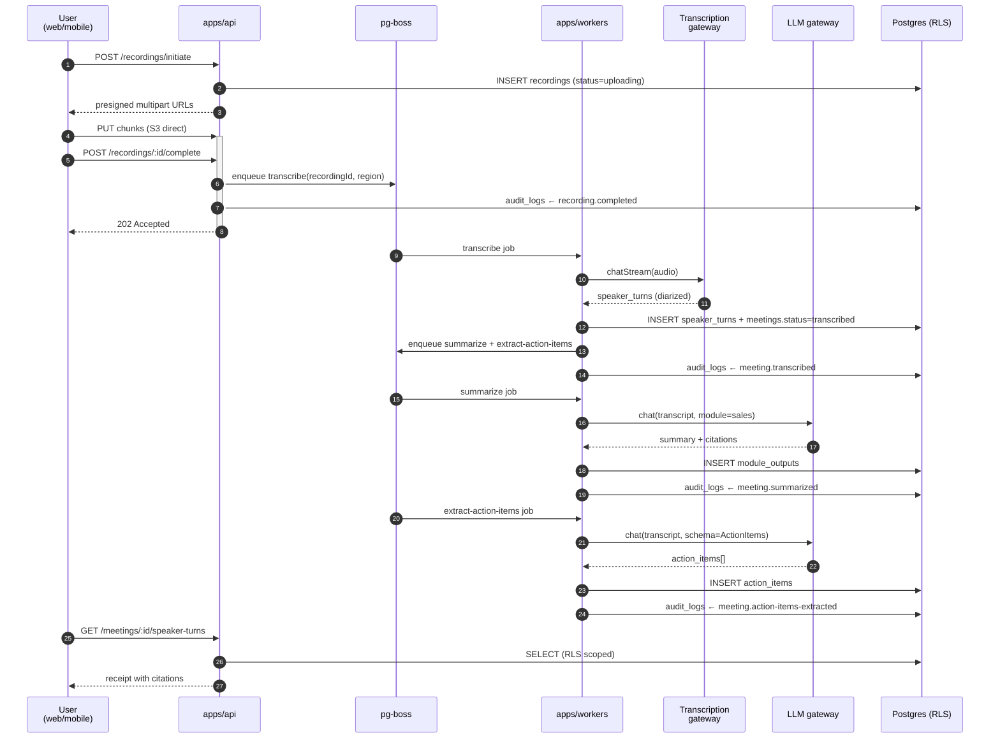
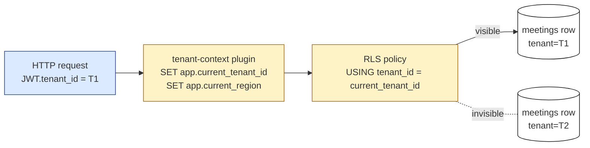
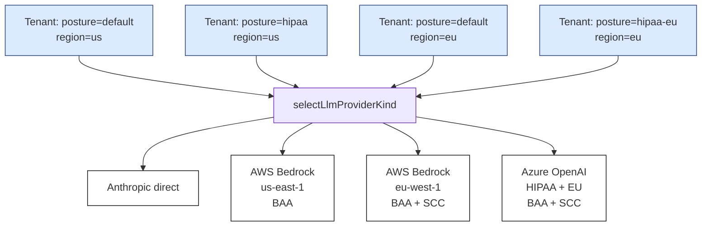
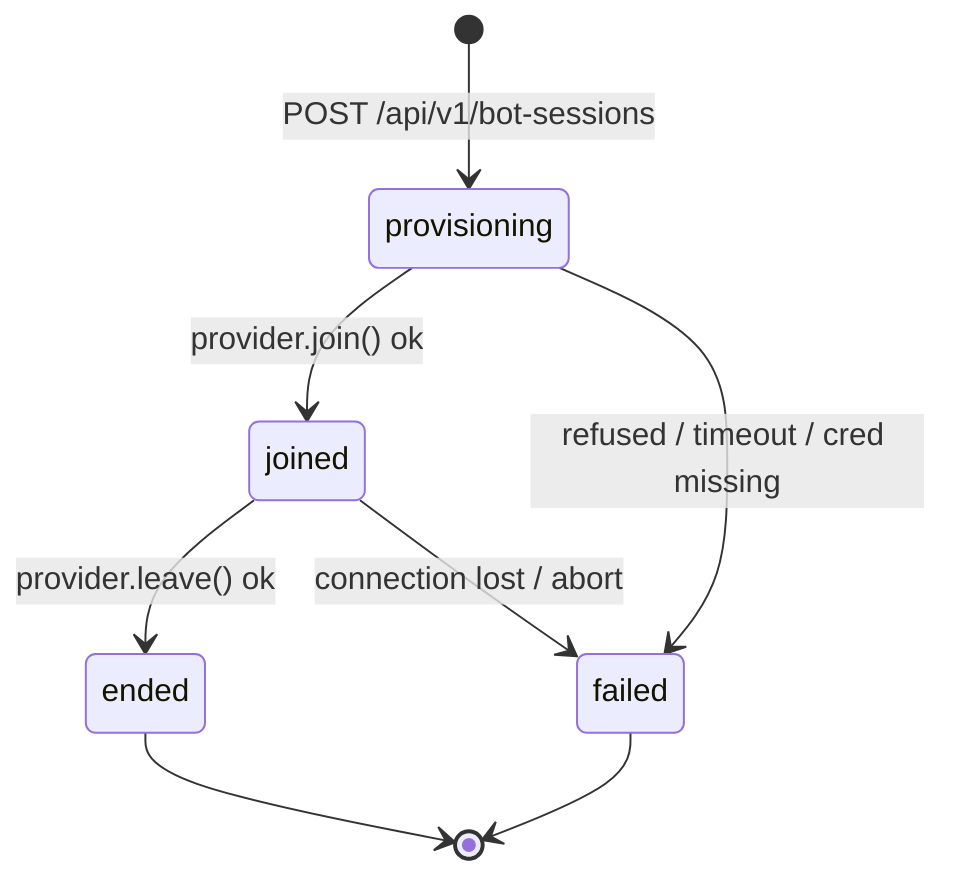
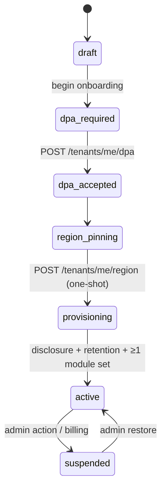

# Architecture

GitHub auto-renders Mermaid in Markdown; the diagrams below display as
SVGs when this file is opened in the GitHub UI.

## System overview

```mermaid
flowchart TB
    classDef client fill:#e0e7ff,stroke:#4f46e5,stroke-width:1.5px,color:#1e1b4b
    classDef edge   fill:#fafafa,stroke:#09090b,stroke-width:1.5px,color:#09090b
    classDef store  fill:#fef3c7,stroke:#a16207,stroke-width:1.5px,color:#451a03
    classDef worker fill:#fff,stroke:#09090b,stroke-width:1.5px,color:#09090b
    classDef gateway fill:#ede9fe,stroke:#6d28d9,stroke-width:1.5px,color:#3b0764

    Web[apps/web<br/>React 19 + Vite]:::client
    Mobile[apps/mobile<br/>Expo 52]:::client
    Ext[apps/extension<br/>Chrome MV3]:::client

    API[apps/api<br/>Fastify 5<br/>Argon2id + JWT + RLS context]:::edge

    PG[(Postgres 16<br/>+ pgvector + RLS)]:::store
    Redis[(Redis 7<br/>refresh tokens<br/>heartbeat keys)]:::store
    PgBoss[/pg-boss queues<br/>same Postgres/]:::store
    S3[(S3 / MinIO<br/>recordings + DSAR)]:::store

    Workers[apps/workers<br/>transcribe + summarize<br/>+ extract-action-items<br/>+ dsar.export + crm.push]:::worker
    Bot[apps/bot<br/>Zoom + Teams<br/>media bot]:::worker

    LLM[packages/llm-gateway<br/>Anthropic + OpenAI<br/>+ Azure + Bedrock + Ollama]:::gateway
    TR[packages/transcription<br/>Whisper API<br/>+ self-hosted faster-whisper]:::gateway
    CRM[packages/crm<br/>HubSpot + Salesforce<br/>+ Pipedrive]:::gateway
    NOTIF[packages/notifications<br/>Postmark + SES + Expo]:::gateway

    Web -.TLS 1.3.-> API
    Mobile -.TLS 1.3.-> API
    Ext -.TLS 1.3.-> API

    API --> PG
    API --> Redis
    API --> PgBoss
    API --> S3

    PgBoss --> Workers
    PgBoss --> Bot

    Workers --> LLM
    Workers --> TR
    Workers --> CRM
    Workers --> NOTIF
    Bot --> S3
```

## Capture → transcribe → analyze → share



## Multi-tenant isolation



## Compliance posture routing



## Bot session FSM (ADR-0006-adjacent pattern)



## Tenant lifecycle FSM (ADR-0004)


